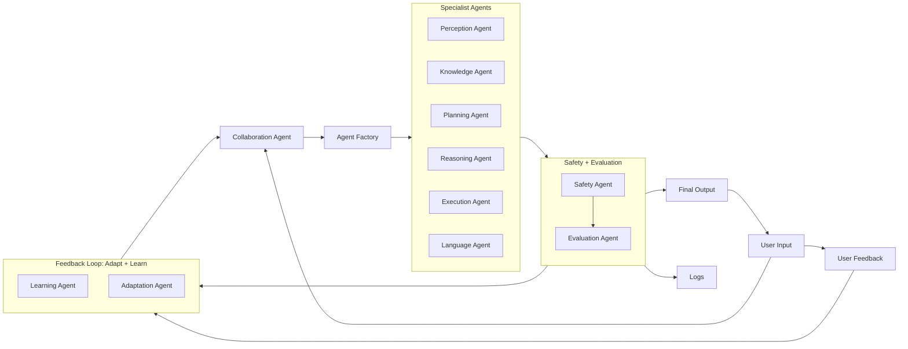

---


[//]: <>
## What is SLAI?

SLAI is a modular, distributed AI assistant framework composed of autonomous agents. It decomposes complex tasks into specialized processes handled by modular agents. Each agent is specialized (e.g., perception, planning, reasoning) and collectively they:

- Process multimodal user input (text, voice, images)
- Retrieve and validate knowledge from memory and external sources
- Plan and execute complex tasks using tools or APIs
- Perform logical reasoning and generate fluent natural language responses
- Ensure output safety, ethical alignment, and continual improvement via learning
- Adapt over time through user feedback, monitoring, and meta-learning

---

## Flow Diagram

[//]: < See `slai_flowchart.png` in the repo for the full data and agent pipeline.>



---

## Minimum System Requirements

### Hardware

| Component   | Minimum Requirement         | Recommended                                              |
| ----------- | --------------------------- | -------------------------------------------------------- |
| **CPU**     | 4-core (Intel i5 / Ryzen 5) | 8-core (Intel i7 / Ryzen 7)                              |
| **RAM**     | 16 GB                       | 32 GB (for multitasking)                                 |
| **GPU**     | NVIDIA GTX 1060             | NVIDIA RTX 3060 or higher (for large tasks and training) |
| **Storage** | 50 GB SSD                   | 100 GB SSD (for models + vector DBs + logs)              |

### Software

- **OS:** Ubuntu 22.04+ / Windows 10+
- **Python:** 3.10+
- **Dependencies:**
  - `torch`, `transformers`, `sentence-transformers`, `faiss`, `gradio`
  - `pydantic`, `langchain`, `openai` (optional)
  - `graphviz`, `numpy`, `pandas`, `flask`, `uvicorn`

---

# How to run

## Clone this repo.
   ```bash
   git clone https://github.com/The-Outsider-97/SLAI.git
   cd SLAI
   ```

2. Set Up a Virtual Environment (Recommended):

On **Linux/MacOS**:
   ```console
   python -m venv venv
   source venv/bin/activate        # On Windows: venv\Scripts\activate
   ```

On **Windows (PowerShell)**:
   ```console
   python -m venv venv
   .\venv\Scripts\Activate.ps1
   ```

Note: If you see an error about execution policy:
   ```console
   Set-ExecutionPolicy -ExecutionPolicy RemoteSigned -Scope CurrentUser
   .\venv\Scripts\Activate.ps1
   ```

3. You'll need the latest pip installer
   ```console
   python -m pip install --upgrade pip
   ```

4. Install requirements:
   ```console
   pip install torch torchvision torchaudio
   pip install -r requirements.txt
   pip install pyyaml
   pip install PyQt5
   pip install psutil gputil
   pip install ply
   pip install textstat
   pip install opencv-python
   pip install matplotlib
   pip install scipy
   pip install watchdog
   pip install deepmerge
   pip install joblib
   pip install pandas
   pip install pyarrow
   pip install spacy
   pip install tenacity
   pip install rollback
   pip install statsmodels
   pip install numpy scipy scikit-learn
   pip install scikit-optimize
   pip install shap
   pip install nltk
   pip install gymnasium
   pip install beautifulsoup4
   pip install fastapi uvicorn
   pip install selenium
   pip install pynvml
   pip install robotexclusionrulesparser
   pip install pytesseract pillow
   pip install evaluate
   pip install bert_score
   pip install rouge_score
   pip install sounddevice
   ```

5. Run Model:

   ```console
   python main.py
   ```


## Continuous Integration
- GitHub Actions workflow runs on each push/PR.
- To trigger manually:
  ```bash
  gh workflow run test.yml
   ```

   If user experiencing errors at this stage, run this command to install PyTorch inside the virtual environment.
   CPU-Only Version (lighter):

   ```console
   pip install torch torchvision torchaudio --index-url https://download.pytorch.org/whl/cpu
   ```

   Confirm Torch Installed:

   ```console
   pip list
   ```
   
6. Run the Tests (Optional but Recommended):

   ```console
   pytest tests/
   ```

---
# SLAI: Roadmap to Autonomous Self-Improvement and Refactoring

This document outlines the current state of SLAI (Safe Learning AI) and identifies the required features and improvements for it to reach its goal of safe, mostly autonomous self-improvement and self-refactoring.

---

## Vision

SLAI aims to be an autonomous, modular AI assistant that can:
- Learn and improve over time via reinforcement and user feedback.
- Edit and refactor its own Python source code to enhance performance.
- Operate autonomously with minimal user intervention.
- Ensure safety, reliability, and continuous adaptation.

SLAI is designed to evolve over time based on the user’s hardware capabilities and engagement. It is a long-term project targeting AI autonomy while prioritizing transparency, control, and safe alignment with human users.

---

## Capability Summary

| **Aspect** | **Current Capabilities** | **Missing / Underdeveloped** |
|-----------|--------------------------|-------------------------------|
| **Performance Optimization & Refactoring** | DQN, MAML, RSI, and Evo agents with hyperparameter tuning. RSI module can adjust model structure/config. | No advanced code analysis, static profiling, or AI-guided refactoring. |
| **User Feedback Utilization** | Feedback conceptually embedded in architecture. | No actual ingestion, parsing, or processing of user feedback into actions. |
| **Self-Editing (Code)** | RSI module can modify code (e.g. layers) with rollback. | Edits are hardcoded templates. No intelligent edits, testing, or Git integration. |
| **Autonomous Operation** | TaskRouter + Collaboration Agent coordinate workflows. Automated R&D loop trains agents. | No proactive task generation or idle self-improvement. Minimal long-term memory or preference learning. |

---

## Current Features

### Modular Agent Framework
- Perception, Planning, Reasoning, Language, SafeAI, RSI, and more.
- Agents are dynamically routed based on task input.

### Recursive Self-Improvement (RSI)
- Rewrites model architecture on stagnated reward.
- Can insert new layers and modify config files.
- Hot reloads agents at runtime with backup handling.

### Automated R&D Engine
- Performs hyperparameter tuning (grid/Bayesian).
- Can evaluate and select top-performing agents.

### Learning Agent
- Implements online learning during runtime.
- Supports lifelong improvement through training from new inputs.

### Safety & Rollback System
- Backs up Python files before applying RSI modifications.
- Recovers original code if modifications fail or result in errors.

---

## Recommendations for Advancing SLAI

### 1. Robust Self-Assessment & Testing
- Integrate and auto-run unit and integration tests post-edit.
- Run benchmark queries to measure real-world performance before/after edits.
- Create detailed metrics for agent scoring.

### 2. Version Control Integration
- Implement `GitPython` to version all RSI edits.
- Auto-commit with timestamp and reason for change.
- Store edit results in an experiment log.
- Optional: Merge successful edits into `main` branch only after passing tests.

### 3. Autonomous Refactoring Engine
- Add `CodeImprovementAgent` using LLM for advanced suggestions.
- Profile slow functions and optimize logic beyond neural layers.
- Integrate PEP8 linter and performance cost analyzer.

### 4. User Feedback System
- Frontend: rating system, correction field, feature request queue.
- Backend: interpret ratings as reward modifiers.
- Enable user preferences to persist via embeddings or logs.

### 5. Deeper Autonomy & Scheduling
- Task scheduler to initiate self-checks and improvements.
- Allow idle-time training, code audit, and model tuning.
- Agents should suggest improvements or experiments.
- Develop persistent memory across sessions.

---

## Goals for Long-Term Autonomy

| **Goal** | **Milestone** |
|---------|---------------|
| Self-healing system | Detects faults and patches own modules |
| Meta-learning loop | Learns from feedback on its own suggestions |
| Zero-touch maintenance | Operates for long durations without intervention |
| Preference-aligned behavior | Adjusts based on learned user traits or habits |
| Agent democracy | Voting system for agents to decide structural changes |

---

## Development Roadmap (Proposed)

### Phase 1: Foundation
- Refactor agent factory and task router for extensibility.
- Ensure all agent outputs are logged and rated.

### Phase 2: Safety & Testing
- Enable live testing post-modification.
- Connect Git versioning to rollback logic.

### Phase 3: Feedback Integration
- Launch UI input fields for feedback.
- Train an LLM-based interpreter for feedback-to-action mapping.

### Phase 4: Autonomous Research
- Add research goals as tasks (e.g., tune a model, explore algorithm X).
- Implement automatic literature retrieval and concept learning.

### Phase 5: Real-Time Adaptation
- Support real-time changes and learning during execution.
- Add a runtime UI for agent performance insights.


---
# SLAI v1.6 Roadmap

**Milestone Focus:**  
Moving from modular execution to autonomous collaboration and introspection.

---

## 🎯 Objectives

1. Enable agents to:
   - Analyze their own performance
   - Propose changes to hyperparameters or policies

2. Build a persistent experiment memory:
   - Evaluation history
   - Configs, scores, and logs over time

3. Expand frontend to support:
   - Live experiment management
   - Leaderboards and real-time comparisons
   - Security/compliance logs display

---

## ✅ Checklist: Agent & System Intelligence

| Task | Description | Status |
|------|-------------|--------|
| Agent self-analysis | Each agent can evaluate and log its own weaknesses | [x] |
| Shared scoring memory | All evaluation results pushed to a central ranking list | ☐ |
| Recursive retraining | Underperforming agents can request tuning | ☐ |
| Agent voting mechanism | Agents can vote on proposed actions (task democracy) | ☐ |

---

## ✅ Checklist: Frontend Enhancements

| Task | Description | Status |
|------|-------------|--------|
| Leaderboard panel | Real-time sortable agent leaderboard | ☐ |
| Agent introspection viewer | Show logs, tuning, and outcomes per agent | ☐ |
| Security & compliance logs view | Render violations and audit reports | ☐ |
| Terminal/metric toggle | Switch between live logs and metrics in UI | ☐ |

---

## ✅ Checklist: Experiment Persistence

| Task | Description | Status |
|------|-------------|--------|
| Evaluation history storage | Save each run with config, agent, metrics | ☐ |
| Historical graphs | Plot accuracy/reward/risk score over time | ☐ |
| Per-agent config/version history | Track changes per agent class | ☐ |
| Save/Restore experiment sessions | Export session as JSON or re-load it later | ☐ |

---

## 🧪 Proposed New Modules

| Module | Purpose |
|--------|---------|
| `agent_introspector.py` | Let agents self-reflect on failure conditions |
| `scoreboard.py` | Central registry of all agent scores |
| `session_manager.py` | Save, restore, and replay sessions |

---

## 🚀 Timeline Suggestion

| Week | Goals |
|------|-------|
| Week 1 | Build `scoreboard` + enable live leaderboard UI |
| Week 2 | Add introspection hooks to top 3 agents |
| Week 3 | Enable persistent evaluation logging (DB or JSONL) |
| Week 4 | UI upgrade: views for logs, scores, history, toggles |

---

## How to Contribute

We welcome collaborators interested in AGI safety, reinforcement learning, or AI-driven automation. You can:
- Fork the repository and submit a PR.
- Open issues for feature ideas or design reviews.
- Help with documentation, examples, and agent tutorials.

  
---

## 📄 License

This project is licensed under the MIT License. See `LICENSE` for details.

---

### Contact

Developed by [@The-Outsider-97](https://github.com/The-Outsider-97)

---

> SLAI is an experiment in building safe, scalable, intelligent systems that learn and grow with every user interaction.
