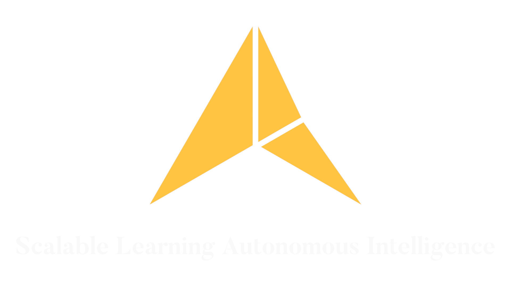

---


[//]: <>
## What is SLAI?

SLAI is a modular, distributed AI assistant framework composed of autonomous agents. It decomposes complex tasks into specialized processes handled by modular agents. Each agent is specialized (e.g., perception, planning, reasoning) and collectively they:

- Process multimodal user input (text, voice, images)
- Retrieve and validate knowledge from memory and external sources
- Plan and execute complex tasks using tools or APIs
- Perform logical reasoning and generate fluent natural language responses
- Ensure output safety, ethical alignment, and continual improvement via learning
- Adapt over time through user feedback, monitoring, and meta-learning

---

## Flow Diagram

[//]: < See `slai_flowchart.png` in the repo for the full data and agent pipeline.>


---

## Minimum System Requirements

### Hardware

| Component   | Minimum Requirement         | Recommended                                              |
| ----------- | --------------------------- | -------------------------------------------------------- |
| **CPU**     | 4-core (Intel i5 / Ryzen 5) | 8-core (Intel i7 / Ryzen 7)                              |
| **RAM**     | 16 GB                       | 32 GB (for multitasking)                                 |
| **GPU**     | NVIDIA GTX 1060             | NVIDIA RTX 3060 or higher (for large tasks and training) |
| **Storage** | 50 GB SSD                   | 100 GB SSD (for models + vector DBs + logs)              |

### Software

- **OS:** Ubuntu 22.04+ / Windows 10+
- **Python:** 3.10+
- **Dependencies:**
  - `torch`, `transformers`, `sentence-transformers`, `faiss`, `gradio`
  - `pydantic`, `langchain`, `openai` (optional)
  - `graphviz`, `numpy`, `pandas`, `flask`, `uvicorn`

---

# How to run

## Clone this repo.
   ```bash
   git clone https://github.com/The-Outsider-97/SLAI.git
   cd SLAI
   ```

2. Set Up a Virtual Environment (Recommended):

On **Linux/MacOS**:
   ```console
   python -m venv venv
   source venv/bin/activate        # On Windows: venv\Scripts\activate
   ```

On **Windows (PowerShell)**:
   ```console
   python -m venv venv
   .\venv\Scripts\Activate.ps1
   ```

Note: If you see an error about execution policy:
   ```console
   Set-ExecutionPolicy -ExecutionPolicy RemoteSigned -Scope CurrentUser
   .\venv\Scripts\Activate.ps1
   ```
3. Install requirements:

   ```console
   pip install torch
   pip install -r requirements.txt
   pip install argparse
   pip install tensorflow
   pip install gputil
   pip install psutil
   pip install PyQt5
   pip install dotenv
   pap install matplotlib
   pip install faiss-cpu
   pip install plotly
   pip install statsmodels
   pip install causalinference
   ```
Optional: For CUDA (GPU), install PyTorch with the correct CUDA version. See: https://pytorch.org/get-started/locally/

4. Run a basic reinforcement learning task (CartPole with DQN):

   ```console
   python main_cartpole.py
   ```

5. Run Evolutionary Hyperparameter Optimization (CartPole + Evolution):

   ```console
   python main_cartpole_evolve.py
   ```

6. Run multi-task learning agent:

   ```console
   python main_multitask.py
   ```

7. Run Meta-Learning (MAML):):

   ```console
   python main_maml.py
   ```

8. Run Meta-Learning (MAML):):
Docker is required for sandboxing.
Start Docker daemon first.

   ```console
   python main_rsi.py
   ```

## Continuous Integration
- GitHub Actions workflow runs on each push/PR.
- To trigger manually:
  ```bash
  gh workflow run test.yml
   ```

   If user experiencing errors at this stage, run this command to install PyTorch inside the virtual environment.
   CPU-Only Version (lighter):

   ```console
   pip install torch torchvision torchaudio --index-url https://download.pytorch.org/whl/cpu
   ```

   Confirm Torch Installed:

   ```console
   pip list
   ```
   
6. Run the Tests (Optional but Recommended):

   ```console
   pytest tests/
   ```

## Roadmap
- [x] Basic evolutionary agent
- [x] Multi-Task RL with shared policies
- [x] Meta-Learning (MAML / Reptile)
- [x] Recursive Self-Improvement (Codegen + Evaluation Loop)
- [x] Safe AI & Alignment Checks
- [x] Collaborative Agents & Task Routing
- [x] Automated R&D Loop

___
---

## SLAI v1.5 — Modular, Collaborative, and Visual

**Release Date:** March 2025  
**Branch:** `SLAI-v.1.5`

### 🔍 Goals

- Build a fully modular system to support:
  - Collaborative agent architecture with task routing
  - Automated research and development loop
  - Frontend interface for real-time monitoring and agent control

---

### ✅ Key Features

#### 1. Collaborative Agents & Task Routing
- Dynamic agent registry with capability tagging
- TaskRouter with fallback handling and success-based ranking
- Shared memory architecture for knowledge transfer
- Agent interface standardization (`execute(task_data)`)

#### 2. Automated R&D Loop
- Modular pipeline for hyperparameter tuning, experiment management, and evaluation
- Grid search with integrated evaluator and model registry
- Centralized metrics logging (F1, accuracy, risk score, etc.)
- Top agent auto-registration after tuning

#### 3. Frontend Visualization
- Flask-based frontend replicating terminal-style UI
- Real-time log streaming via `/logs`
- Live metric updates via `/metrics`
- Agent dropdown launcher with backend subprocess support
- Modular components (`window_controls`, `metrics_box`, `buttons`)

---

### 📦 Backend Modules

| Folder            | Description                                         |
|------------------|-----------------------------------------------------|
| `agents/`         | All agent classes (DQN, MAML, RSI, SafeAI, etc.)   |
| `collaborative/`  | Registry, task router, shared memory               |
| `rnd_loop/`       | Evaluator, experiment manager, hyperparam tuner    |
| `modules/`        | Monitoring, logging, compliance, training, security |
| `deployment/`     | Model registry, inference API, batch processing    |
| `frontend/`       | Templates, styles, and visual interface components |

---

### 🧠 Intelligence Infrastructure

- Real-time `logger.py` with queue integration
- Monitoring logs pushed to frontend terminal
- Shared memory supports inter-agent communication
- Evaluation results feed back into tuning and registry

---

### 🧪 How to Run

```bash
# Launch the web frontend
python app.py

# Launch an agent manually
python main_safe_ai.py
```

___
---

# SLAI v1.6 Roadmap

**Milestone Focus:**  
Moving from modular execution to autonomous collaboration and introspection.

---

## 🎯 Objectives

1. Enable agents to:
   - Analyze their own performance
   - Propose changes to hyperparameters or policies

2. Build a persistent experiment memory:
   - Evaluation history
   - Configs, scores, and logs over time

3. Expand frontend to support:
   - Live experiment management
   - Leaderboards and real-time comparisons
   - Security/compliance logs display

---

## ✅ Checklist: Agent & System Intelligence

| Task | Description | Status |
|------|-------------|--------|
| Agent self-analysis | Each agent can evaluate and log its own weaknesses | ☐ |
| Shared scoring memory | All evaluation results pushed to a central ranking list | ☐ |
| Recursive retraining | Underperforming agents can request tuning | ☐ |
| Agent voting mechanism | Agents can vote on proposed actions (task democracy) | ☐ |

---

## ✅ Checklist: Frontend Enhancements

| Task | Description | Status |
|------|-------------|--------|
| Leaderboard panel | Real-time sortable agent leaderboard | ☐ |
| Agent introspection viewer | Show logs, tuning, and outcomes per agent | ☐ |
| Security & compliance logs view | Render violations and audit reports | ☐ |
| Terminal/metric toggle | Switch between live logs and metrics in UI | ☐ |

---

## ✅ Checklist: Experiment Persistence

| Task | Description | Status |
|------|-------------|--------|
| Evaluation history storage | Save each run with config, agent, metrics | ☐ |
| Historical graphs | Plot accuracy/reward/risk score over time | ☐ |
| Per-agent config/version history | Track changes per agent class | ☐ |
| Save/Restore experiment sessions | Export session as JSON or re-load it later | ☐ |

---

## 🧪 Proposed New Modules

| Module | Purpose |
|--------|---------|
| `agent_introspector.py` | Let agents self-reflect on failure conditions |
| `scoreboard.py` | Central registry of all agent scores |
| `session_manager.py` | Save, restore, and replay sessions |

---

## 🚀 Timeline Suggestion

| Week | Goals |
|------|-------|
| Week 1 | Build `scoreboard` + enable live leaderboard UI |
| Week 2 | Add introspection hooks to top 3 agents |
| Week 3 | Enable persistent evaluation logging (DB or JSONL) |
| Week 4 | UI upgrade: views for logs, scores, history, toggles |

---

## 📝 Notes

- All new modules should integrate with:
  - `shared_memory`
  - `logger.py`
  - `evaluator.py`
- Focus on reusable interfaces so agents can plug in different types of self-analysis logic
- Prioritize UI clarity: avoid clutter, maintain 2-panel simplicity

---
## 📄 License

This project is licensed under the MIT License. See `LICENSE` for details.

---

### Contact

Developed by [@The-Outsider-97](https://github.com/The-Outsider-97)

---

> SLAI is an experiment in building safe, scalable, intelligent systems that learn and grow with every user interaction.
