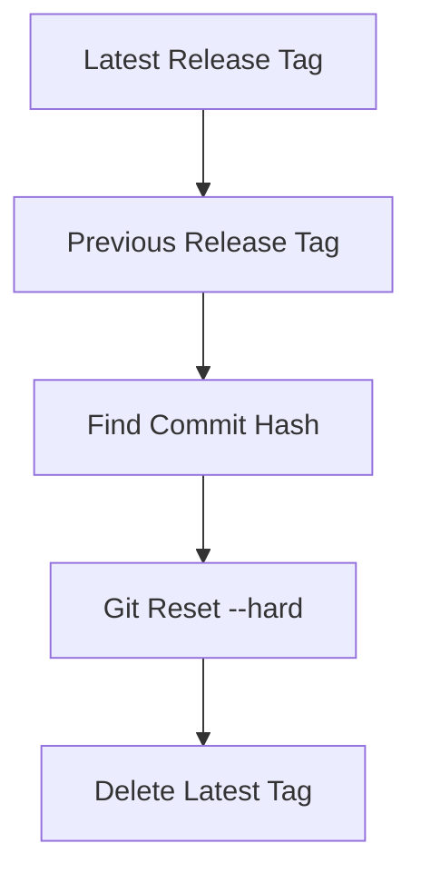
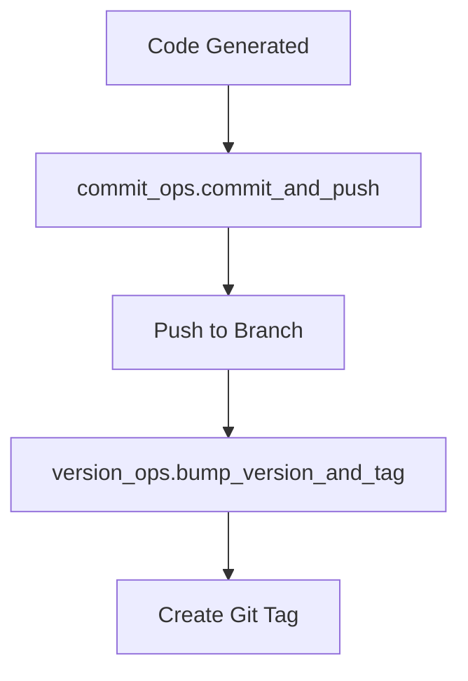
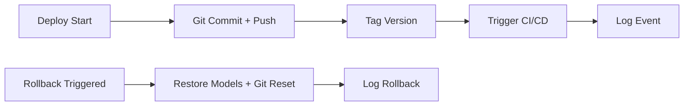

# SLAI Deployment System

This module provides a robust, modular, and rollback-first deployment architecture for SLAI (`v1.6.2+`). It supports version tagging, model rollback, Git history management, CI/CD triggering, and environment-aware deployments (e.g., `dev`, `staging`, `prod`).

It integrates seamlessly with SLAI's core language architecture and is designed to ensure **traceability**, **recoverability**, and **structured release management** during rapid development and experimentation phases.

---

##  Core Features

-  **Rollback-First**: Full rollback support for model files and Git history (tags/commits).
   **Audit Logging**: Structured JSONL event logging with system metrics and sensitive field scrubbing.
- **Versioning**: SemVer-compliant Git tag creation and automated version bumping.
- **Branch Operations**: Safe creation, merging, and deletion of Git branches.
- **CI/CD Triggering**: Unified interface for GitHub Actions, Jenkins, or GitLab pipelines.
- **Multi-Environment Support**: Isolate and manage deployments per environment (`dev`, `prod`, etc.).

---

## 🗂 Directory Structure

```bash
deployment/
├── audit_logger.py         # Unified audit logging system (JSONL format with rotation, redaction)
├── rollback/               # Rollback logic (models + Git state)
│   ├── __init__.py
│   ├── model_rollback.py   # Restores model files from environment-specific backups
│   └── code_rollback.py    # Git tag-based rollbacks and hard resets
├── git_ops/                # Git version control and branching tools
│   ├── __init__.py
│   ├── branch_ops.py       # Create/switch/merge/delete Git branches
│   ├── commit_ops.py       # Save code to file and push to the correct branch
│   └── version_ops.py      # Tag management, version bumping (SemVer)
├── ci_trigger.py           # Environment-aware CI/CD triggering
└── deployment_manager.py   # High-level orchestrator: deploy/rollback across environments
```

---

## Rollback System

### Model Rollback
Located in `rollback/model_rollback.py`. Backs up and restores models from `models/{env}/backups/`.

```python
from rollback import rollback_model

rollback_model(models_dir="models/prod/", backup_dir="models/prod/backups/")
```

### 🔹 Code Rollback
Located in `rollback/code_rollback.py`. Reverts Git state to the previous annotated tag.

```python
from rollback.code_rollback import rollback_to_previous_tag

rollback_to_previous_tag()
```



---

## Audit Logging

### Structured, Filterable Audit History
All deployment and rollback events are logged as newline-delimited JSON (`.jsonl`) in `deployment/logs/`.

```json
{
  "timestamp": "2025-04-10T22:15:00Z",
  "event_type": "deploy",
  "user": "johndoe",
  "environment": "prod",
  "branch": "main",
  "version": "v1.6.3",
  "success": true,
  "details": { "commit": "abc123" },
  "system_metrics": { "cpu_percent": 9.5, "ram_used": 3145728000, "disk_free": 9823755264 },
  "hostname": "slai-node1",
  "ip_address": "192.168.0.101"
}
```

### Sensitive Field Redaction
Fields like `token`, `password`, or `secret` are automatically redacted when logged.

### Log Rotation
Files larger than 200MB are automatically renamed and archived with a timestamp.

---

## Git Operations

Located in `git_ops/`, these modules allow SLAI to control and automate Git as part of deployment flows.

- `branch_ops.py`: Safe branching tools (`create_branch`, `merge_branches`, `auto_name_branch`, etc.)
- `commit_ops.py`: Write and push code to repo programmatically
- `version_ops.py`: Version bumping via semantic versioning and Git tag annotations



---

## 📡 CI/CD Integration

Located in `ci_trigger.py`, this module dispatches builds to GitHub Actions, Jenkins, or GitLab pipelines via environment-targeted configuration.

```python
from deployment.ci_trigger import trigger_ci

trigger_ci(env="dev", branch="develop")
```

---

## Deployment Manager

High-level interface that coordinates deployments, logging, versioning, and CI triggering:

```python
from deployment.deployment_manager import DeploymentManager

manager = DeploymentManager(env="prod")
manager.deploy(user="jane", branch="main")
manager.rollback(user="jane", reason="build failure")
```



---

## How It Fits into SLAI

This system replaces and consolidates legacy scripts (`deployment_history.py`, `rollback_handler.py`, `version_control.py`, etc.) into a unified, extensible pipeline.

It directly supports:
- SLAI’s experimental model iterations via `auto_name_branch()`
- Rollback of failed LLM fine-tunings or semantic corruption events
- Deployment branching tied to `SLAILM` or `language_agent` milestones
- Auditable releases for research reproducibility and CI

---

## TODO & Extension Ideas

- [ ] Add Git commit hash tracing per rollback
- [ ] Hook into SLAI WebUI for one-click rollback
- [ ] Add YAML/JSON config for environments instead of hardcoded `CI_CONFIG`
- [ ] Write CLI wrapper (e.g. `slai-deploy deploy --env prod`)
- [ ] Webhook integration for Slack/Discord alerts

