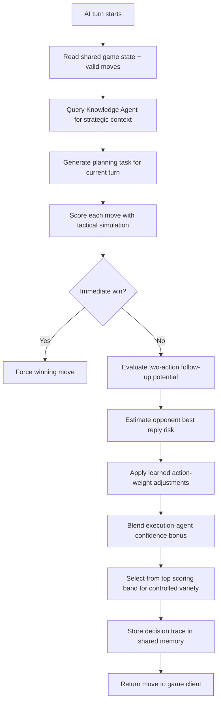

# Aether Shift

**Aether Shift** is a tactical board game where two architects compete to stabilize a floating island by manipulating a shifting grid of Aether Tiles.

## Objective
Win by achieving **one** of the following:
1.  **Path Victory:** Create a continuous connected path of tiles from your **Home Edge** to the opponent's **Home Edge**.
    *   **Red Player:** Connect Top Edge to Bottom Edge.
    *   **Blue Player:** Connect Bottom Edge to Top Edge.
2.  **Power Well Victory:** Control 3 Power Wells at the **end of your round** (after both actions). Each controlled Well must still have your Resonator locked on it.

## Components
*   **The Board:** A 5x5 grid of tiles.
*   **Action Deck:** Shared pool of 3 face-up cards. Each card has two actions (Top/Bottom).
*   **Architect (Meeple):** Your main piece. Move it to traverse the board.
*   **Resonators (Cubes):** Used to lock tiles and capture Power Wells. You have 4.

## How to Play
On your turn, you must perform **2 Actions**. You select actions from the shared face-up cards.

### Actions
*   **PLACE:** Put a new tile on an empty square.
*   **ROTATE:** Spin a tile 90 degrees. *Cannot rotate tiles with Resonators.*
*   **SHIFT:** Slide an entire row or column. Click an **edge tile** to push that row/column inward. The tile that falls off wraps around to the other side.
*   **ADVANCE:** Move your Architect to an adjacent, connected tile.
*   **ATTUNE:** Place a Resonator on your current tile. This **locks** the tile (cannot be rotated) and captures it if it's a Power Well.
    * The Architect **cannot** use existing neutral/grey tiles to capture a Power Well.

## Game Modes
*   **Player vs AI:** Play against a computer opponent.
*   **2 Player (PVP):** Pass and play on the same device.

## Tips
*   **Shifting is powerful:** You can move your opponent away from their goal or bring a Power Well to you.
*   **Watch connections:** You can only move if the path lines connect.
*   **Resource Management:** You only have 4 Resonators. Use them wisely to lock key tiles or capture Wells.


## AI Decision Flow


### Integration Notes
- The Aether backend AI performs deterministic state simulation for `PLACE`, `ROTATE`, `SHIFT`, `ADVANCE`, and `ATTUNE`, including action-economy updates, path victory checks, and Power Well capture resolution.
- The scorer uses board-level evaluation (path progress, well control, resonator economy, and positional pressure) plus two-ply tactical lookahead when the AI still has a second action in the turn.
- Match learning persists to `logs/aether_learning_state.json` and updates action preferences based on outcomes, so behavior adapts over time without placeholders or stubs.
    H --> I[Return move to game client]
```
