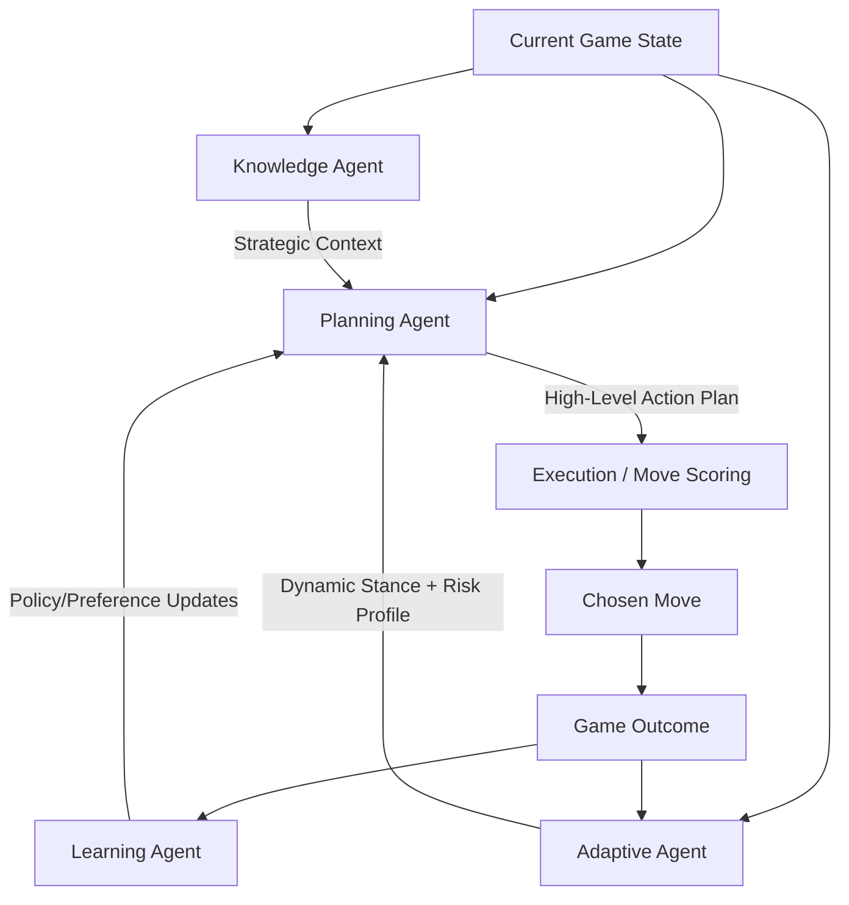

# Chronos: Clash of Wills

Chronos is a competitive, turn-based strategy board game where two players fight for control of a central Core while managing hidden intent through token selection and simultaneous action planning.

## What the game is

In each round, players choose actions for their units and resolve movement/combat across a grid battlefield. You can win by:

1. **Eliminating the enemy Strategos**, or
2. **Reaching the core-control score threshold** first.

The design emphasizes positioning, prediction, and calculated risk rather than pure reaction speed.

### Inspiration

Chronos is inspired by:

- **Classical abstract strategy games** (board control and positional pressure),
- **Game-theory decision making** (reading opponents and selecting high-value commitments),
- **Simultaneous-resolution tactics** (plans collide, creating emergent outcomes).

The result is a "mind game" format where tempo, board geometry, and commitment timing are as important as raw piece strength.

## Installation (clear setup guide)

### Prerequisites

- **Node.js** 18+
- **Python** 3.8+
- **pip**

### 1) Clone and install JavaScript dependencies

```bash
git clone <your-repo-url>
cd Chronos
npm install
```

### 2) Create a Python virtual environment and install Python dependencies

**macOS / Linux**

```bash
python3 -m venv venv
source venv/bin/activate
pip install -r requirements.txt
```

**Windows (PowerShell / CMD)**

```bash
python -m venv venv
venv\Scripts\activate
pip install -r requirements.txt
```

### 3) Run the full app stack

```bash
npm run dev
```

This command starts:

- **Node/Express + Vite middleware** on `http://localhost:3000`
- **Python AI service** on `http://localhost:5000`
- **API proxy** from `/api/ai/*` to the Python service

Open the game at **http://localhost:3000**.

## Troubleshooting

- If `python` is not recognized, update `server.js` to use `python3` on systems where that alias is required.
- If AI requests fail, verify your virtual environment is active and `pip install -r requirements.txt` completed.
- If ports are in use, update `PORT` and `PYTHON_PORT` in `server.js`.

## AI agent architecture

Chronos uses a multi-agent AI pipeline to produce tactical decisions.

- **Knowledge Agent**
  - Retrieves contextual strategy guidance and relevant tactical cues.
- **Planning Agent**
  - Generates a high-level plan from the current game state plus retrieved context.
- **Execution Agent**
  - Applies the plan to concrete candidate actions and supports move selection logic.
- **Learning Agent**
  - Updates long-term behavior from wins/losses to improve future decisions.
- **Adaptive Agent**
  - Dynamically shifts tactical stance (comeback, conversion, defensive, core-contest, balanced) based on score/material/core pressure and opponent tempo signatures.

At runtime, the AI loops through: context retrieval → adaptive stance synthesis → planning → execution scoring/arbitration. After each match, both learning and adaptation updates influence future planning preferences, risk appetite, and zone/action priorities.


