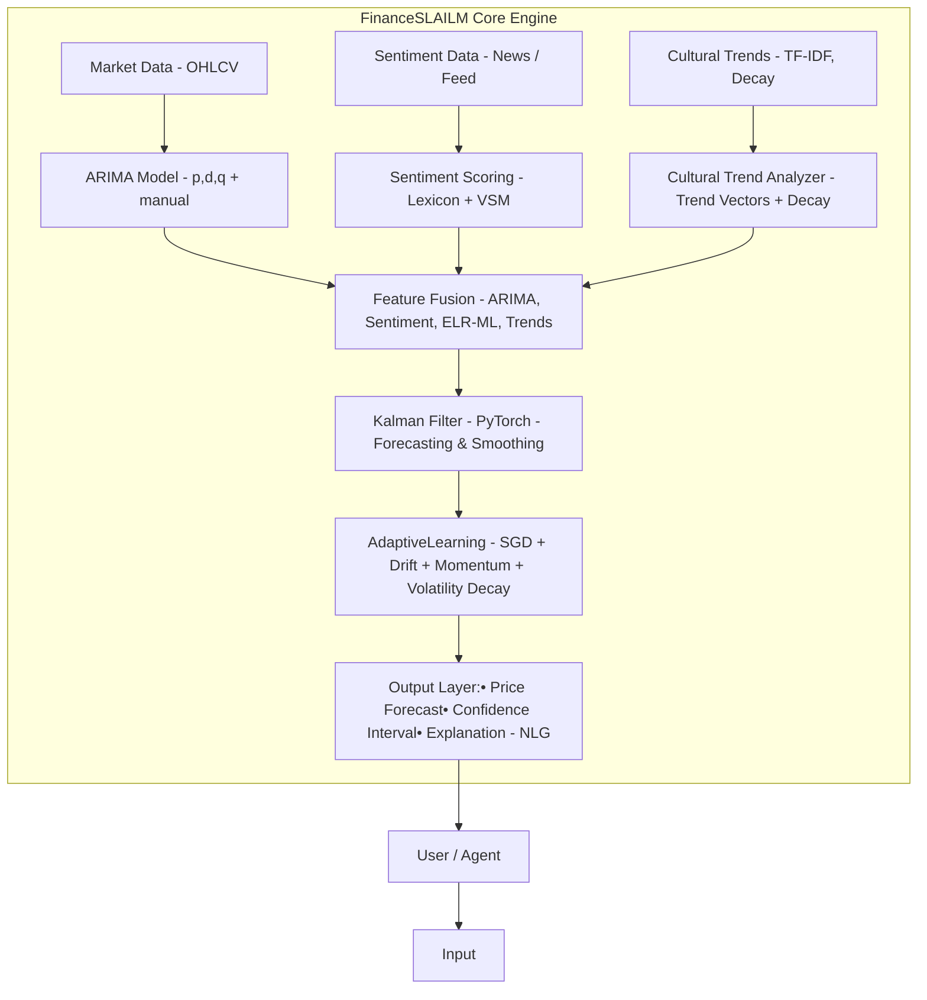

### Mission Statement

FinanceSLAILM is an adaptive, interpretable, and secure financial intelligence engine that integrates first-principle statistical models, sentiment dynamics, and online learning to enable robust forecasting, autonomous reasoning, and real-time decision-making without reliance on opaque ML libraries.

