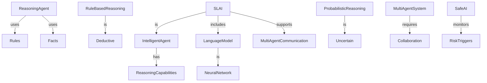
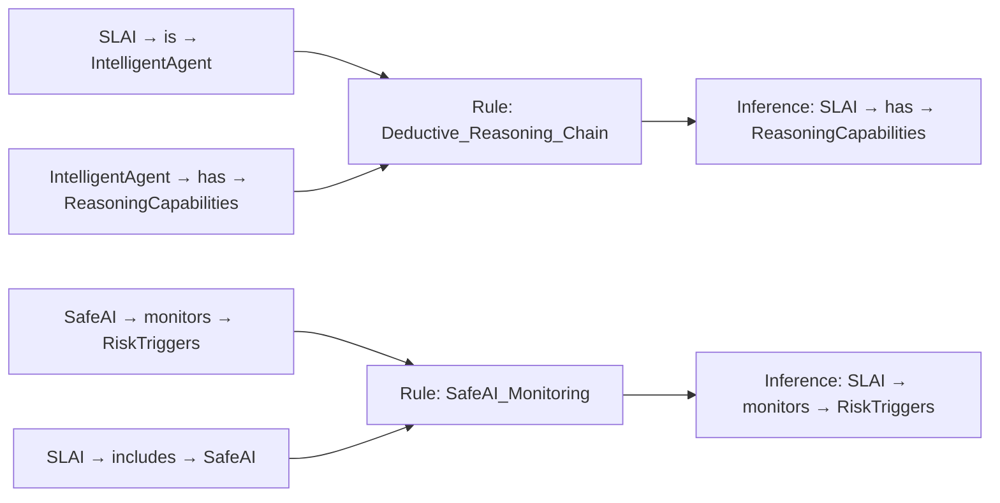

# SLAI Agents Overview

This folder contains all agent implementations for SLAI. Each agent encapsulates a distinct learning strategy or system behavior. Below is a summary of each agent's role and core functionality.

---

### `dqn_agent.py`
**Deep Q-Network Agent (DQN)**  
Implements a classic reinforcement learning algorithm using neural networks to approximate Q-values. Suitable for discrete action spaces like CartPole.

- Learns optimal actions from environment feedback.
- Uses ε-greedy exploration and experience replay.

---

### `evolution_agent.py`
**Evolutionary Strategy Agent**  
Applies population-based optimization to evolve neural network architectures or hyperparameters.

- No backpropagation — uses selection, mutation, and evaluation.
- Maintains fitness scores to evolve top-performing models.

---

### `evolutionary_dqn.py`
**Hybrid Evolution + DQN Agent**  
Combines evolutionary principles with DQN-style policy evaluation.

- Evolves DQN parameters and architectures.
- Suitable for environments requiring exploration of agent structure and learning behavior.

---

### `maml_agent.py`
**Model-Agnostic Meta-Learning (MAML) Agent**  
Learns a meta-policy that can adapt quickly to new tasks with minimal data.

- Performs inner and outer-loop updates.
- Designed for few-shot reinforcement learning.

---

### `knowledge_agent.py`

---

### `rsi_agent.py`
**Reinforcement Self-Improving Agent (RSI)**  
Focuses on continuous policy refinement by leveraging shared memory.

- Tracks its own performance and learns from past failures.
- Dynamically adjusts hyperparameters during execution.

---

### `safe_ai_agent.py`
**Safety-Aware Agent**  
Monitors and assesses the risk of actions or policies taken by other agents.

- Learns thresholds per task type based on policy risk scores.
- Suggests corrective actions if safety is compromised.

---

### `collaborative_agent.py`
**Collaborative Task Router**  
Delegates tasks to the most suitable registered agent based on task type and context.

- Uses shared memory and a task router.
- Integrates and manages multi-agent collaboration at runtime.

---
### `Rule Chain Map`

---

## Agent Integration

Each agent are instantiated via the [`agent_factory`](../utils/agent_factory.py) and registered through the `CollaborationManager`. Shared memory access is optional but recommended for coordination.

---

## Contribution Guidelines

- Ensure agents inherit from `BaseAgent` where possible.
- Include `train()`, `evaluate()`, and `execute(task_data)` methods.
- Use logging via `setup_logger()` for consistency.

