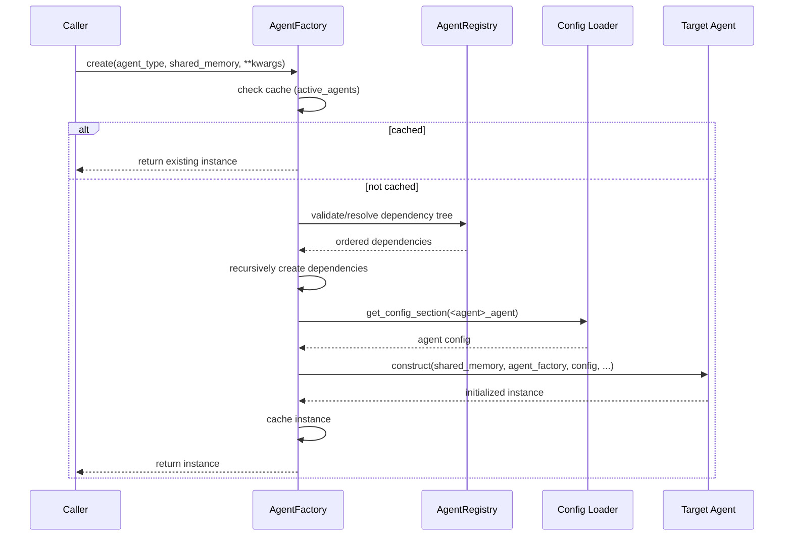
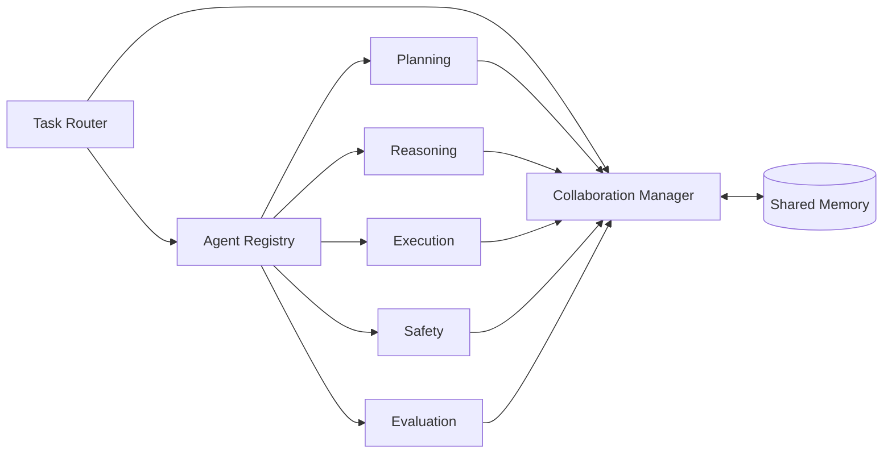
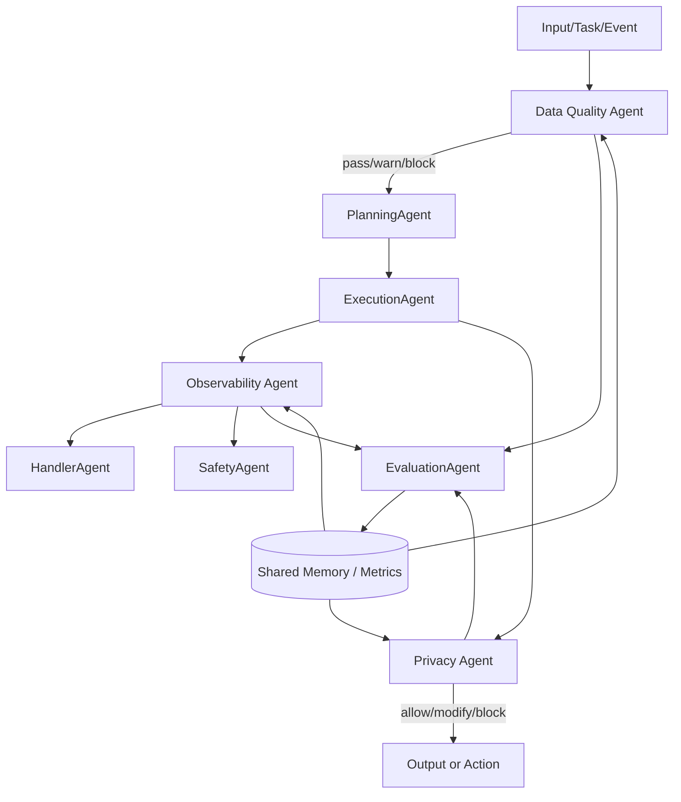

# SLAI Agents Architecture

The `src/agents` package contains the core multi-agent runtime used by SLAI. It defines domain-specialized agents (planning, reasoning, language, safety, etc.), shared collaboration primitives, execution workflows, and factory-based instantiation.

This document provides a practical architecture map for engineers onboarding to the codebase, extending agents, or integrating new orchestration flows.

---

## 1) Package goals

The agents subsystem is designed to:

- **Separate responsibilities by capability domain** (e.g., `planning`, `reasoning`, `safety`).
- **Enable composition through shared memory and routing** instead of hard-coding peer dependencies.
- **Support dynamic instantiation** with `AgentFactory` and metadata-driven registration.
- **Standardize implementation contracts** via `BaseAgent` and common config-loading patterns.

---

## 2) High-level architecture

```mermaid
flowchart TD
    UserTask[Incoming task / event] --> Factory[AgentFactory]

    Factory --> P[PlanningAgent]
    Factory --> R[ReasoningAgent]
    Factory --> L[LanguageAgent]
    Factory --> S[SafetyAgent]
    Factory --> E[ExecutionAgent]
    Factory --> K[KnowledgeAgent]
    Factory --> V[EvaluationAgent]
    Factory --> A[AlignmentAgent]
    Factory --> C[CollaborativeAgent]
    Factory --> PE[PerceptionAgent]
    Factory --> LE[LearningAgent]
    Factory --> AD[AdaptiveAgent]
    Factory --> H[HandlerAgent]
    Factory --> B[BrowserAgent]
    Factory --> O[ObservabilityAgent]
    Factory --> RE[ReaderAgent]
    Factory --> Q[QualityAgent]
    Factory --> PR[PrivacyAgent]
    Factory --> N[NetworkAgent]

    C <--> Shared[(Collaborative Shared Memory)]
    P <--> Shared
    R <--> Shared
    L <--> Shared
    S <--> Shared
    E <--> Shared
    K <--> Shared
    V <--> Shared
    A <--> Shared
    PE <--> Shared
    LE <--> Shared
    AD <--> Shared
    H <--> Shared
    B <--> Shared
    O <--> Shared
    RE <--> Shared
    Q <--> Shared
    PR <--> Shared
    N <--> Shared

    E --> Actions[Execution actions]
    V --> Reports[Evaluation outputs]
    S --> Guardrails[Safety decisions]
```

---

## 3) Top-level module map

The package exposes two complementary layers:

1. **Facade agents** (`*_agent.py`) at `src/agents/` used by orchestration and factory logic.
2. **Capability subpackages** (e.g., `planning/`, `safety/`, `language/`) that hold internals, helpers, configs, and templates.

### Facade agent files

- `adaptive_agent.py`
- `alignment_agent.py`
- `base_agent.py`
- `browser_agent.py`
- `collaborative_agent.py`
- `evaluation_agent.py`
- `execution_agent.py`
- `handler_agent.py`
- `knowledge_agent.py`
- `language_agent.py`
- `learning_agent.py`
- `perception_agent.py`
- `planning_agent.py`
- `privacy_agent.py`
- `quality_agent.py`
- `reader_agent.py`
- `qnn_agent.py`
- `reasoning_agent.py`
- `safety_agent.py`
- `network_agent.py`
- `observability_agent.py`

### Core orchestration files

- `agent_factory.py` — central dynamic creation and registry integration.
- `__init__.py` — package version marker and import root.
- `factory/` — metadata, config adapters, and factory utilities.
- `collaborative/` — shared memory, registry, and task routing.

---

## 4) Capability domains and responsibilities

| Domain | Primary concern | Typical contents |
|---|---|---|
| `adaptive/` | Online adaptation, tuning, policy improvements | policy manager, parameter tuner, RL/meta/imitation workers |
| `alignment/` | Value alignment, fairness, and ethics controls | bias/fairness modules, counterfactual auditing, templates |
| `base/` | Common low-level infrastructure | issue handling, metric stores, base config helpers |
| `browser/` | Browser-task workflows and page operations | workflow, security checks, functional browser actions |
| `collaborative/` | Multi-agent coordination | shared memory, agent registry, task router |
| `evaluators/` | System evaluation and validation | performance/safety/efficiency evaluators, reporting utils |
| `execution/` | Action-level task execution | action selector, coordinator, executable action classes |
| `handler/` | Policy-based handling/orchestration glue | handler memory and policy components |
| `knowledge/` | Knowledge management and sync | cache, ontology manager, monitor/governor utilities |
| `language/` | NLP/NLU/NLG processing | tokenization/rules, grammar, context, templates/resources |
| `learning/` | Learning algorithms and environments | DQN/RSI/MAML modules, strategy selectors, env wrappers |
| `network/` | Agent-to-agent and external network operations | adapters, stream handling, reliability, lifecycle, policy, metrics |
| `observability/` | Runtime telemetry, tracing, and diagnostics | observability memory, tracing, intelligence, contract checks |
| `perception/` | Input encoding/decoding and memory | encoders, decoders, model modules, perception memory |
| `planning/` | Planning and heuristic search | schedulers, planners, heuristic selector, monitoring |
| `privacy/` | Data governance and privacy controls | consent, retention, minimization, ID/pseudonymization, auditability |
| `quality/` | Output and workflow quality assurance | semantic/statistical/structural quality checks, workflow control |
| `reasoning/` | Probabilistic + symbolic reasoning | rule engine, probabilistic models, validation, networks |
| `safety/` | Runtime safety and secure operation | guard/compliance modules, cyber safety, secure memory |

---

## 5) Agent factory lifecycle

`AgentFactory` is the canonical instantiation path and is responsible for metadata registration, dependency-aware creation, and per-agent config injection.

```mermaid
sequenceDiagram
    participant Caller
    participant Factory as AgentFactory
    participant Registry as AgentRegistry
    participant Config as Config Loader
    participant Agent as Target Agent

    Caller->>Factory: create(agent_type, shared_memory, **kwargs)
    Factory->>Factory: check cache (active_agents)
    alt cached
        Factory-->>Caller: return existing instance
    else not cached
        Factory->>Registry: validate/resolve dependency tree
        Registry-->>Factory: ordered dependencies
        Factory->>Factory: recursively create dependencies
        Factory->>Config: get_config_section(<agent>_agent)
        Config-->>Factory: agent config
        Factory->>Agent: construct(shared_memory, agent_factory, config, ...)
        Agent-->>Factory: initialized instance
        Factory->>Factory: cache instance
        Factory-->>Caller: return instance
    end
```

---

## 6) Collaboration and routing model

The collaboration layer enables agents to cooperate without hard coupling.

```mermaid
flowchart LR
    Router[Task Router] --> Registry[Agent Registry]
    Router --> Manager[Collaboration Manager]
    Manager <--> Memory[(Shared Memory)]

    Registry --> Plan[Planning]
    Registry --> Reason[Reasoning]
    Registry --> Exec[Execution]
    Registry --> Safe[Safety]
    Registry --> Eval[Evaluation]

    Plan --> Manager
    Reason --> Manager
    Exec --> Manager
    Safe --> Manager
    Eval --> Manager
```

---

## Cross-Agent Coordination Flow

```mermaid
flowchart TD
    IN[Input/Task/Event] --> DQ[Data Quality Agent]
    DQ -->|pass/warn/block| PL[PlanningAgent]

    PL --> EX[ExecutionAgent]
    EX --> OBS[Observability Agent]
    EX --> PR[Privacy Agent]

    PR -->|allow/modify/block| OUT[Output or Action]
    OBS --> HANDLER[HandlerAgent]
    OBS --> SAFE[SafetyAgent]

    DQ --> EVAL[EvaluationAgent]
    OBS --> EVAL
    PR --> EVAL

    EVAL --> MEM[(Shared Memory / Metrics)]
    MEM --> DQ
    MEM --> OBS
    MEM --> PR
```

---

## 7) Configuration and assets pattern

Most domain folders use a consistent structure:

- `configs/` for YAML/JSON runtime configuration.
- `utils/` for domain-specific helper utilities and loaders.
- `templates/`, `networks/`, `guidelines/`, or `models/` for static domain assets.
- Domain `README.md` files for component-level implementation notes.

This allows each domain to evolve independently while preserving predictable integration points.

---

## 8) Extension guide (adding a new agent)

1. **Create a facade agent** at `src/agents/<new>_agent.py`, inheriting from `BaseAgent`.
2. **Add a domain package** under `src/agents/<new>/` if the logic is non-trivial.
3. **Provide config assets** in `<new>/configs/` and load via shared config helpers.
4. **Register in factory map** (`AgentFactory._agent_classes`) and metadata registry flow.
5. **Expose collaboration hooks** if the agent participates in routed tasks.
6. **Add/update documentation** in both domain README and this top-level architecture README.

---

## 9) Recommended engineering practices

- Keep **agent facades thin** and push detailed algorithms into domain modules.
- Maintain **single-responsibility boundaries** between domains.
- Prefer **shared memory + routing** for inter-agent communication.
- Include **clear structured logs** around decision points and failures.
- Use **config-driven behavior** over hard-coded constants where possible.
- Update Mermaid diagrams when introducing new orchestration relationships.

---

## 10) Quick navigation

- Start here for architecture: `src/agents/README.md`
- Factory internals: `src/agents/agent_factory.py`
- Base contract: `src/agents/base_agent.py`
- Coordination primitives: `src/agents/collaborative/`
- Domain deep-dives: `src/agents/*/README.md`
