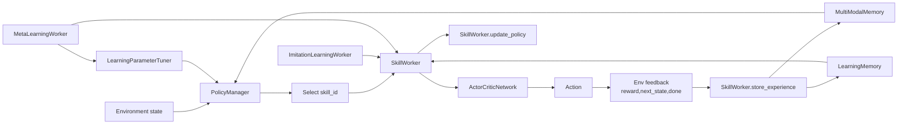
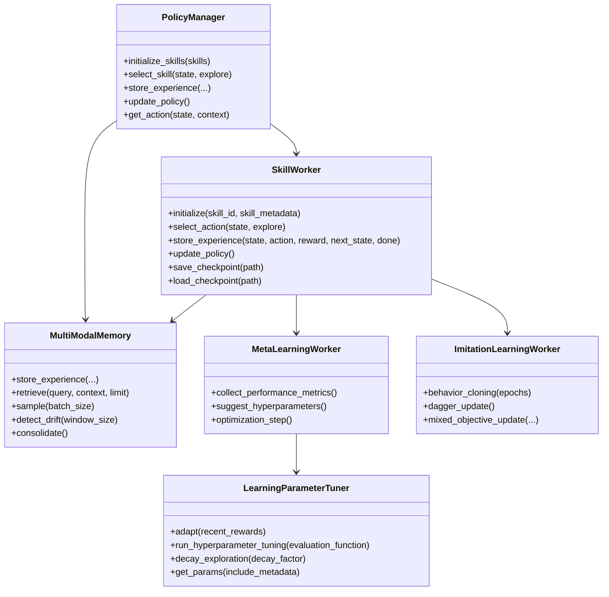

# Adaptive Agent Module

This directory implements SLAI's adaptive learning stack, combining reinforcement learning, imitation learning, meta-learning, policy control, and adaptive memory.

## Directory structure

```text
adaptive/
├── __init__.py
├── adaptive_memory.py
├── imitation_learning_worker.py
├── meta_learning_worker.py
├── parameter_tuner.py
├── policy_manager.py
├── reinforcement_learning.py
├── configs/
│   └── adaptive_config.yaml
└── utils/
    ├── config_loader.py
    ├── neural_network.py
    └── sgd_regressor.py
```

## Main components

### `reinforcement_learning.py`
- `Transition`: dataclass for trajectory elements.
- `SkillWorker`: actor-critic skill learner with:
  - goal conditioning support
  - action selection and reward normalization
  - policy updates and checkpointing
  - optional imitation + meta-learning attachments

### `policy_manager.py`
Coordinates skill-level decision making:

- initializes and selects skills
- stores high-level policy experiences
- computes/update policy behavior and reports
- integrates memory-informed probability adjustment

### `adaptive_memory.py`
`MultiModalMemory` provides hybrid episodic/semantic storage:

- experience logging and priority scoring
- memory bias generation for policy decisions
- parameter-impact analysis and drift detection
- retrieval, consolidation, forgetting/decay, and sampling

### `meta_learning_worker.py`
- aggregates skill performance metrics
- stores hyperparameter-performance pairs
- suggests/upgrades hyperparameters
- uses regressor-backed optimization cycles

### `imitation_learning_worker.py`
- behavior cloning from demonstrations
- DAgger querying/update routines
- mixed objective training hooks
- demonstration persistence

### `parameter_tuner.py`
Adaptive hyperparameter tuner for exploration/learning dynamics:

- reward-trend adaptation
- bounded updates
- exploration decay schedules
- temperature and discount-factor helpers

## Adaptive pipeline diagram



## Component interaction (class view)



## Minimal usage sketch

```python
from src.agents.adaptive.policy_manager import PolicyManager

manager = PolicyManager()
manager.initialize_skills({
    0: {"name": "navigation", "state_dim": 32, "action_dim": 6},
    1: {"name": "manipulation", "state_dim": 32, "action_dim": 8},
})

state = ...
skill_id = manager.select_skill(state, explore=True)
result = manager.get_action(state, context={"task_type": "control"})
```
