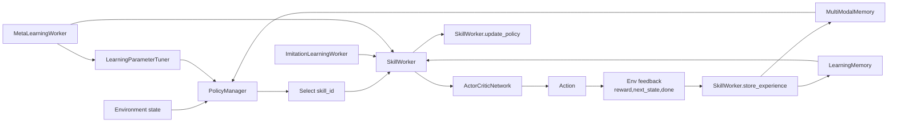
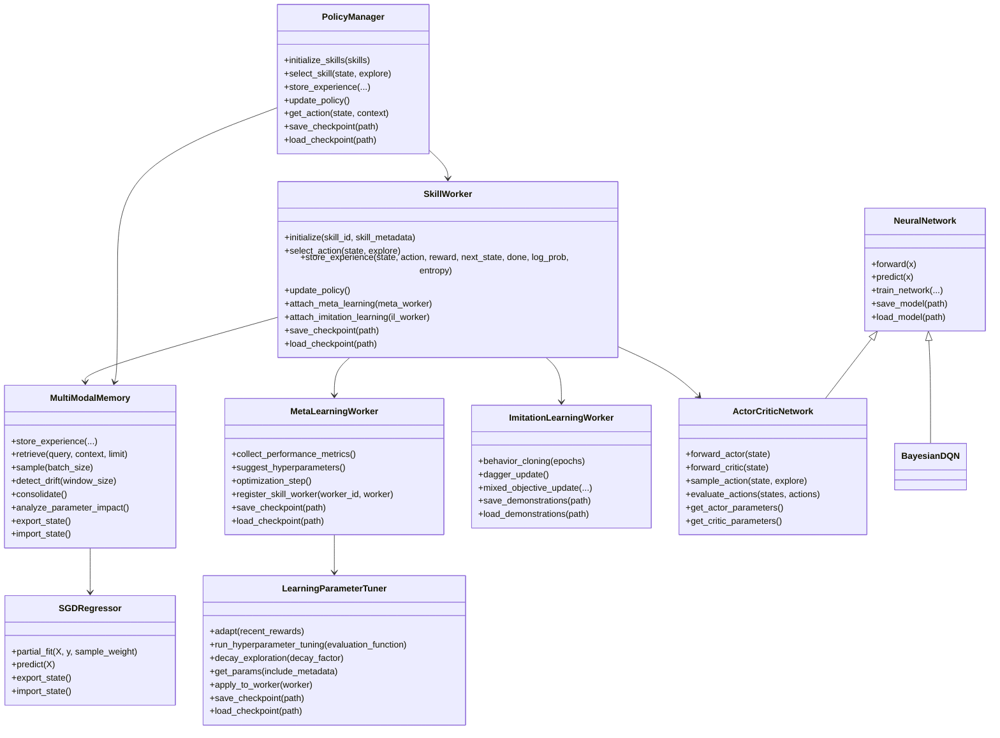

# Adaptive Agent Module

This directory implements SLAI's adaptive learning stack, combining reinforcement learning, imitation learning, meta-learning, policy control, adaptive memory, and supporting neural network and regression utilities.

## Directory Structure

```text
adaptive/
├── __init__.py
├── adaptive_memory.py          # MultiModalMemory – episodic/semantic memory system
├── imitation_learning_worker.py # ImitationLearningWorker – BC + DAgger
├── meta_learning_worker.py     # MetaLearningWorker – hyperparameter optimisation
├── parameter_tuner.py          # LearningParameterTuner – online parameter adaptation
├── policy_manager.py           # PolicyManager – skill selection & hierarchical control
├── reinforcement_learning.py   # SkillWorker – actor‑critic skill execution
├── modules/
│   ├── neural_network.py       # NeuralNetwork, BayesianDQN, ActorCriticNetwork
│   └── sgd_regressor.py        # SGDRegressor – online linear regression
├── utils/
│   ├── adaptive_errors.py      # Structured exception hierarchy
│   ├── adaptive_helpers.py     # Shared utilities (device resolution, hashing, etc.)
│   └── config_loader.py        # Config caching & section access
└── configs/
    └── adaptive_config.yaml    # Central configuration file
```

## Main Components

| Component | File | Description |
|-----------|------|-------------|
| **`SkillWorker`** | `reinforcement_learning.py` | Actor‑critic learner for a single skill. Supports continuous/discrete actions, goal conditioning, GAE, optional imitation & meta‑learning integration, and checkpointing. |
| **`PolicyManager`** | `policy_manager.py` | Hierarchical controller that selects which skill to execute. Uses a policy network over skill IDs, memory‑informed bias, and stores high‑level experiences. |
| **`MultiModalMemory`** | `adaptive_memory.py` | Hybrid episodic–semantic memory with reinforcement prioritisation, concept drift detection, parameter‑impact analysis, and retrieval‑based bias generation. |
| **`ImitationLearningWorker`** | `imitation_learning_worker.py` | Behaviour cloning from demonstrations and DAgger (Dataset Aggregation) with expert querying, mixed RL/IL losses, and demonstration persistence. |
| **`MetaLearningWorker`** | `meta_learning_worker.py` | Bayesian optimisation of hyperparameters across skills using a Bayesian Neural Network, expected improvement acquisition, and worker registry management. |
| **`LearningParameterTuner`** | `parameter_tuner.py` | Online adaptive tuning of learning rate, exploration rate, discount factor, and temperature based on reward statistics and performance trends. |
| **`NeuralNetwork`** | `modules/neural_network.py` | Config‑driven feed‑forward network with support for regression, binary and multiclass classification, schedulers, and robust persistence. |
| **`BayesianDQN`** | `modules/neural_network.py` | Monte Carlo dropout extension of `NeuralNetwork` for uncertainty estimation in Q‑learning. |
| **`ActorCriticNetwork`** | `modules/neural_network.py` | Shared actor‑critic network for continuous/discrete policies, used by `SkillWorker`. |
| **`SGDRegressor`** | `modules/sgd_regressor.py` | Online linear regression with SGD, adaptive learning rates, L2 regularisation, and sample‑weight handling – used by `MultiModalMemory` for parameter‑impact analysis. |

## Adaptive pipeline diagram


```mermaid
flowchart LR
    A[Environment state] --> B[PolicyManager]
    B --> C[Select skill_id]
    C --> D[SkillWorker]
    D --> E[ActorCriticNetwork]
    E --> F[Action]
    F --> G[Env feedback\nreward,next_state,done]

    G --> H[SkillWorker.store_experience]
    H --> I[MultiModalMemory]
    H --> J[LearningMemory]

    J --> D
    D --> K[SkillWorker.update_policy]

    L[ImitationLearningWorker] --> D
    M[MetaLearningWorker] --> D
    M --> N[LearningParameterTuner]
    N --> B

    I --> B
```

## Component interaction (class view)


```mermaid
classDiagram
    class SkillWorker {
        +initialize(skill_id, skill_metadata)
        +select_action(state, explore)
        +store_experience(state, action, reward, next_state, done, log_prob, entropy)
        +update_policy()
        +attach_meta_learning(meta_worker)
        +attach_imitation_learning(il_worker)
        +save_checkpoint(path)
        +load_checkpoint(path)
    }

    class PolicyManager {
        +initialize_skills(skills)
        +select_skill(state, explore)
        +store_experience(...)
        +update_policy()
        +get_action(state, context)
        +save_checkpoint(path)
        +load_checkpoint(path)
    }

    class MultiModalMemory {
        +store_experience(...)
        +retrieve(query, context, limit)
        +sample(batch_size)
        +detect_drift(window_size)
        +consolidate()
        +analyze_parameter_impact()
        +export_state()
        +import_state()
    }

    class MetaLearningWorker {
        +collect_performance_metrics()
        +suggest_hyperparameters()
        +optimization_step()
        +register_skill_worker(worker_id, worker)
        +save_checkpoint(path)
        +load_checkpoint(path)
    }

    class ImitationLearningWorker {
        +behavior_cloning(epochs)
        +dagger_update()
        +mixed_objective_update(...)
        +save_demonstrations(path)
        +load_demonstrations(path)
    }

    class LearningParameterTuner {
        +adapt(recent_rewards)
        +run_hyperparameter_tuning(evaluation_function)
        +decay_exploration(decay_factor)
        +get_params(include_metadata)
        +apply_to_worker(worker)
        +save_checkpoint(path)
        +load_checkpoint(path)
    }

    class ActorCriticNetwork {
        +forward_actor(state)
        +forward_critic(state)
        +sample_action(state, explore)
        +evaluate_actions(states, actions)
        +get_actor_parameters()
        +get_critic_parameters()
    }

    class NeuralNetwork {
        +forward(x)
        +predict(x)
        +train_network(...)
        +save_model(path)
        +load_model(path)
    }

    class SGDRegressor {
        +partial_fit(X, y, sample_weight)
        +predict(X)
        +export_state()
        +import_state()
    }

    PolicyManager --> SkillWorker
    SkillWorker --> ActorCriticNetwork
    SkillWorker --> MultiModalMemory
    SkillWorker --> MetaLearningWorker
    SkillWorker --> ImitationLearningWorker
    MetaLearningWorker --> LearningParameterTuner
    PolicyManager --> MultiModalMemory
    MultiModalMemory --> SGDRegressor
    NeuralNetwork <|-- BayesianDQN
    NeuralNetwork <|-- ActorCriticNetwork
```

## Minimal usage sketch

```python
from src.agents.adaptive.policy_manager import PolicyManager
from src.agents.adaptive.reinforcement_learning import SkillWorker
from src.agents.adaptive.adaptive_memory import MultiModalMemory
from src.agents.adaptive.modules.neural_network import ActorCriticNetwork

# 1. Create memory and policy manager
memory = MultiModalMemory()
manager = PolicyManager()
manager.initialize_skills({
    0: {"name": "navigation", "state_dim": 32, "action_dim": 6},
    1: {"name": "manipulation", "state_dim": 32, "action_dim": 8},
})

# 2. Create a skill worker (or use the manager to get one)
worker = SkillWorker.create_worker(
    skill_id=0,
    skill_metadata={"name": "navigation", "state_dim": 32, "action_dim": 6}
)

# 3. In the environment loop:
state = env.reset()
skill_id = manager.select_skill(state, explore=True)
action, log_prob, entropy = worker.select_action(state, explore=True)
next_state, reward, done, _ = env.step(action)

# 4. Store experience and update
worker.store_experience(state, action, reward, next_state, done, log_prob, entropy)
if done:
    worker.update_policy()
    manager.finalize_skill(reward, success=reward > 0)

# 5. Attach meta‑learning and imitation learning (optional)
from src.agents.adaptive.meta_learning_worker import MetaLearningWorker
from src.agents.adaptive.imitation_learning_worker import ImitationLearningWorker

meta = MetaLearningWorker()
imitation = ImitationLearningWorker(action_dim=6, state_dim=32, policy_network=worker.actor_critic)
worker.attach_meta_learning(meta)
worker.attach_imitation_learning(imitation)

# 6. Checkpointing
manager.save_checkpoint("manager.pt")
worker.save_checkpoint("skill_0.pt")
memory.save("memory.pkl")
```
