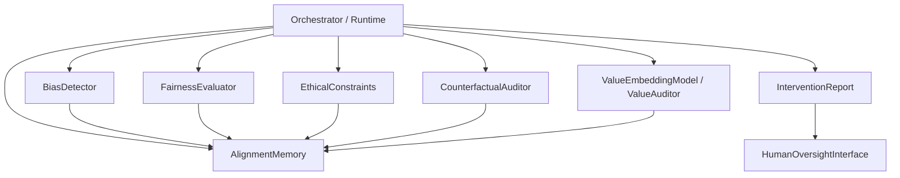

# Alignment Agent Subsystem (`src/agents/alignment`)

This directory contains SLAI’s alignment and governance subsystem: reusable components for bias/fairness auditing, ethical rule enforcement, causal counterfactual checks, value-model auditing, intervention reporting, and human-oversight orchestration.

Unlike a single monolithic `AlignmentAgent` class, this package is organized as composable modules that can be orchestrated by a higher-level runtime.

---

## Scope and responsibilities

The alignment subsystem is responsible for:

- persistent alignment telemetry and drift tracking (`alignment_memory.py`)
- group/metric bias detection with statistical testing (`bias_detection.py`)
- fairness evaluation across group and individual perspectives (`fairness_evaluator.py`)
- policy and constitutional rule governance (`ethical_constraints.py`)
- causal and counterfactual fairness auditing (`counterfactual_auditor.py`, `auditors/`)
- value embedding, preference modeling, and value-policy scoring (`value_embedding_model.py`)
- structured intervention reports and human review workflows (`utils/intervention_report.py`, `utils/human_oversight.py`)
- typed error taxonomy and config/validation helpers (`utils/alignment_errors.py`, `utils/alignment_helpers.py`, `utils/config_loader.py`)

---

## Directory structure

```text
alignment/
├── __init__.py
├── README.md
├── alignment_memory.py
├── bias_detection.py
├── counterfactual_auditor.py
├── ethical_constraints.py
├── fairness_evaluator.py
├── value_embedding_model.py
├── configs/
│   └── alignment_config.yaml
├── auditors/
│   ├── __init__.py
│   ├── TetradRunner.java
│   ├── causal_model.py
│   └── fairness_metrics.py
├── templates/
│   ├── capability.json
│   ├── constitutional_rules_privacy.json
│   ├── constitutional_rules_transparency.json
│   ├── distribution.json
│   ├── physical_harm.json
│   ├── procedure.json
│   ├── psychological_harm.json
│   └── un_human_rights.json
└── utils/
    ├── CHANNELS.md
    ├── __init__.py
    ├── alignment_errors.py
    ├── alignment_helpers.py
    ├── config_loader.py
    ├── human_oversight.py
    └── intervention_report.py
```

---

## Subsystem interaction diagram



---

## Core subsystem components

### 1) `AlignmentMemory`
Persistent memory layer for alignment events and outcomes.

Key functions:
- maintains alignment logs, outcome history, and context registry
- tracks intervention effects and model history
- supports concept drift scoring and replay buffers
- validates memory configuration and retention settings

Use this as the common evidence store consumed by bias/fairness/ethics/counterfactual modules.

### 2) `BiasDetector`
Group and intersectional bias telemetry engine.

Key functions:
- computes fairness-oriented disparity metrics
- performs statistical significance testing and corrections
- tracks historical bias snapshots over time
- optionally logs to `AlignmentMemory`

### 3) `FairnessEvaluator`
Formal fairness evaluation across both population-level and instance-level lenses.

Key functions:
- group metrics (e.g., statistical parity, disparate impact)
- individual consistency and neighborhood-based analyses
- configurable thresholds, bootstrap/permutation sampling
- historical logging and memory integration controls

### 4) `EthicalConstraints`
Ethical governance/control-plane module.

Key functions:
- loads and enforces safety/fairness/constitutional rule bundles
- tracks constraint priorities, severities, and adaptation controls
- produces audit-friendly records for downstream review
- integrates with memory for persistent governance telemetry

### 5) `CounterfactualAuditor`
Causal intervention and sensitivity analysis layer.

Key functions:
- generates counterfactual scenarios per sensitive attribute
- runs counterfactual prediction paths with configurable strategies
- evaluates fairness thresholds under interventions
- integrates with `auditors/causal_model.py` and `auditors/fairness_metrics.py`

### 6) `ValueEmbeddingModel` (+ dataset/trainer/auditor)
Neural value-modeling stack for alignment scoring.

Key functions:
- encodes value text, cultural context, and policy parameters
- estimates policy-value compatibility and preference alignment
- supports training/evaluation helpers (`ValueDataset`, `ValueTrainer`, `ValueAuditor`)
- can emit memory-compatible audit telemetry

### 7) Utilities and reporting
- `alignment_errors.py`: typed exception hierarchy for alignment failures
- `alignment_helpers.py`: normalization, coercion, and validation helpers
- `config_loader.py`: centralized config loading
- `human_oversight.py`: async human review flows, channels, persistence, and auth hooks
- `intervention_report.py`: structured report schema for interventions

---

## Integration pattern (recommended)

A typical orchestration flow for this subsystem:

1. initialize shared `AlignmentMemory`
2. run `BiasDetector` and `FairnessEvaluator` on decision outputs
3. evaluate policy/rule constraints through `EthicalConstraints`
4. trigger `CounterfactualAuditor` for high-risk or ambiguous decisions
5. optionally score value congruence using `ValueEmbeddingModel` / `ValueAuditor`
6. compile findings into intervention reports and escalate through `HumanOversightInterface` when required

This sequence is intentionally modular so product-specific orchestrators can adapt ordering and thresholds.

---

## Minimal usage example

```python
from src.agents.alignment import AlignmentMemory, BiasDetector, FairnessEvaluator, EthicalConstraints

memory = AlignmentMemory()
bias = BiasDetector(alignment_memory=memory)
fairness = FairnessEvaluator()
ethics = EthicalConstraints()

# In your orchestrator:
# 1) bias_report = bias.detect_bias(...)
# 2) fairness_report = fairness.evaluate_fairness(...)
# 3) ethics_report = ethics.evaluate_constraints(...)
# 4) persist/aggregate and escalate if needed
```

---

## Notes for maintainers

- Keep config-backed defaults in sync with `configs/alignment_config.yaml`.
- Prefer adding reusable primitives here rather than embedding governance logic directly into role-specific agents.
- When adding new auditors or templates, update both this README and `__init__.py` exports (where applicable) to preserve discoverability.
