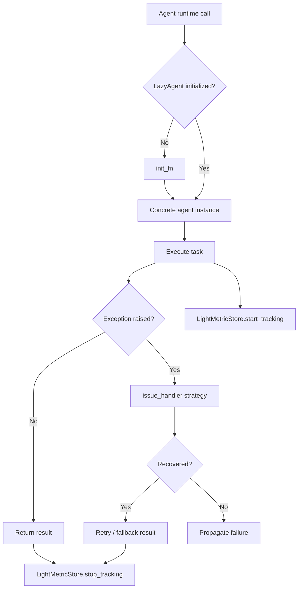

# Base Agent Utilities

This directory contains core runtime primitives reused across SLAI agents:

- lazy initialization (`lazy_agent.py`)
- lightweight performance metrics (`light_metric_store.py`)
- targeted runtime error recovery helpers (`issue_handler.py`)
- shared config and utility helpers (`configs/`, `utils/`)

## Directory structure

```text
base/
├── __init__.py
├── lazy_agent.py
├── light_metric_store.py
├── issue_handler.py
├── configs/
│   ├── agents_config.yaml
│   └── base_config.yaml
└── utils/
    ├── activation_engine.py
    ├── base _transformer.py
    ├── base_tokenizer.py
    ├── chemistry_constraints.py
    ├── config_loader.py
    ├── input_sanitizer.py
    ├── main_config_loader.py
    ├── math_science.py
    ├── numpy_encoder.py
    └── physics_constraints.py
```

## Core components

### `LazyAgent`
A small wrapper that defers object construction until first attribute access.

- Accepts a callable `init_fn`.
- Initializes only once via `_ensure_initialized()`.
- Proxies attribute lookups with `__getattr__`.
- Emits useful diagnostics when initialization fails.

### `LightMetricStore`
A lightweight metric collector for runtime observability.

- Tracks operation timings (`time.perf_counter`).
- Optionally tracks RSS memory deltas (via `psutil`, when available).
- Aggregates per-category metrics and emits JSON snapshots.

### `issue_handler.py`
A set of specialized error-handling functions that attempt mitigation/retry strategies:

- unicode / emoji sanitization
- transient network errors
- memory pressure and timeout handling
- runtime/dependency/resource constraints
- similarity-based fallback for repeated historical errors

## Runtime relationship diagram



## Typical usage

```python
from src.agents.base.lazy_agent import LazyAgent
from src.agents.base.light_metric_store import LightMetricStore

metrics = LightMetricStore()
agent = LazyAgent(init_fn=lambda: MyAgent())

metrics.start_tracking("inference", category="base")
result = agent.run(task)
metrics.stop_tracking("inference", category="base")

print(metrics.get_metrics_summary("base"))
```
