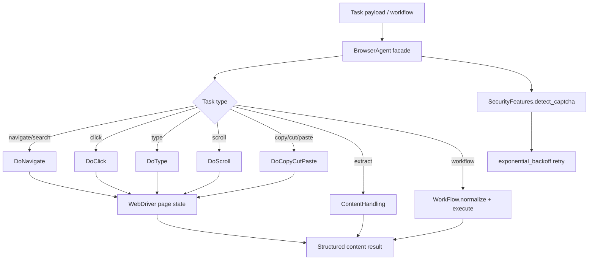

# Browser Agent Subsystem (`src/agents/browser`)

This package contains the Browser Agent’s domain modules used by `src/agents/browser_agent.py`.

It provides browser-facing building blocks for:

- navigation/search orchestration
- click/type/scroll/clipboard interaction primitives
- special content extraction (PDF, arXiv)
- workflow normalization/execution
- lightweight security/retry helpers (e.g., CAPTCHA detection + exponential backoff)

---

## Relationship to `BrowserAgent`

`BrowserAgent` (in `src/agents/browser_agent.py`) is the façade that composes this package’s modules:

- `DoNavigate`
- `DoClick`
- `DoScroll`
- `DoType`
- `DoCopyCutPaste`
- `WorkFlow`
- `ContentHandling`
- `SecurityFeatures`

The agent handles lifecycle, task dispatch (`perform_task`), workflow execution, and retry logic, while this package provides focused subsystem capabilities.

---

## Directory structure

```text
browser/
├── __init__.py
├── README.md
├── content.py
├── security.py
├── utils.py
├── workflow.py
├── configs/
│   └── browser_config.yaml
├── functions/
│   ├── __init__.py
│   ├── do_click.py
│   ├── do_copy_cut_paste.py
│   ├── do_navigate.py
│   ├── do_scroll.py
│   └── do_type.py
└── utils/
    ├── __init__.py
    └── config_loader.py
```

> Note: both `utils.py` and `utils/` exist and serve different purposes (`utils.py` for interaction helpers, `utils/config_loader.py` for config loading).

---

## Architecture and execution flow



---

## Core modules

### `workflow.py` (`WorkFlow`)
- normalizes workflow scripts into canonical `{action, params}` steps
- validates action names against a strict supported-action set
- keeps workflow handling driver-agnostic and thin

### `content.py` (`ContentHandling`)
- `handle_pdf(url)`: downloads and extracts PDF text (truncated preview)
- `handle_arxiv(driver)`: extracts arXiv abstract when available
- `postprocess_if_special(result, driver)`: conditionally enriches extracted content for special URLs

### `security.py`
- `SecurityFeatures.detect_captcha(driver)`: checks page source for CAPTCHA indicators
- `exponential_backoff(retries)`: basic retry delay utility (`2 ** retries`)

### `utils.py` (`Utility`)
- human-like typing and clicking helpers (`human_type`, `human_click`)
- query-term-based best-link selector (`select_link`)

### `utils/config_loader.py`
- cached YAML config loading (`load_global_config`)
- section retrieval helper (`get_config_section`)

---

## `functions/` package

Browser interaction primitives are implemented in `src/agents/browser/functions/`.

See detailed function-level documentation here:

- [`functions/README.md`](./functions/README.md)

---

## Typical task shapes consumed by `BrowserAgent`

```python
{"task": "navigate", "url": "https://example.com"}
{"task": "search", "query": "selenium python"}
{"task": "click", "selector": "button.submit"}
{"task": "type", "selector": "input[name='q']", "text": "alignment research"}
{"task": "scroll", "mode": "direction", "direction": "down", "amount": 300}
{"workflow": [{"action": "navigate", "params": {"url": "https://example.com"}}]}
```

---

## Maintainer notes

- Keep function return payloads consistent (`status`, `message`, optional action metadata).
- Preserve backward compatibility for task keys used by `perform_task` and workflow scripts.
- If new actions are added, update:
  1. `WorkFlow.SUPPORTED_ACTIONS`
  2. `BrowserAgent.execute_workflow(...)`
  3. `BrowserAgent.perform_task(...)`
  4. this README and `functions/README.md`
