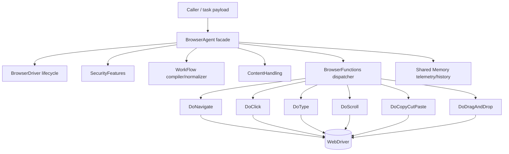
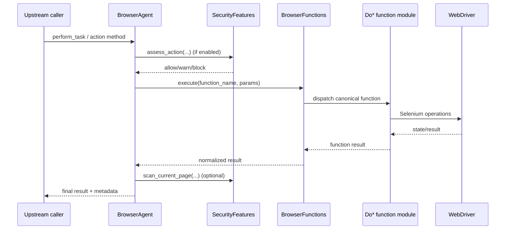

# Browser Agent Subsystem (`src/agents/browser`)

This package contains the browser-domain runtime used by `src/agents/browser_agent.py`.

As of the latest Base Agent update, the architecture is intentionally split into:

- **`BrowserAgent` (facade/orchestrator)**: lifecycle, policy, retries, task routing, security gates, workflow compile/execute decisions, and shared-memory publication.
- **`BrowserFunctions` (function dispatcher)**: canonical function registry, alias normalization, execution contracts, and delegation to concrete function modules.
- **Concrete function modules (`functions/`)**: Selenium interaction logic only (navigate/click/type/scroll/clipboard/drag-drop).

---

## What changed conceptually

Historically, docs often described `BrowserAgent` as directly coordinating all `Do*` modules. That is now **one layer too low**.

The current flow is:

1. `BrowserAgent` receives a task or workflow.
2. `BrowserAgent` applies agent policy (guards/retries/workflow compile/search behavior/etc.).
3. `BrowserAgent` calls into `BrowserFunctions`.
4. `BrowserFunctions` resolves aliases + dispatches to a concrete `Do*` module.
5. Results are normalized and returned to `BrowserAgent` for optional security/reporting/shared-memory publication.

---

## High-level architecture



---

## Directory structure

```text
browser/
├── __init__.py
├── README.md
├── browser_functions.py        # function registry + aliasing + dispatch
├── browser_memory.py           # optional memory store for function/content/security traces
├── content.py                  # content extraction / post-processing
├── security.py                 # URL/action/page safety assessments
├── utilities.py                # helper utilities used by browser subsystem
├── workflow.py                 # workflow normalize/compile/dry-run interfaces
├── configs/
│   └── browser_config.yaml
├── templates/
│   └── indicators.json
├── functions/
│   ├── __init__.py
│   ├── do_click.py
│   ├── do_copy_cut_paste.py
│   ├── do_drag_and_drop.py
│   ├── do_navigate.py
│   ├── do_scroll.py
│   └── do_type.py
└── utils/
    ├── __init__.py
    ├── Browser_helpers.py
    ├── browser_driver.py
    ├── browser_errors.py
    └── config_loader.py
```

---

## Module responsibilities (current)

### `browser_functions.py` (`BrowserFunctions`)

Primary responsibilities:

- Build and maintain a **canonical function registry** (`navigate`, `click`, `type`, `scroll`, etc.).
- Normalize external names via alias map (e.g. `open_url` -> `navigate`, `click_element` -> `click`).
- Own component composition for function modules around the active driver.
- Execute single function calls, generic task payloads, and workflows with unified result envelopes.
- Optionally record action/workflow outcomes to `BrowserMemory`.
- Provide convenience browser functions like `screenshot`, `extract_page`, and `page_state` at orchestration level.

### `functions/*` (concrete interaction primitives)

Each module contains low-level Selenium interaction behavior + typed options/request/context dataclasses. They do **not** own orchestration policy.

- `do_navigate.py`: URL normalization, navigation controls, load verification, navigation history.
- `do_click.py`: robust clicking with wait/strategy fallbacks.
- `do_type.py`: typing/clearing/key submission strategies and verification.
- `do_scroll.py`: by/to/direction/element/percentage/page/end scrolling modes.
- `do_copy_cut_paste.py`: clipboard-aware copy/cut/paste strategies with verification.
- `do_drag_and_drop.py`: drag-target or drag-by-offset execution.

### `security.py` (`SecurityFeatures`)

Protective scanning and policy decisions:

- assess navigation URLs
- assess action payload risk
- scan current page (captcha/bot/rate-limit/login-wall/sensitive markers)
- emit structured decisions (`allow` / `warn` / `block`)

### `content.py` (`ContentHandling`)

Extraction/post-processing for page content and special result types, bounded by config (timeouts, limits, retries, metadata inclusion, etc.).

### `workflow.py` (`WorkFlow`)

Normalizes and compiles workflow definitions into executable browser steps. `BrowserAgent` chooses compile/dry-run behavior; `BrowserFunctions` executes steps.

### `utils/browser_driver.py` (`BrowserDriver`)

Single owner of browser driver lifecycle:

- startup / attach / detach / restart / close
- health/state reporting
- ownership semantics

---

## BrowserAgent integration contract

`BrowserAgent` uses this package with strict boundaries:

- **Lifecycle:** via `BrowserDriver` only.
- **Execution:** via `BrowserFunctions.execute(...)` / `execute_workflow(...)`.
- **Security:** pre-action/post-action gates through `SecurityFeatures`.
- **Content:** optional post-extraction enrichment through `ContentHandling`.
- **Observability:** compact execution history + shared-memory publication.

It should not directly re-implement module internals that already exist in `functions/*` or `BrowserFunctions`.

---

## Execution sequence (single action)



---

## Maintaining consistency when adding features

When introducing a new browser action or alias, update all relevant layers:

1. Concrete implementation in `functions/` (or orchestration-only helper in `BrowserFunctions`).
2. Registration/alias mapping in `BrowserFunctions`.
3. `BrowserAgent` task routing aliases if user-facing task names should map to it.
4. Workflow supported actions where applicable.
5. Documentation:
   - this file (`src/agents/browser/README.md`)
   - function-level docs (`src/agents/browser/functions/README.md`)

This keeps agent-level docs aligned with the actual runtime boundaries.
