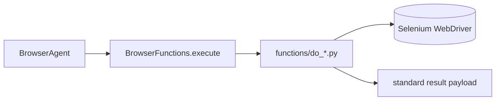

# Browser Functions Modules (`src/agents/browser/functions`)

This folder contains the **concrete Selenium interaction primitives** used by `BrowserFunctions`.

These modules are intentionally focused on action execution (click/type/scroll/etc.) and should not own:

- browser lifecycle management (handled by `BrowserDriver` via `BrowserAgent`)
- global task orchestration and alias routing (handled by `BrowserFunctions`)
- high-level security policy decisions (handled by `SecurityFeatures`)

---

## How this folder is used

Each module exposes:

- a `Do*` executor class
- config/options dataclass
- request/context dataclasses for deterministic behavior + diagnostics
- stable return payloads (`status`, `message`, `data`/`error`, metadata)

---

## Module index

### `do_navigate.py`

**Purpose:** Navigation and navigation-state operations.

Key capabilities:

- `navigate`, `go_to_url`, `open_url`
- `back`, `forward`, `refresh`
- `get_current_url`, `get_current_title`
- navigation history retrieval and clear
- load-state waiting and optional verification
- URL preparation/validation and safe redaction

Primary dataclasses:

- `NavigateOptions`
- `NavigationRequest`
- `NavigationState`
- `NavigationHistoryEntry`

---

### `do_click.py`

**Purpose:** Click execution with retries, wait behavior, and strategy fallback.

Typical responsibilities:

- resolve element by selector
- ensure visibility/clickability (as configured)
- attempt click using preferred strategy chain
- capture pre/post state and emit structured success/error payloads

Primary dataclasses include click options/request/execution context objects.

---

### `do_type.py`

**Purpose:** Text entry and key interaction.

Key capabilities:

- `type_text`, `append_text`, `clear_text`
- key actions (`press_key`, `submit`)
- strategy chains for clear/type operations
- focus/visibility/writable checks
- optional post-type verification

Primary dataclasses:

- `TypeOptions`
- `TypeRequest`
- `TypeExecutionContext`

---

### `do_scroll.py`

**Purpose:** Scrolling in multiple semantic modes.

Supported operation styles:

- coordinate scrolling (`to`, `by`)
- directional scrolling (`up/down/left/right`)
- element into view
- top/bottom/percentage/page semantics
- repeat-until-end behavior with stop conditions

Primary dataclasses:

- `ScrollOptions`
- `ScrollRequest`
- `ScrollState`
- `ScrollExecutionContext`

---

### `do_copy_cut_paste.py`

**Purpose:** Clipboard and text-edit actions with verification.

Key capabilities:

- `copy`, `cut`, `paste`
- keyboard/js/native strategy support per action
- optional clipboard read/write integration
- element preparation and writable checks
- state capture + result verification

Primary dataclasses:

- `ClipboardOptions`
- `ClipboardRequest`
- `ClipboardExecutionContext`

---

### `do_drag_and_drop.py`

**Purpose:** Drag-and-drop interactions.

Key capabilities:

- drag source to target selector
- drag source by offset (`offset_x`, `offset_y`)
- configurable drag strategies and validation
- structured diagnostics and normalized result payloads

Primary dataclasses:

- `DragAndDropOptions`
- `DragAndDropRequest`
- `DragAndDropExecutionContext`

---

## Public exports

`__init__.py` re-exports the module classes/dataclasses and normalizer helpers so `BrowserFunctions` can import from one place.

If you add a new function module, update:

1. `src/agents/browser/functions/__init__.py` exports
2. `src/agents/browser/browser_functions.py` registration + alias mapping
3. docs in this README and `src/agents/browser/README.md`

---

## Design expectations for new function modules

To stay consistent with existing modules:

- Keep action logic local to the module (do not move orchestration into `BrowserAgent`).
- Use typed options/request/context dataclasses for deterministic behavior and testability.
- Return structured browser-domain results instead of ad-hoc dicts.
- Normalize/validate user inputs early (selectors, timeouts, modes, directions, keys).
- Include bounded, safe diagnostics (avoid leaking sensitive raw content).
- Reuse shared helper/error utilities from `src/agents/browser/utils/`.

This keeps the function layer composable, debuggable, and stable under `BrowserFunctions` dispatch.
