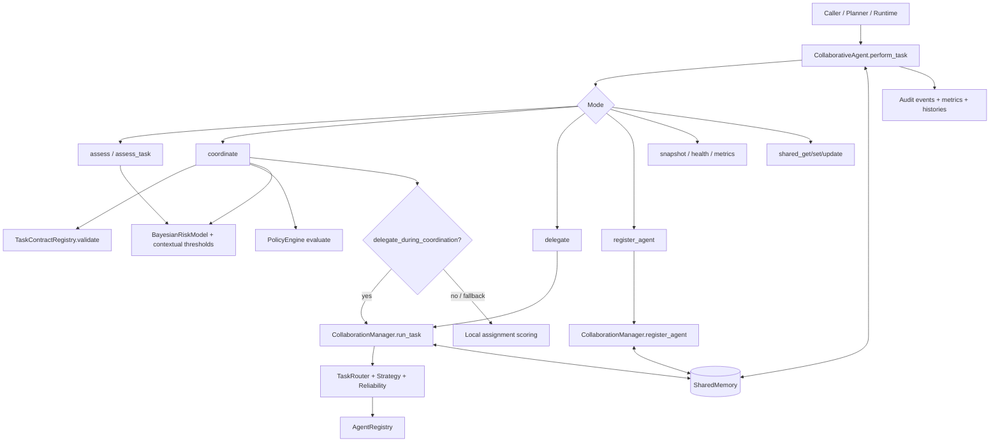
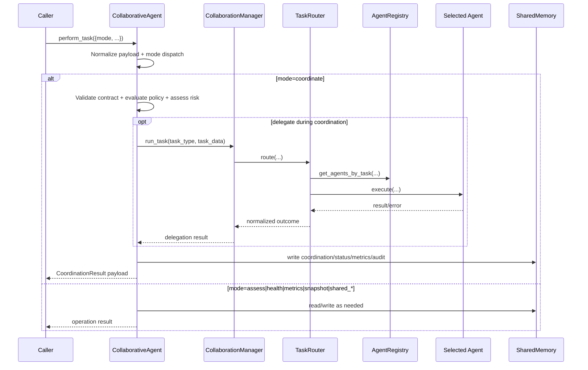

# Collaborative Runtime (`src/agents/collaborative`)

This package contains SLAI's **collaborative subsystem internals**: registry, routing, policy/contract enforcement, reliability, and shared-memory primitives.

As of the latest `CollaborativeAgent` update, this folder is now best understood as:

1. **Subsystem layer** (this directory): reusable collaboration building blocks.
2. **Agent-facing orchestration layer** (`src/agents/collaborative_agent.py`): a BaseAgent-compatible coordinator that composes these building blocks and exposes operational modes such as `assess`, `coordinate`, `delegate`, `health`, `metrics`, and shared-memory operations.

---

## What lives in this directory

- `collaboration_manager.py` — top-level subsystem facade used by `CollaborativeAgent` for registration/delegation and manager telemetry.
- `registry.py` — dynamic in-memory registry/discovery of agent instances and capabilities.
- `task_router.py` — capability-aware routing and execution selection.
- `task_contracts.py` — declarative task schemas/validators used before assignment/delegation.
- `policy_engine.py` — prioritized allow/deny/review policy rules.
- `router_strategy.py` — ranking strategies (e.g., weighted and least-loaded).
- `reliability.py` — retry/backoff and circuit-breaker protections.
- `shared_memory.py` — thread/process-safe shared state with TTL/versioning/pub-sub/CAS/metrics.
- `utils/collaboration_error.py` — typed collaboration exceptions + audit/report utilities.
- `utils/collaborative_helpers.py` — normalization, result shaping, redaction, memory wrappers, metrics/audit helpers.
- `configs/collaborative_config.yaml` — collaborative runtime tuning.

> Note: `src/agents/collaborative_agent.py` intentionally **does not own** low-level router/registry/reliability internals. It composes this subsystem through `CollaborationManager` and local policy/contract/risk orchestration.

---

## Updated architecture (Agent facade + collaborative subsystem)



---

## Responsibilities split (important)

### `CollaborativeAgent` (`src/agents/collaborative_agent.py`)
- BaseAgent-compatible external interface.
- Mode-based dispatch (`assess`, `coordinate`, `delegate`, `register_agent`, `explain`, `snapshot`, `health`, `metrics`, `shared_*`).
- Adaptive Bayesian risk model + contextual thresholding.
- Coordination lifecycle + bounded histories (assessments, coordinations, delegations, metric events).
- Shared memory publication for status, metrics, health, snapshots, and audit events.
- State serialization/deserialization (`serialize_state`, `save_state`, `load_state`).

### Collaborative subsystem (`src/agents/collaborative/*`)
- Manager facade for run/register/list/stats/health/snapshot/export operations.
- Router + strategy + reliability execution mechanics.
- Registry discovery/capability filtering.
- Policy and contract rule execution.
- Shared-memory transport primitives and consistency controls.
- Typed errors and helper utilities.

---

## End-to-end runtime flow



---

## Coordination pipeline details

For each task in a coordination run, `CollaborativeAgent` follows:

1. Normalize task payload and infer `task_type`.
2. Validate task contract (if contract registry is available).
3. Optionally delegate through `CollaborationManager` (config-driven).
4. If not delegated, compute local best-agent score from capability/load/risk/priority weights.
5. Evaluate policy decision (`allow` / `deny` / `require_review`).
6. Perform safety assessment via adaptive thresholding.
7. Emit assignment status:
   - `delegated`
   - `assigned`
   - `assigned_with_review`
   - `rejected_policy`
   - `rejected_high_risk`
   - `rejected_invalid_contract`
   - `unassigned`
8. Publish bounded artifacts (coordination result, histories, metrics, status, audit event) to shared memory when enabled.

---

## Risk model behavior (new in agent-facing layer)

`CollaborativeAgent` uses a Beta-Binomial-style adaptive model:

- Maintains posterior safety observations per key:
  - `task:<task_type>`
  - `agent:<agent_name>`
- Computes dynamic thresholds from:
  - base configured threshold
  - task posterior threshold
  - agent posterior threshold
  - contextual threshold adjustments (e.g., privileged actions, sensitive data)
- Maps risk to levels/actions:
  - `low` → proceed
  - `moderate` → proceed with guardrails
  - `high` → human review
  - `critical` → halt and escalate

This enables risk tolerance to adapt over time while staying bounded by configured min/max thresholds.

---

## Configuration map

Primary knobs are split across agent-level and subsystem-level config sections:

- **Agent-facing (`collaborative_agent`)**
  - Enablement flags for manager/policy/contracts.
  - Coordination toggles (delegate during coordination, local fallback).
  - Risk + Bayesian parameters.
  - Scoring weights (capability/load/risk/priority).
  - History limits and shared-memory keys.
  - Audit/status publication + redaction controls.

- **Subsystem (`collaboration`, `collaboration_manager`, `task_routing`, `reliability`, `shared_memory`)**
  - Manager concurrency/load/threading.
  - Router strategy and retry behavior.
  - Reliability and circuit-breaker behavior.
  - Shared-memory capacity/TTL/versioning/perf settings.

---

## Minimal usage examples

### 1) Use `CollaborativeAgent` (recommended entry point)

```python
from src.agents.collaborative_agent import CollaborativeAgent
from src.agents.collaborative.shared_memory import SharedMemory

memory = SharedMemory()
agent = CollaborativeAgent(shared_memory=memory)

result = agent.perform_task(
    {
        "mode": "coordinate",
        "tasks": [{"id": "t1", "type": "echo_task", "payload": {"message": "hello"}}],
        "available_agents": {
            "EchoAgent": {
                "capabilities": ["echo_task"],
                "current_load": 0,
                "priority": 5,
            }
        },
        "constraints": {"external_user": False},
    }
)

print(result)
```

### 2) Use `CollaborationManager` directly (subsystem-level)

```python
from src.agents.collaborative.collaboration_manager import CollaborationManager
from src.agents.collaborative.shared_memory import SharedMemory

class EchoAgent:
    def execute(self, data):
        return {"echo": data}

memory = SharedMemory()
manager = CollaborationManager(shared_memory=memory)
manager.register_agent("Echo", EchoAgent(), capabilities=["echo_task"])

result = manager.run_task("echo_task", {"message": "hello"}, retries=2)
print(result)
print(manager.get_agent_stats())
```

---

## Operational notes

- Prefer `CollaborativeAgent` when integrating with SLAI's agent runtime and BaseAgent interface.
- Use `CollaborationManager` directly for subsystem-only orchestration/testing.
- Keep policy and contract semantics in their dedicated modules; avoid duplicating logic in callers.
- Shared-memory payloads and audit events are designed to be JSON-safe and optionally redacted for operational safety.
- Manager and agent snapshots/health endpoints are intended for observability, not just debugging.
