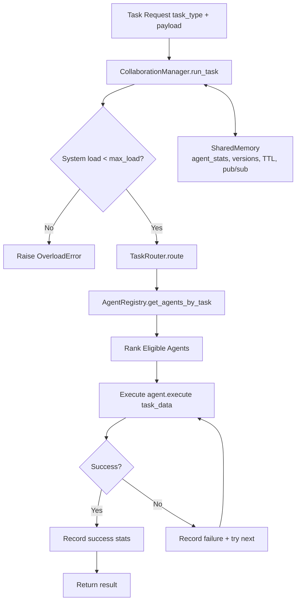
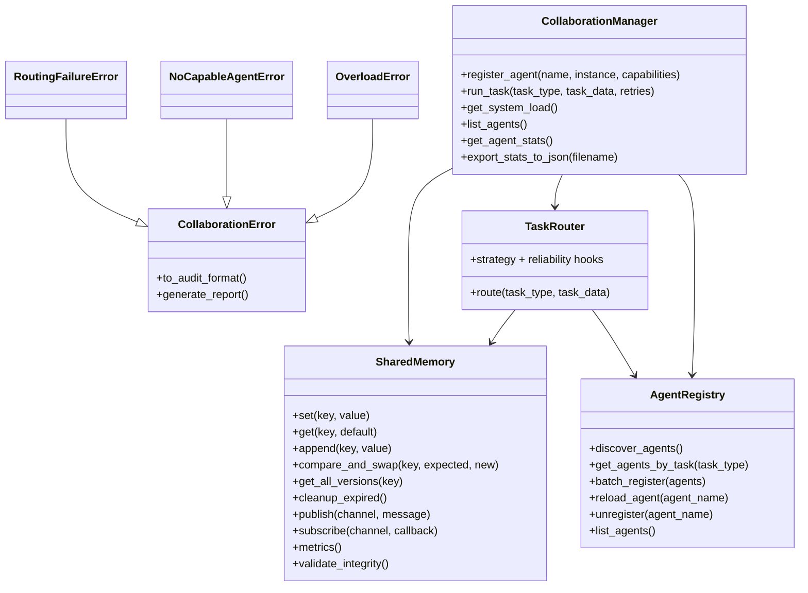

# Collaborative Agent Module

This directory provides SLAI's multi-agent coordination layer: **agent registration**, **capability-based routing**, **shared runtime memory**, and **operational/error telemetry**.

## What lives here

- `collaboration_manager.py` — top-level orchestration facade for registering agents and running tasks.
- `registry.py` — dynamic discovery and in-memory registry of agent metadata/capabilities.
- `task_router.py` — selects and executes eligible agents with ranking + fallback attempts.
- `shared_memory.py` — thread-safe/process-safe memory fabric (TTL/versioning/pub-sub/CAS/metrics).
- `task_contracts.py` — declarative task schemas/contracts with type + validator checks.
- `policy_engine.py` — prioritized policy rules for allow/deny/review decisions.
- `router_strategy.py` — pluggable ranking strategies (weighted / least-loaded).
- `reliability.py` — retry/backoff and circuit-breaker protections per agent.
- `utils/collaboration_error.py` — typed collaboration exceptions + audit report generation.
- `configs/collaborative_config.yaml` — runtime tuning for load, routing, registry, and shared memory.

---

## Runtime flow



---

## Component architecture



---

## Shared memory capabilities

`shared_memory.py` is more than a key-value map. It supports:

- TTL-based entries and periodic expiry cleanup.
- Version history (`get_all_versions`) and snapshot access.
- Atomic update patterns (`compare_and_swap`, `increment`).
- Publish/subscribe callbacks (`publish`, `subscribe`, `notify`).
- Prioritized queue-style retrieval.
- Persistence (`save_to_file`, `load_from_file`) and integrity validation.
- Optional manager-backed multi-process access via `SharedMemoryManager`.

---

## Configuration map

`configs/collaborative_config.yaml` controls orchestration behavior:

- `collaboration`: max concurrency, load factor, thread pool sizing.
- `task_routing`: risk threshold, retries/backoff, fallback plans.
- `task_contracts`/`policy`: optional sections for contract + policy tuning in agent-level config overrides.
- `reliability`: circuit-breaker and retry/backoff defaults.
- `task_routing.strategy`: select router behavior (`weighted`, `least_loaded`).
- `registry`: discovery defaults and exclusion rules.
- `shared_memory`: memory limits, version cap, TTL and latency knobs.
- `agents`: default priority + task limits.
- `paths`: output and cross-module config paths.

---

## Minimal usage

```python
from src.agents.collaborative.collaboration_manager import CollaborationManager
from src.agents.collaborative.shared_memory import SharedMemory

class EchoAgent:
    def execute(self, data):
        return {"echo": data}

memory = SharedMemory()
manager = CollaborationManager(shared_memory=memory)

manager.register_agent("Echo", EchoAgent(), capabilities=["echo_task"])
result = manager.run_task("echo_task", {"message": "hello"}, retries=2)

print(result)
print(manager.get_agent_stats())
```

---

## Operational notes

- `CollaborationManager.max_load` scales with registered agent count and `load_factor`.
- Routing is capability-driven; if one agent fails, the router attempts alternatives.
- Collaboration errors can be serialized into machine-readable audit reports.
