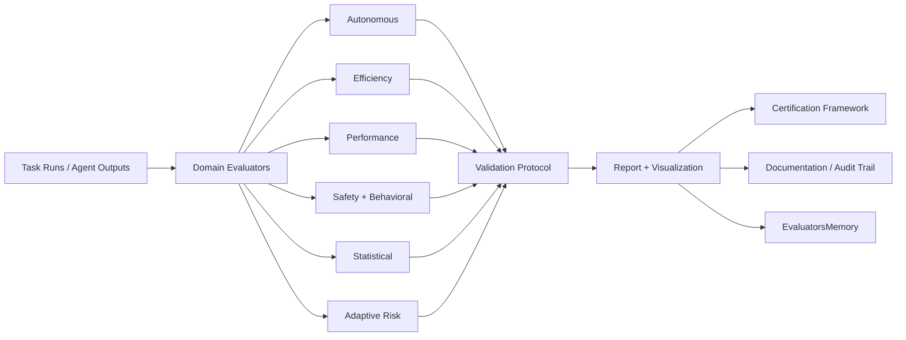
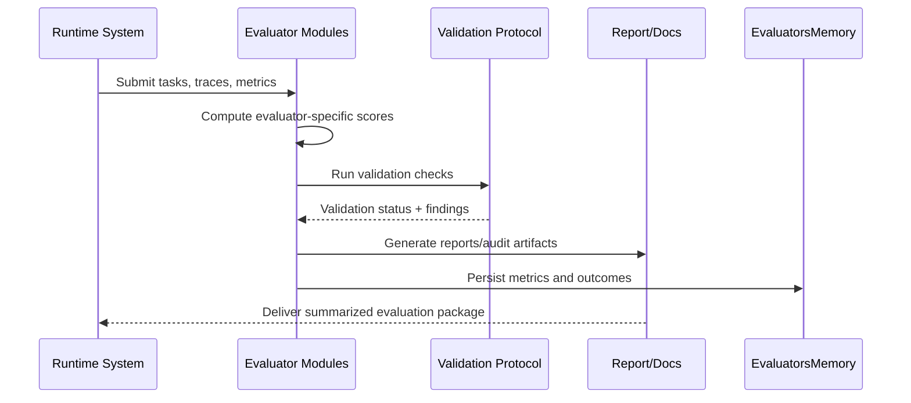

# Evaluators Subsystem

## Overview
The `src/agents/evaluators/` package provides autonomous assessment, risk estimation, statistical analysis, and validation/report tooling for SLAI behaviors and task outcomes.

It includes:

- **Task and autonomy evaluators** (`autonomous_evaluator.py`, `performance_evaluator.py`)
- **Efficiency and utilization evaluators** (`efficiency_evaluator.py`, `resource_utilization_evaluator.py`)
- **Safety/risk and behavior checks** (`safety_evaluator.py`, `adaptive_risk.py`, `behavioral_validator.py`)
- **Statistical analysis** (`statistical_evaluator.py`)
- **Persistence + infrastructure** (`evaluators_memory.py`, `base_infra.py`)
- **Validation/report/certification utilities** (`utils/`)

---

## Directory Structure

```text
src/agents/evaluators/
├── __init__.py
├── autonomous_evaluator.py
├── performance_evaluator.py
├── efficiency_evaluator.py
├── resource_utilization_evaluator.py
├── safety_evaluator.py
├── adaptive_risk.py
├── statistical_evaluator.py
├── behavioral_validator.py
├── evaluators_memory.py
├── base_infra.py
├── configs/
│   └── evaluator_config.yaml
├── templates/
│   ├── audit_schema.json
│   ├── certification_templates.json
│   └── recommendation_template.json
└── utils/
    ├── __init__.py
    ├── config_loader.py
    ├── evaluators_calculations.py
    ├── evaluation_errors.py
    ├── evaluation_transformer.py
    ├── validation_protocol.py
    ├── report.py
    ├── documentation.py
    ├── certification_framework.py
    ├── plugin_loader.py
    └── static_analyzer.py
```

---

## Evaluation Architecture



---

## Core Modules

### Evaluators
- `autonomous_evaluator.py`: evaluates robotics/planning-style tasks (completion, path quality, collisions, energy, success rates).
- `efficiency_evaluator.py`: analyzes operational efficiency metrics and optimization opportunities.
- `performance_evaluator.py`: tracks broader runtime/quality performance signals.
- `resource_utilization_evaluator.py`: evaluates compute/resource usage and allocation patterns.
- `safety_evaluator.py`: applies safety-centric constraints and checks.
- `adaptive_risk.py`: estimates risk dynamically from observed conditions.
- `statistical_evaluator.py`: computes aggregate/distributional metrics and analytical summaries.
- `behavioral_validator.py`: validates behavioral policy adherence and consistency.

### Utility Layer (`utils/`)
- `validation_protocol.py`: shared protocol/hooks for validation staging.
- `report.py`: report assembly and visualization support.
- `documentation.py`: audit-ready documentation components (including chain/block style artifacts).
- `certification_framework.py`: certification-oriented policies and decisions.
- `evaluation_transformer.py`: data transformation for evaluation pipelines.
- `evaluation_errors.py`: typed evaluator exceptions.
- `evaluators_calculations.py`: reusable metric computations.

---

## End-to-End Flow



---

## Notes

- Global evaluator behavior is configured via `configs/evaluator_config.yaml` and `utils/config_loader.py`.
- Templates under `templates/` support schema-driven audit and certification workflows.
- The subsystem is designed to support both online evaluation and post-run audit/report generation.
