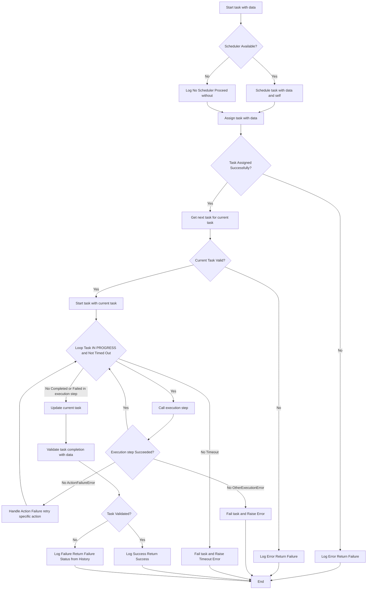
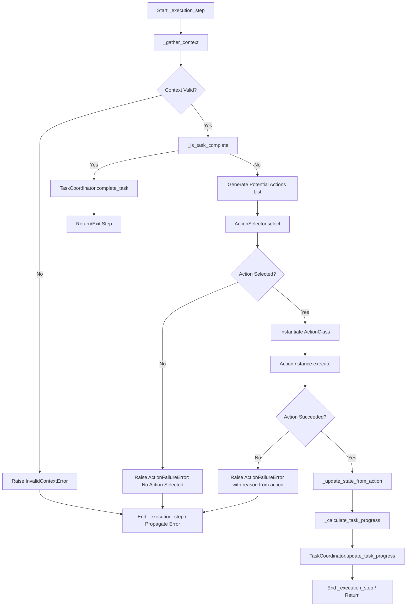

# AI Execution Agent System

## Overview

This system defines a sophisticated AI Execution Agent designed to perform tasks in a dynamic environment. The agent operates by perceiving its surroundings (context gathering), selecting appropriate actions based on its current state and goals, and executing those actions. It features robust task management, state persistence, error handling, and a flexible action selection mechanism.

The system is built with modularity in mind, allowing for easy extension of actions, strategies, and agent capabilities.

## Core Concepts & Academic Foundations

The agent's design draws upon several established AI concepts:

1.  **Behavior Trees (BTs):** The agent's main execution loop (`perform_task` -> `_execution_step`) where it repeatedly gathers context, selects an action, and executes it, mirrors the fundamental cycle of a behavior tree. The `ActionSelector` acts as a sophisticated selector node within this implicit tree.
2.  **Finite State Machines (FSMs):** The agent's internal state (e.g., `hand_empty`, `at_destination`, `energy_level`) and the action postconditions that modify this state represent a form of FSM. Actions trigger transitions between these states.
3.  **Utility-Based AI:** The `ActionSelector`'s "utility" and "hybrid" strategies are direct implementations of utility theory. The agent calculates the expected utility of various actions based on the current context and chooses the one that maximizes this utility. (Reference: "Artificial Intelligence: A Modern Approach" by Russell and Norvig).
4.  **Planning & Scheduling:** The `DeadlineAwareScheduler` incorporates concepts like Earliest Deadline First (EDF) and capability matching, common in real-time systems and multi-agent planning.
5.  **State Management & Persistence:** `ExecutionMemory` provides robust mechanisms for caching, checkpointing, and cookie management, crucial for long-running or resumable agent operations.

## Real-World Applications

This agent architecture is suitable for a variety of applications:

*   **Robotics & Automation:** Autonomous navigation (`MoveToAction`), object manipulation (`PickObjectAction`), and energy management (`IdleAction`) are directly applicable to mobile robots, warehouse automation, or domestic service bots.
*   **Gaming (NPCs):** Creating intelligent Non-Player Characters that can navigate complex environments, interact with objects, and make decisions under uncertainty.
*   **Simulation Environments:** Modeling autonomous entities in complex simulations where stateful decision-making and task execution are required.
*   **Complex Task Management:** Systems where tasks have dependencies, require specific capabilities, involve risk assessment, and need robust retry/fallback mechanisms (e.g., manufacturing, logistics).

## Key Components

*   **`ExecutionAgent` (in `execution_agent.py`):**
    *   The central orchestrator. It receives high-level tasks, manages its internal state, and uses its sub-components to execute these tasks.
    *   Its core logic resides in the `perform_task` method and the `_execution_step` loop.
*   **`BaseAgent` (in `base_agent.py`):**
    *   The parent class providing foundational capabilities like robust error handling (including retries, known issue handling, alternative execution paths), logging, metric tracking, and lazy component initialization.
*   **`TaskCoordinator` (in `task_coordinator.py`):**
    *   Manages the lifecycle of tasks (pending, in_progress, completed, failed, cancelled).
    *   Handles task dependencies, retries, timeouts, and progress tracking.
*   **`ActionSelector` (in `action_selector.py`):**
    *   Responsible for choosing the most appropriate action from a list of available actions based on the current context and a configured strategy (e.g., priority-based, utility-based, hybrid).
*   **`BaseAction` (in `base_action.py`) & Subclasses (`MoveToAction`, `PickObjectAction`, `IdleAction`):**
    *   Define specific, executable behaviors.
    *   Each action has preconditions (what must be true to execute), postconditions (what becomes true after execution), a cost, and its own execution logic.
*   **`ExecutionMemory` (in `execution_memory.py`):**
    *   Provides multi-level caching (in-memory, disk), versioned checkpointing for saving/restoring agent state, and secure cookie management. Utilizes compression for efficiency.
*   **`DeadlineAwareScheduler` (in `task_scheduler.py`):**
    *   Used by the `ExecutionAgent` to perform an initial scheduling assessment for a given task, considering agent capabilities, task deadlines, and risk.
*   **`ExecutionError` (in `execution_error.py`) & Subclasses:**
    *   A hierarchy of custom exceptions for detailed error reporting and handling within the execution flow.
*   **`ExecutionManager` (in `execution_manager.py`):**
    *   A higher-level component designed to execute predefined workflows of actions. It seems to offer an alternative way to orchestrate actions compared to the `ExecutionAgent`'s more dynamic, context-driven loop. The primary focus of this README is the `ExecutionAgent`.
*   **Configuration (`config_loader.py`, `execution_config.yaml`):**
    *   System behavior is largely configurable via YAML files, allowing for easy tuning without code changes.

## Workflow / Execution Loop

The `ExecutionAgent`'s primary job is to complete a given task. This is orchestrated by the `perform_task` method, which internally calls `_execution_step` repeatedly.

### 1. High-Level Task Performance (`ExecutionAgent.perform_task`)

---

### 2. Core Execution Step (`ExecutionAgent._execution_step`)

This is the heart of the agent's decision-making and action cycle.

