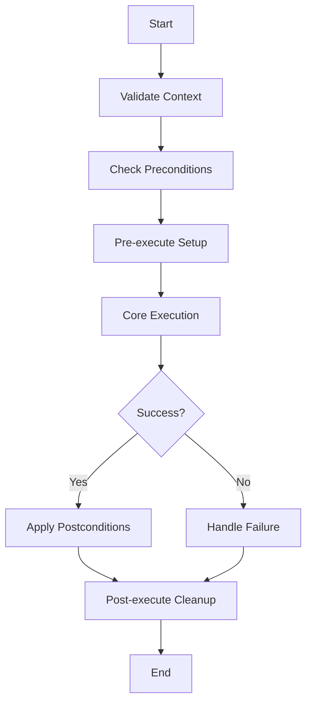

```mermaid
flowchart TD
A[Start] --> B[Validate Context]
B --> C[Check Preconditions]
C --> D[Pre-execute Setup]
D --> E[Core Execution]
E --> F{Success?}
F -->|Yes| G[Apply Postconditions]
F -->|No| H[Handle Failure]
G --> I[Post-execute Cleanup]
H --> I
I --> J[End]
```
