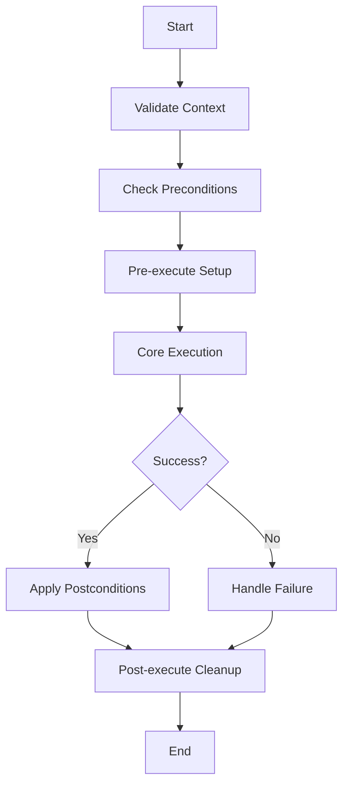

# Execution Actions

This directory contains concrete `BaseAction` implementations used by `ExecutionAgent`.

## Action lifecycle

All actions follow the base lifecycle:

## Current actions

- `move_to.py`
  - Navigation action using A* pathfinding over `map_data`.
  - Requires: `current_position`, `destination`, `map_data`, and precondition `has_destination`.
  - Validation behavior:
    - Feasibility is enforced by `ExecutionValidator` before execution.
    - `move_to` is **not** constrained by `max_object_distance`; that limit is for manipulation actions.
    - Destination bounds are validated against `map_data` dimensions when map data exists.
- `pick_object.py`
  - Manipulation action to acquire an object.
  - Uses manipulation-distance checks (via validator) and grasp constraints.
- `place_object.py`
  - Manipulation action to place the held object.
  - Requires object possession and valid place context.
- `idle.py`
  - Recovery/safety action for rest, cooldown, or fallback behavior.

## Recovery/selection interplay

- If a `move_to` failure is classified as unreachable and recovery cannot change movement preconditions, recovery returns failure and marks `move_to` disallowed for the retry context.
- `ActionSelector` then filters out disallowed actions, preventing repeated selection of the same impossible `move_to` in the same execution retry cycle.
