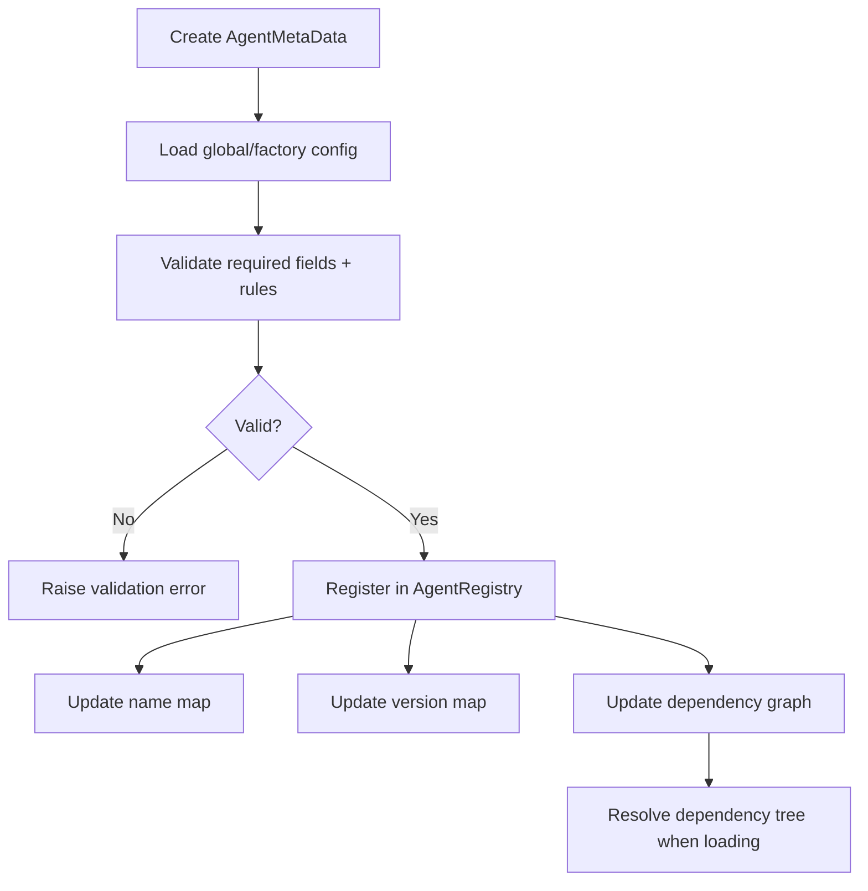
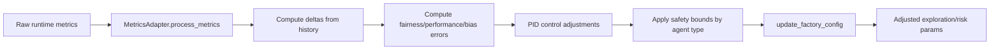

# Factory Module

This module provides the metadata and adaptation layer used to register agent implementations and dynamically tune behavior based on runtime metrics.

## Directory structure

```text
factory/
├── __init__.py
├── agent_meta_data.py
├── metrics_adapter.py
├── configs/
│   └── factory_config.yaml
└── utils/
    └── config_loader.py
```

## Core components

- `AgentMetaData` (`agent_meta_data.py`)
  - Dataclass that describes an agent (name, class path, version, dependencies).
  - Loads default metadata validation constraints from config.
  - Validates required fields, name constraints, and module path policy.

- `AgentRegistry` (`agent_meta_data.py`)
  - In-memory registry for `AgentMetaData` entries.
  - Tracks version index and dependency graph.
  - Supports dependency resolution order for loading agents.

- `MetricsAdapter` (`metrics_adapter.py`)
  - Processes fairness/performance/bias metrics.
  - Applies PID-style control adjustments.
  - Enforces per-agent safety bounds before updates are applied.
  - Can update selected factory-managed runtime parameters.

- Config loaders (`utils/config_loader.py`)
  - Shared utility to read and access `factory_config.yaml` sections.

## Metadata + registry flow



## Metric adaptation flow


