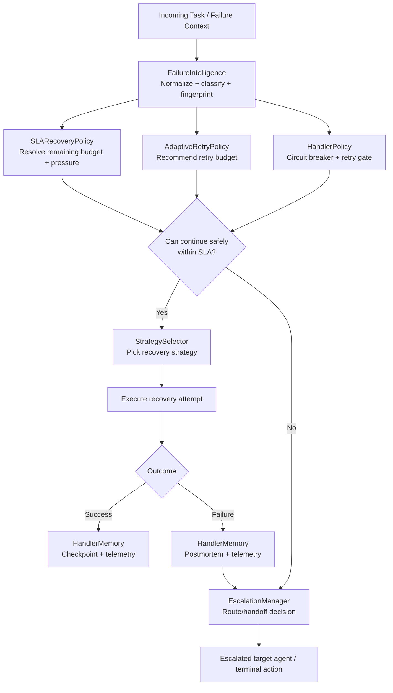

# Handler Agent Subsystem (`src/agents/handler`)

## Purpose
The Handler subsystem provides a production-oriented resilience layer for SLAI orchestration. It helps the Handler Agent and peer agents make consistent decisions around retries, safeguards, escalation, and postmortem memory while keeping behavior configurable and explainable.

This package is intentionally modular:
- policy and safety controls are separated from
- retry budgeting and strategy selection, which are separated from
- escalation routing and memory retention.

---

## What’s Included

- **`HandlerMemory`** (`handler_memory.py`)  
  Bounded in-process storage for checkpoints, telemetry, and postmortems, with optional mirroring to shared memory.

- **`HandlerPolicy`** (`handler_policy.py`)  
  Retry and circuit-breaker governance with policy decisions and failure-budget controls.

- **`AdaptiveRetryPolicy`** (`adaptive_retry_policy.py`)  
  Dynamic retry budget recommendations based on failure characteristics, confidence, and short-term history.

- **`ProbabilisticStrategySelector`** (`strategy_selector.py`)  
  Strategy ranking/selection support to choose the most suitable recovery path.

- **`SLARecoveryPolicy`** (`sla_policy.py`)  
  SLA-aware attempt/timeboxing decisions, including pressure-aware mode recommendations.

- **`EscalationManager`** (`escalation_manager.py`)  
  Structured handoff decisioning and payload creation for cross-agent escalation.

- **`FailureIntelligence`** (`failure_intelligence.py`)  
  Failure normalization, signatures/fingerprints, category/severity hints, and recommendation scaffolding.

- **Utility layer** (`utils/`)  
  Shared error schema, config loading, normalization/coercion helpers.

---

## Directory Layout

```text
src/agents/handler/
├── __init__.py
├── README.md
├── adaptive_retry_policy.py
├── escalation_manager.py
├── failure_intelligence.py
├── handler_memory.py
├── handler_policy.py
├── sla_policy.py
├── strategy_selector.py
├── configs/
│   └── handler_config.yaml
└── utils/
    ├── __init__.py
    ├── config_loader.py
    ├── handler_error.py
    └── handler_helpers.py
```

---

## System Flow (Decision Pipeline)



---

## Component Responsibilities and Key APIs

## 1) `HandlerMemory`
**Primary role:** bounded resilience memory and forensic traceability.

### Core responsibilities
- Maintains bounded stores for:
  - checkpoints,
  - telemetry events,
  - postmortems.
- Supports lookup/filter/prune/export behavior for operational tooling.
- Applies payload sanitization and size limits.
- Optionally mirrors streams to SharedMemory-like backends.

### Important usage details
- **Constructor config overrides are applied** by deep-merging runtime `config` over the `memory` section from YAML. This keeps environment defaults while allowing targeted runtime tuning.
- Optional shared-memory mirroring can be strict (`require_shared_memory_when_mirroring`) or soft-fail with warnings.

### Representative methods
- `save_checkpoint(...) -> str`
- `get_checkpoint(...) -> Optional[dict]`
- `find_checkpoints(...) -> list[dict]`
- `append_telemetry(...) -> None`
- `recent_telemetry(...) -> list[dict]`
- `append_postmortem(...) -> None`

---

## 2) `HandlerPolicy`
**Primary role:** guardrail enforcement for execution safety.

### Core responsibilities
- Retry gate enforcement.
- Circuit-breaker lifecycle (closed/open/half-open).
- Failure-rate and weighted-failure budget checks.
- Explainable `PolicyDecision` emission for downstream orchestration.

### Typical decision factors
- severity/category/action/retryability,
- rolling window failure density,
- cooldown and half-open probe availability,
- evaluator hook and budget states.

---

## 3) `AdaptiveRetryPolicy`
**Primary role:** right-size retries to avoid both under-recovery and runaway loops.

### Core responsibilities
- Produces recommended retry limits per failure profile.
- Applies modifiers by severity/category/history/confidence.
- Supports suppression under consecutive failures or low-confidence regimes.

---

## 4) `SLARecoveryPolicy`
**Primary role:** keep recovery behavior aligned with time budgets and SLA pressure.

### Core responsibilities
- Resolves SLA budget from context or defaults.
- Computes mode/priority/recommended attempts under pressure.
- Issues structured SLA decisions for orchestration consumers.

### Typical outputs
- `remaining_seconds`, `recommended_attempts`, `mode`, `can_retry`, `priority`,
- plus enriched fields (pressure, recommendation, breach status, metadata).

---

## 5) `ProbabilisticStrategySelector`
**Primary role:** rank and choose recovery strategies with bounded confidence.

### Core responsibilities
- Scores/ranks candidate strategies from normalized failure context.
- Produces deterministic decision payloads for handler execution paths.

---

## 6) `EscalationManager`
**Primary role:** produce consistent escalation routing and handoff payloads.

### Core responsibilities
- Determines if escalation is required.
- Selects target via action/category/recommendation/severity matrices.
- Produces typed, bounded payloads for receiving agents.
- Can optionally emit escalation events to memory.

---

## 7) `FailureIntelligence`
**Primary role:** canonical interpretation of failures before policy/action.

### Core responsibilities
- Normalize raw errors and contexts.
- Assign category/severity/retryability hints.
- Generate deterministic fingerprints/signatures.
- Provide bounded recommendation metadata.

---

## Configuration Model
Configuration is loaded via `utils/config_loader.py` from `configs/handler_config.yaml`.

### Primary sections
- `memory`
- `policy`
- `sla_policy`
- `escalation_manager`
- `adaptive_retry_policy`
- `strategy_selector`
- `failure_intelligence`

### Configuration precedence
1. YAML defaults (global baseline)
2. subsystem-level runtime `config` overrides (constructor input)
3. explicit method-level arguments (where supported)

This precedence model ensures predictable defaults with local override flexibility.

---

## Operational Best Practices
- Use stable labels for checkpoints (`before_*`, `after_*`, `rollback_*`).
- Include correlation IDs in metadata to connect policy, memory, and escalation trails.
- Keep telemetry/postmortem payloads concise and structured.
- Prefer normalized `HandlerError` payloads for external boundaries.
- Treat breaker-open and SLA-breach modes as first-class observability signals.
- Use bounded config values and monitor saturation (deque maxlen churn can hide repeated instability).

---

## Minimal Integration Pattern

```python
from src.agents.handler import (
    HandlerMemory,
    HandlerPolicy,
    SLARecoveryPolicy,
    EscalationManager,
)

memory = HandlerMemory(config={
    "max_checkpoints": 200,
    "max_telemetry_events": 5000,
})
policy = HandlerPolicy(memory=memory)
sla = SLARecoveryPolicy(memory=memory)
escalation = EscalationManager(memory=memory)

# In handler loop:
# 1) normalize failure/context (FailureIntelligence)
# 2) evaluate SLA and retry guardrails
# 3) select strategy + execute
# 4) write telemetry/postmortem and escalate if needed
```

---

## Scope Boundaries
To keep coupling low, this package does **not**:
- execute business-domain task logic,
- persist long-term storage by itself,
- replace upstream orchestration governance.

It provides the reliability primitives that higher-level agents can compose.
