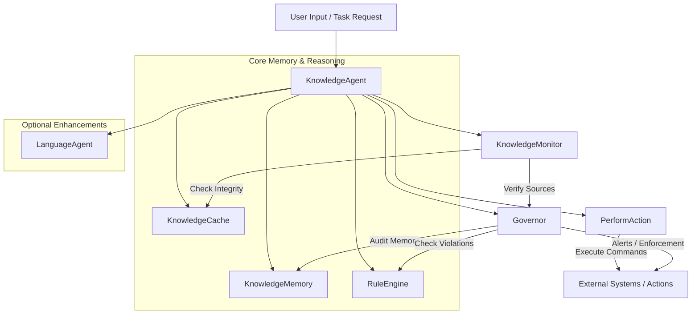

# Knowledge Agent Architecture

---

## Architecture Components

### KnowledgeAgent
Core orchestrator for RAG-style retrieval, ontology management, and inference.
Implements TF-IDF + rule-based inference with ontology support.
Maintains a structured knowledge base (knowledge_agent) and long-term local memory (knowledge_memory).
Integrates a Governor for ethical auditing and a RuleEngine for inference.

### KnowledgeMemory
Local memory unit focused on relevance-weighted, context-aware storage.
Supports TTL-based expiration, metadata filtering, and custom relevance heuristics.
Use .update() to insert knowledge, .recall() to retrieve filtered entries.

### KnowledgeCache

Encrypted LRU cache with semantic hashing support.
Configurable with SimHash/MD5 for query grouping.
Optional AES encryption via cryptography.fernet.

### KnowledgeMonitor
Watches for academic integrity and data tampering.
Validates knowledge sources (papers, datasets) for domain trust and freshness.
Computes and compares integrity hashes.
Raises alerts or quarantines assets if violations are found.

### Governor
Enforces ethical constraints and monitors agent behavior.
Loads principles and restrictions from configurable YAML/JSON guidelines.
Audits memory against rules via the RuleEngine.
Performs real-time and scheduled audits with enforcement actions (alert, restrict, etc.).

### PerformAction
Execution layer that performs actions extracted from documents.
Extracts structured action:type:payload commands.
Executes via HTTP, database, or shell (with sandboxing).
Supports concurrency limits and retry policies.

### RuleEngine
Sector-specific, pluggable rule system for inference.
Supports dynamic rule loading from JSON templates.
Categorizes rules by domain (medical, economic, technological, etc.).
Applies rules either globally or by inferred sector.

---

## Use Cases
- Medical AI: Clinical guideline retrieval, symptom-treatment inference.
- Legal Agents: Cross-reference case law, statute analysis with ethical checks.
- Supply Chains: Predict logistical risks using pattern rules.
- AI Safety: Detect bias, enforce behavior policies, and handle violations.
