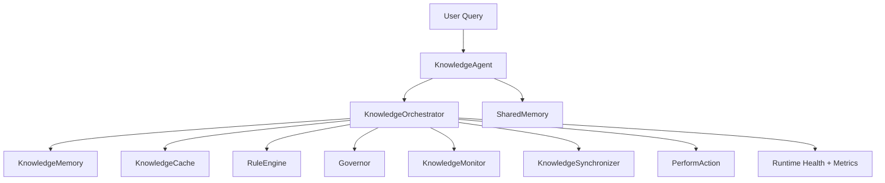

# Knowledge Subsystem Architecture

This folder contains the production knowledge subsystem used by `KnowledgeAgent`.
The system is designed around a **single orchestrator-driven lifecycle** with
clear separation between retrieval, memory, governance, actions, and runtime observability.

---

## Design Goals

- **Single ownership for subsystem lifecycle** (start/stop/health).
- **No double initialization** of core dependencies (cache/governor/action executor).
- **Strong governance defaults** for bias and policy auditing.
- **Consistent shared-memory integration** for cross-agent visibility.
- **Operational readiness** with runtime health and metrics.

---

## Components

### `KnowledgeOrchestrator` (subsystem coordinator)
- Central wiring point for:
  - `KnowledgeMemory`
  - `KnowledgeCache`
  - `RuleEngine`
  - `Governor`
  - `KnowledgeSynchronizer`
  - `KnowledgeMonitor`
  - `PerformAction`
- Exposes lifecycle methods (`start`, `stop`), explicit sync/audit calls, and health snapshots.
- Reduces circular ownership by centralizing subsystem dependency creation/attachment.

### `KnowledgeAgent` (application-level entrypoint)
- Performs retrieval (TF-IDF / dense / hybrid).
- Uses ontology expansion and optional governance/bias checks.
- Publishes retrieval context to shared memory for downstream consumers.
- Delegates subsystem operations to `KnowledgeOrchestrator` where appropriate.

### `KnowledgeMemory`
- Relevance-weighted, context-aware memory with TTL and metadata filtering.
- Supports persistence and retrieval ranking.

### `KnowledgeCache`
- LRU-style cache with configurable hashing and optional encryption hooks.
- Used for fast query-result short-circuiting.

### `Governor`
- Policy and ethics enforcement layer.
- Audits retrieval/memory behavior and tracks violation thresholds.

### `RuleEngine`
- Template-backed rule evaluation and inference.
- Supports domain-specific rule sets and dynamic discovery.

### `KnowledgeMonitor`
- Data-integrity and source-quality checks for knowledge assets.
- Can trigger alert/quarantine behavior based on policy.

### `PerformAction`
- Executes validated action directives extracted from knowledge payloads.
- Handles retry, throttling, and execution logging.

### `runtime/` package (`RTHealth`, `RTMetrics`)
- Health probes (liveness/readiness/component checks).
- Thread-safe metrics collection and Prometheus export.

---

## High-Level Flow

```mermaid
graph TD
    U[User Query] --> KA[KnowledgeAgent]
    KA --> KO[KnowledgeOrchestrator]

    KO --> KM[KnowledgeMemory]
    KO --> KC[KnowledgeCache]
    KO --> RE[RuleEngine]
    KO --> GOV[Governor]
    KO --> MON[KnowledgeMonitor]
    KO --> SYNC[KnowledgeSynchronizer]
    KO --> ACT[PerformAction]

    KA --> SHM[SharedMemory]
    KO --> RT[Runtime Health + Metrics]
```

---

## Shared Memory Conventions (recommended keys)

- `knowledge:last_retrieval`: structured retrieval payload (query, mode, top results, timestamp).
- `retrieved_knowledge`: compatibility key containing only retrieved text list.
- `knowledge:metrics:KnowledgeAgent:retrieval_count`: monotonically increasing retrieval counter.
- `knowledge:<tag>:*`: broadcast payloads for latest knowledge snapshots.

These keys keep integration stable with existing consumers while enabling richer telemetry.

---

## Runtime Documentation

For operational details, health checks, and metrics naming conventions, see:

- [`runtime/RUNTIME.md`](runtime/RUNTIME.md)

---

## Use Cases

- Medical AI: policy-aware guideline retrieval + action tracing.
- Legal assistants: concept expansion + rule-constrained recommendations.
- Supply-chain copilots: retrieval + inferred risk rules + sync monitoring.
- AI safety layers: governance auditing, bias detection, and runtime observability.
