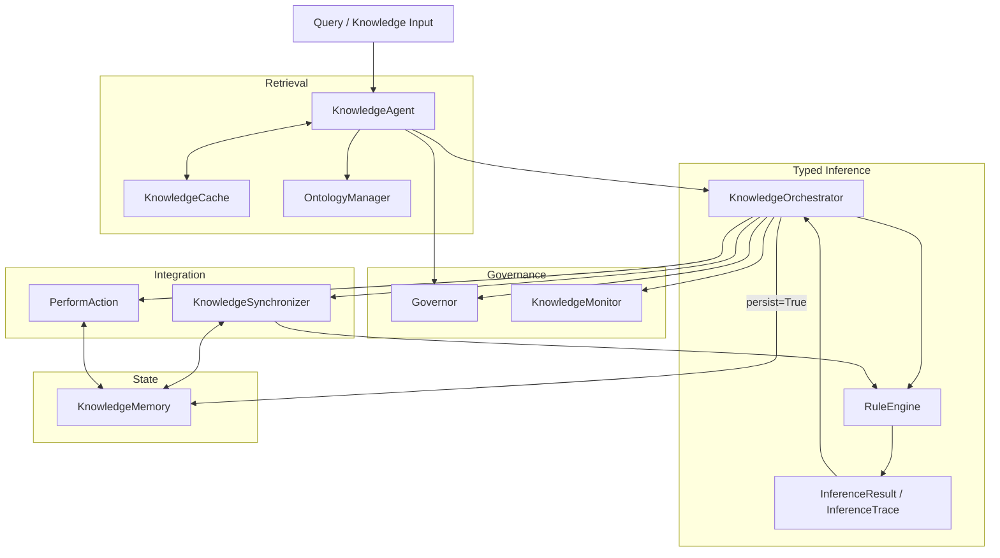

# Knowledge Agent Subsystem

The Knowledge Agent subsystem provides SLAI with a coordinated knowledge-processing layer for **retrieval, structured inference, contextual memory, ontology management, governance, synchronization, integrity monitoring, action execution, and runtime observability**.

The application-level entry point is `src/agents/knowledge_agent.py`. Supporting services are located under `src/agents/knowledge/`.

The subsystem is intentionally decomposed so that retrieving information, inferring new facts, persisting state, enforcing policy, synchronizing external knowledge, and executing downstream actions remain separate responsibilities. This separation is important for testability, provenance, lifecycle control, and future integration with learning and reasoning components.

---

## 1. Architectural Objectives

The subsystem is designed around the following principles.

### 1.1 Explicit responsibility boundaries

Each major component owns one primary concern:

- `KnowledgeAgent` owns document ingestion, indexing, retrieval, query expansion, and application-level coordination.
- `KnowledgeOrchestrator` coordinates subsystem services and cross-component operations.
- `RuleEngine` owns executable rule inference.
- `InferenceResult` and `InferenceTrace` define the canonical typed inference output.
- `KnowledgeMemory` owns storage, relevance estimation, recall, expiry, and persistence.
- `OntologyManager` owns ontology triples and semantic expansion.
- `Governor` owns governance, policy evaluation, auditing, and bias-related controls.
- `KnowledgeSynchronizer` owns consistency with configured external knowledge sources.
- `KnowledgeMonitor` owns knowledge integrity and source-quality monitoring.
- `PerformAction` owns validated downstream action execution.
- `runtime/` provides operational health and metrics.

No component should acquire a second responsibility merely because another component exposes useful data.

### 1.2 Shared dependency identity in the orchestrated path

The normal orchestrated path uses shared instances of stateful services rather than independently constructing parallel copies of the same logical state.
In particular, the canonical `KnowledgeMemory` and `RuleEngine` instances are passed into dependent components such as the governor, synchronizer, action executor, and monitor when the subsystem is assembled through `KnowledgeOrchestrator`.
Standalone constructors may retain practical fallback construction for isolated use and testing, but orchestrated operation should preserve shared identity.

### 1.3 Dependency inversion

Cross-component dependencies are expressed through protocol contracts in `modules/interfaces.py`.

This allows orchestration code to depend on behavioral contracts such as:

- `MemoryStore`
- `CacheStore`
- `RuleService`
- `ComplianceService`
- `SyncService`
- `MonitorService`
- `ActionExecutor`

rather than requiring every caller to depend on a concrete implementation.

### 1.4 Inference and persistence are separate operations

`RuleEngine` computes inferred facts.
`InferenceResult` represents those facts and their provenance.
`KnowledgeOrchestrator` decides whether an inference result should be persisted.
`KnowledgeMemory` stores the supplied result without becoming an inference engine itself.

This boundary prevents memory, governance, and inference from forming unnecessary cyclic ownership.

### 1.5 Provenance is part of the inference contract

Inference is not represented as an unqualified collection of facts. When tracing is enabled, accepted rule contributions include provenance such as the producing rule, configured source, confidence, and execution sector.

This makes inference output inspectable by orchestration, governance, diagnostics, and future learning consumers.

### 1.6 Backward compatibility is explicit

The canonical typed inference API is `RuleEngine.infer()`.

Legacy interfaces such as `apply()`, `smart_apply()`, and `load_all_sectors()` may remain available for compatibility, but new integrations should prefer the typed contract and `reload_rules()` where applicable.

---

## 2. Package Layout

```text
src/agents/
├── knowledge_agent.py
│
└── knowledge/
    ├── README.md
    ├── __init__.py
    ├── governor.py
    ├── knowledge_cache.py
    ├── knowledge_memory.py
    ├── knowledge_monitor.py
    ├── knowledge_orchestrator.py
    ├── knowledge_sync.py
    ├── ontology_manager.py
    ├── perform_action.py
    │
    ├── configs/
    │   └── ...
    │
    ├── modules/
    │   ├── README.md
    │   ├── __init__.py
    │   ├── inference_result.py
    │   ├── interfaces.py
    │   ├── knowledge_ontology.db
    │   └── rule_engine.py
    │
    ├── runtime/
    │   ├── RUNTIME.md
    │   └── ...
    │
    └── utils/
        └── ...
```

`modules/` contains the stable inference contracts and executable rule engine. Detailed documentation for that package belongs in [`modules/README.md`](modules/README.md); this document describes how those modules participate in the wider Knowledge subsystem.

---

## 3. System-Level Data Flow

The Knowledge subsystem contains several related but distinct flows.


```mermaid
flowchart TD
    Q[Query / Knowledge Input]

    subgraph Retrieval["Retrieval"]
        KA[KnowledgeAgent]
        CACHE[KnowledgeCache]
        ONT[OntologyManager]
    end

    subgraph Inference["Typed Inference"]
        ORCH[KnowledgeOrchestrator]
        RE[RuleEngine]
        IR[InferenceResult / InferenceTrace]
    end

    subgraph State["State"]
        MEM[KnowledgeMemory]
    end

    subgraph Governance["Governance"]
        GOV[Governor]
        MON[KnowledgeMonitor]
    end

    subgraph Integration["Integration"]
        SYNC[KnowledgeSynchronizer]
        ACT[PerformAction]
    end

    Q --> KA
    KA <--> CACHE
    KA --> ONT
    KA --> GOV

    KA --> ORCH
    ORCH --> RE
    RE --> IR
    IR --> ORCH

    ORCH -->|persist=True| MEM
    ORCH --> GOV
    ORCH --> MON
    ORCH --> SYNC
    ORCH --> ACT

    SYNC <--> MEM
    SYNC --> RE
    ACT <--> MEM
```

The diagram should not be interpreted as requiring every query to pass through every component. Retrieval, inference, synchronization, monitoring, auditing, and action execution are individually callable capabilities.

---

## 4. `KnowledgeAgent`

`KnowledgeAgent` is the application-facing knowledge component.

Its responsibilities include:

- document ingestion and indexing;
- TF-IDF retrieval;
- optional dense retrieval through a configured embedding model;
- hybrid retrieval;
- ontology-assisted query expansion;
- retrieval caching;
- contextual search;
- governance-aware retrieval auditing;
- optional bias analysis;
- publication of retrieval results into shared memory;
- attachment of the supporting Knowledge subsystem.

### Retrieval semantics

Retrieval scores measure similarity or ranking relevance according to the configured retrieval mode. They are **not equivalent** to rule-inference confidence or memory relevance.

The subsystem intentionally keeps these quantities conceptually separate:

| Quantity | Meaning |
|---|---|
| Retrieval score | Similarity/ranking signal used to order retrieved documents |
| Inference confidence | Weighted confidence assigned to a rule-produced fact |
| Memory relevance | Context-sensitive relevance score used by `KnowledgeMemory` |
| Governance score/threshold | Policy-specific signal used by governance logic |

These values should not be merged or compared as though they were measurements of the same underlying property.

### Shared-memory outputs

Successful retrieval publishes structured context for other SLAI components.

Current compatibility keys include:

- `knowledge:last_retrieval` — structured retrieval payload containing query, retrieval mode, timestamp, scores, document identifiers, text, and metadata;
- `retrieved_knowledge` — compatibility list containing retrieved text;
- `knowledge:metrics:<agent-name>:retrieval_count` — retrieval counter.

Consumers should prefer structured payloads when provenance or metadata is required.

---

## 5. `KnowledgeOrchestrator`

`KnowledgeOrchestrator` is the primary subsystem coordination boundary.

It can be constructed with explicit implementations or practical defaults for:

- memory;
- cache;
- rule service;
- governance;
- synchronization;
- monitoring;
- action execution.

When it constructs dependent components itself, shared stateful dependencies are injected so that the normal orchestrated path does not fragment memory or inference state across separate component instances.

### Primary operations

The orchestrator exposes coordinated operations including:

- `start()`
- `stop()`
- `infer(...)`
- `sync(...)`
- `audit()`
- `monitor_once()`
- `execute_actions(...)`
- `health()`

`start()` represents the explicit subsystem lifecycle state. Individual background-capable components may also expose their own lifecycle controls and configuration-driven autostart behavior.

`stop()` invokes the shutdown hooks exposed by managed components where supported. Components that own additional external resources should retain explicit local cleanup APIs as required by their implementation.

---

## 6. Typed Inference Contract

The canonical inference data structures are located in:

```text
src/agents/knowledge/modules/inference_result.py
```

### `InferenceTrace`

`InferenceTrace` represents provenance for one accepted rule contribution.

It contains:

```text
fact
confidence
rule
source
sector
```

The trace is frozen so that an individual provenance record is not accidentally mutated after construction.

### `InferenceResult`

`InferenceResult` is the canonical result envelope returned by typed rule inference.

It contains:

```text
facts: Dict[Any, float]
traces: List[InferenceTrace]
sector: Optional[str]
```

`facts` contains the final accepted facts and their resulting confidence values.

`traces` contains rule-level provenance when tracing was requested.

`sector` records the explicitly requested or automatically detected inference sector.

`InferenceResult` is deliberately a **data contract**. It contains no rule execution, persistence, configuration, logging, governance, or lifecycle behavior.

### Provenance scope

`InferenceTrace` is useful provenance, but it is not a formal proof object.

A trace identifies the accepted rule contribution that produced a fact, but it does not currently encode a complete proof tree, all triggering antecedents, counterfactual reasoning, or a formal causal graph.

---

## 7. `RuleEngine`

`RuleEngine`, located in `modules/rule_engine.py`, owns executable rule inference.

### Responsibilities

The engine supports:

- configured source rules;
- optional rule auto-discovery;
- runtime-added rules;
- separate source and runtime rule registries;
- idempotent source-rule reloading;
- category and sector indexing;
- automatic sector detection;
- sector-scoped inference;
- smart rule selection;
- configurable confidence thresholds;
- rule execution timeouts;
- failure and timeout accounting;
- typed inference through `infer()`;
- compatibility interfaces through `apply()` and `smart_apply()`.

### Rule lifecycle

Source-backed rules and runtime-added rules are intentionally distinct.

`reload_rules()` replaces the source-loaded rule set while preserving runtime-added rules. This avoids rule multiplication when synchronization or configuration refreshes reload the same sources repeatedly.

Runtime rules should be managed through the rule-engine API rather than by mutating internal registries directly.

### Smart inference

When smart inference is enabled, the engine inspects the supplied knowledge structure and attempts to select a relevant sector.

If a recognized sector has indexed rules, those rules are used.

If no usable sector-specific rule set exists, the engine can fall back to the broader rule collection.

The resulting `InferenceResult.sector` represents the requested or detected sector, while each `InferenceTrace.sector` describes the execution scope of the contributing rule.

### Confidence semantics

Rule-produced confidence is combined with the configured rule weight before thresholding.

Therefore, confidence stored in `InferenceResult.facts` and `InferenceTrace.confidence` represents the **post-weight inference confidence** produced by the RuleEngine path, not necessarily the unmodified value emitted inside the rule implementation.

### Execution trust boundary

Executable rule implementations are Python code strings executed in a restricted worker environment and isolated through process-based execution.

This mechanism provides operational isolation and timeout handling; it must **not** be treated as a security boundary for arbitrary untrusted Python.

Machine-generated or externally supplied executable code should therefore not be inserted directly into the runtime rule set without a separate validation and approval process.

---

## 8. Inference-to-Memory Flow

The preferred typed inference path is:

```text
knowledge input
    ↓
KnowledgeOrchestrator.infer()
    ↓
RuleEngine.infer()
    ↓
InferenceResult
    ↓
caller
```

When persistence is requested:

```text
InferenceResult
    ↓
KnowledgeOrchestrator
    ↓
KnowledgeMemory.update()
```

The orchestrator enables tracing when persistence requires provenance.

A persisted inferred fact uses metadata conceptually equivalent to:

```json
{
  "type": "inferred_fact",
  "confidence": 0.86,
  "source": "rule_engine",
  "sector": "scientific",
  "provenance": [
    {
      "confidence": 0.86,
      "rule": "example_rule_name",
      "source": "configured_rule_source",
      "sector": "scientific"
    }
  ]
}
```

The example values above illustrate the schema only; real values are generated by the active rules and configuration.

---

## 9. `KnowledgeMemory`

`KnowledgeMemory` is the subsystem's local, context-aware memory store.

Its responsibilities include:

- keyed updates;
- metadata-aware recall;
- TTL-based expiry;
- bounded storage;
- query-result caching;
- persistence to JSON;
- optional startup autoload;
- relevance calculation;
- retrieval and cache metrics.

### Relevance model

Memory relevance can combine several dimensions:

- semantic similarity;
- contextual term relevance;
- temporal relevance;
- structural similarity.

The configured weights are normalized before they are applied.

The memory subsystem may use embeddings where available and can fall back to lexical/TF-IDF-style similarity according to configuration.

### Inference awareness without inference ownership

`KnowledgeMemory` can store and log entries whose metadata identifies them as inferred facts.

It does **not** own a `RuleEngine` as part of the inference flow, and it does not decide whether new facts should be inferred.

That decision remains outside the storage layer.

---

## 10. `KnowledgeCache`

`KnowledgeCache` provides low-latency caching for repeated knowledge operations.

Its role is distinct from `KnowledgeMemory`:

- cache entries are primarily performance artifacts;
- memory entries are knowledge/state artifacts with metadata, relevance, expiry, and persistence semantics.

Callers should not use the cache as a substitute for durable or provenance-bearing knowledge memory.

---

## 11. `OntologyManager`

`OntologyManager` manages semantic relationships across SQLite-backed storage and an RDF graph.

Its responsibilities include:

- ontology triple persistence;
- RDF graph construction;
- normalized subject/predicate/object handling;
- type, subclass, and label predicates;
- semantic query expansion;
- ontology versioning/persistence operations supported by the implementation.

The ontology layer expands or grounds retrieval concepts; it is separate from executable rule inference.

A relationship stored in the ontology is therefore not automatically an executable RuleEngine rule.

---

## 12. `Governor`

`Governor` provides policy, governance, ethics, and audit functionality.

Its responsibilities include governance-oriented activities such as:

- policy and guideline loading;
- retrieval auditing;
- memory and agent behavior auditing;
- violation tracking;
- bias-related evaluation;
- emergency or enforcement handling supported by configured policy;
- reporting and monitoring support.

In orchestrated operation, the governor receives the shared memory and rule service rather than owning independent parallel subsystem state.

### Governance rules versus executable inference rules

Policy/governance rules and executable RuleEngine rules serve different purposes and should not be treated as one interchangeable schema.

Conceptually:

```text
Governance / policy rule
    → describes permission, restriction, audit, or approval semantics

Executable inference rule
    → computes inferred facts from a knowledge base
```

Any future learned-rule pipeline should preserve this distinction rather than injecting generated executable Python directly into the inference engine.

---

## 13. `KnowledgeSynchronizer`

`KnowledgeSynchronizer` manages consistency between local knowledge state and configured external sources.

Supported concerns include:

- file-backed sources;
- API sources;
- optional database sources;
- inline configured sources;
- retry policy;
- per-source timeout behavior;
- circuit-breaker state;
- configurable conflict-resolution strategies;
- version snapshots;
- rollback support;
- synchronization statistics.

Conflict resolution and rule inference are separate responsibilities. The synchronizer may use the RuleEngine when a configured conflict strategy requires rule-based evaluation, but it does not become the owner of rule semantics.

When source rules are refreshed, rule reload behavior should remain idempotent so that repeated synchronization does not duplicate executable rules.

---

## 14. `KnowledgeMonitor`

`KnowledgeMonitor` provides knowledge-integrity and source-quality monitoring.

Its responsibilities include:

- configured academic-source loading;
- integrity-hash tracking;
- validation context;
- trust/source checks supported by configuration;
- academic-compliance checks;
- data-integrity verification;
- reporting;
- explicit monitoring lifecycle control.

The monitor accepts injected cache, RuleEngine, governor, and action-execution dependencies. Lazy fallback construction remains useful for isolated use, while orchestrated operation should use the canonical shared subsystem instances.

---

## 15. `PerformAction`

`PerformAction` is the controlled actuator for structured downstream actions derived from knowledge payloads.

Action directives use the form:

```text
action:TYPE:PAYLOAD
```

The extraction layer returns `(action_type, payload)` pairs and does not pre-interpret arbitrary payloads as executable structures.

### Responsibilities

The action subsystem supports:

- directive extraction;
- action-type allowlists;
- domain restrictions for network operations;
- shell-command allowlists;
- database-operation restrictions;
- payload sanitization and validation;
- retry handling;
- configurable action concurrency;
- execution-result persistence;
- SQLite-backed action logging;
- reuse of suitable prior results from shared KnowledgeMemory.

Action execution is intentionally downstream of knowledge acquisition and inference. A retrieved or inferred statement is not automatically an authorization to perform an external action.

---

## 16. Runtime Health and Metrics

Operational instrumentation is provided by the `runtime/` package.

### `RTHealth`

Runtime health tracks component states such as:

- `healthy`
- `degraded`
- `unhealthy`

Built-in probes cover core components including memory, cache, RuleEngine, governor, synchronization, action execution, and ontology.

Liveness and readiness are intentionally different:

- liveness indicates whether critical runtime components remain operational;
- readiness indicates whether the core serving path is suitable to receive work.

### `RTMetrics`

Runtime metrics provide thread-safe counters, gauges, and histograms, including metrics for:

- cache hits/misses;
- rule successes, failures, and timeouts;
- synchronization;
- action execution;
- memory/cache/rule-set size;
- retrieval, rule, synchronization, and action latency.

For operational semantics, metric names, and recommended alerting practices, see:

- [`runtime/RUNTIME.md`](runtime/RUNTIME.md)

---

## 17. Configuration

The subsystem reads centrally managed configuration sections rather than embedding deployment policy into callers.

Relevant sections include, where enabled by the corresponding component:

```text
knowledge_agent
knowledge_memory
rule_engine
governor
knowledge_sync
external_sources
knowledge_monitor
perform_action
ontology_manager
runtime_health
runtime_metrics
```

Configuration should determine policy and operating parameters; code-level ownership boundaries should remain stable across configurations.

When deprecating a configuration key, preserve compatibility long enough for callers and deployment files to migrate explicitly.

---

## 18. Lifecycle and Concurrency

Several components use concurrency internally:

- `KnowledgeAgent` uses worker pools for retrieval-related operations;
- `RuleEngine` uses a process pool for rule execution;
- `KnowledgeMemory` protects mutable state and query caches with locks;
- `KnowledgeSynchronizer` supports threaded synchronization and external fetch workers;
- `KnowledgeMonitor` supports a controlled monitoring thread;
- `PerformAction` protects action concurrency with a configurable semaphore;
- runtime health may use periodic background checks.

Thread/process ownership should remain explicit.

Components that allocate executors, threads, database handles, or other external resources should expose or retain a corresponding shutdown path.

Application teardown should invoke the relevant subsystem lifecycle operations rather than relying on interpreter finalization.

---

## 19. Error Handling and Degraded Operation

Knowledge components use subsystem-specific errors and logging to distinguish failures in areas such as:

- retrieval;
- embeddings;
- ontology operations;
- governance;
- memory updates;
- action execution;
- synchronization;
- rule execution.

Operational code should distinguish:

```text
no result
```

from:

```text
degraded dependency
```

and from:

```text
failed operation
```

A missing dense embedding backend, for example, is not conceptually identical to a governance failure or a failed persistence operation.

Health and metrics should be used to surface degraded states instead of silently representing them as successful empty results where the component contract provides a more precise signal.

---

## 20. Extension Rules

New Knowledge functionality should preserve the subsystem boundaries.

### New inference backend

Implement the `RuleService` protocol and continue returning the canonical `InferenceResult`.

Do not require `KnowledgeMemory` or `KnowledgeOrchestrator` to know backend-specific execution details.

### New memory backend

Implement `MemoryStore`.

Preserve metadata and provenance supplied by orchestration.

Do not move RuleEngine execution into the memory backend.

### New cache backend

Implement `CacheStore`.

Keep cache behavior performance-oriented rather than treating it as authoritative knowledge persistence.

### New governance backend

Implement the relevant compliance contract without changing `InferenceResult` into a governance object.

Governance may inspect inference output, but it should not own the inference result schema.

### Learning integration

Learning components may consume:

- final inferred facts;
- weighted confidence;
- rule provenance;
- source provenance;
- sector information;
- rule failure/performance metadata where exposed.

Learning should not need to understand the RuleEngine process pool, synchronization internals, or memory storage implementation.

A future learned-rule pipeline should introduce an explicit candidate/validation/approval representation before executable code reaches the RuleEngine.

---

## 21. Import and Dependency Guidelines

To reduce circular imports:

1. Keep `modules/inference_result.py` free of concrete subsystem imports.
2. Keep protocol definitions in `modules/interfaces.py` dependent only on stable contracts and standard-library typing/dataclass functionality.
3. Import concrete implementations directly from their defining module when subsystem internals require them.
4. Avoid using package-level wildcard imports as an internal dependency mechanism.
5. Do not make `KnowledgeMemory` import RuleEngine to perform inference.
6. Do not make `InferenceResult` call RuleEngine or persistence services.
7. Keep orchestration responsible for cross-component wiring.

The intended dependency direction is approximately:

```text
stable contracts
      ↑
concrete components
      ↑
orchestration
      ↑
application-level KnowledgeAgent
```

Cross-cutting utilities and error types should remain dependency leaves where practical.

---

## 22. Compatibility Guidance

For new code, prefer:

```python
result = rule_engine.infer(
    knowledge_base,
    smart=True,
    trace=True,
)
```

over legacy untyped inference APIs.

Use:

```python
rule_engine.reload_rules()
```

for source-rule refresh where supported.

Compatibility methods should remain thin adapters over the canonical implementation rather than evolving into independent inference paths.

This reduces semantic drift between old and new APIs.

---

## 23. Minimal Typed-Inference Example

```python
from src.agents.knowledge.modules.rule_engine import RuleEngine

engine = RuleEngine()

try:
    result = engine.infer(
        {
            "research_topic": "artificial intelligence",
            "context": {
                "domain": "technology",
            },
        },
        smart=True,
        trace=True,
    )

    for fact, confidence in result.facts.items():
        print(f"{fact}: {confidence:.3f}")

    for trace in result.traces:
        print(
            trace.rule,
            trace.source,
            trace.sector,
            trace.confidence,
        )
finally:
    engine.close()
```

The example demonstrates the data contract only. Actual inferred facts depend entirely on the active configured rule set.

---

## 24. Orchestrated Persistence Example

```python
result = orchestrator.infer(
    knowledge_base,
    smart=True,
    trace=True,
    persist=True,
    context={
        "origin": "knowledge_agent",
    },
)
```

With `persist=True`, the orchestrator persists accepted inferred facts through the configured `MemoryStore` and retains available rule provenance in metadata.

The caller still receives the `InferenceResult`; persistence does not replace the return value.

---

## 25. Academic and Epistemic Boundaries

The subsystem is designed to improve traceability and engineering rigor, but its data structures should not be assigned stronger epistemic meaning than the implementation supports.

Specifically:

- retrieval similarity does not establish factual truth;
- RuleEngine confidence does not constitute calibrated probability unless the rule system has been empirically calibrated for that interpretation;
- memory relevance measures contextual usefulness, not correctness;
- `InferenceTrace` provides execution provenance, not a complete logical proof;
- governance checks reduce policy risk but do not prove ethical or factual correctness;
- ontology relationships provide semantic structure but are not automatically causal relationships;
- a restricted Python execution environment is not a secure sandbox for arbitrary untrusted code.

These distinctions are important when Knowledge outputs are consumed by autonomous learning, reasoning, planning, or action systems.

---

## 26. Testing Expectations

Changes to the Knowledge subsystem should preserve at least the following invariants.

### Dependency identity

In an orchestrated configuration, stateful dependencies supplied to dependent components should reference the same logical Memory and RuleEngine instances.

### Inference contract

`RuleEngine.infer()` should always return an `InferenceResult`.

When tracing is enabled, entries in `result.traces` should be `InferenceTrace` instances derived from actual accepted rule contributions.

### Rule reload idempotency

Repeated source-rule reloads should not increase the rule count solely because the same sources were loaded again.

Runtime-added rules should survive source refresh where that is the documented lifecycle.

### Persistence boundary

Inference with `persist=False` should not write inferred facts into `KnowledgeMemory`.

Inference with `persist=True` should use the orchestration persistence bridge rather than direct RuleEngine-to-Memory ownership.

### Retrieval compatibility

Retrieval caching, ontology expansion, governance auditing, and shared-memory publication should not change the public result shape unexpectedly.

### Action extraction

Structured action directives should remain `(action_type, payload)` pairs through extraction so validation and execution receive the expected payload type.

### Lifecycle

Background workers and process pools should be stoppable through their owning component's lifecycle path.

---

## 27. Related Documentation

- [`modules/README.md`](modules/README.md) — inference contracts and RuleEngine internals.
- [`runtime/RUNTIME.md`](runtime/RUNTIME.md) — health probes, metrics, and operational guidance.
- `configs/` — Knowledge subsystem configuration.
- `src/agents/knowledge_agent.py` — application-level retrieval and Knowledge integration.

---

## 28. Summary

The Knowledge Agent subsystem separates knowledge processing into explicit architectural layers:

```text
Retrieval
    ↓
Typed inference
    ↓
Optional persistence
    ↓
Governance / monitoring / synchronization
    ↓
Controlled downstream action
```

The central architectural contract is that **knowledge retrieval, inference, persistence, governance, and action execution remain distinguishable operations with explicit provenance and dependency ownership**.

`InferenceResult` provides the stable bridge between executable rule inference and higher-level consumers. `KnowledgeOrchestrator` coordinates that bridge without turning `KnowledgeMemory` into an inference engine or requiring learning components to depend on RuleEngine internals.

This structure provides a stable basis for future reasoning and learning integrations while preserving inspectability, testability, backward compatibility, and operational observability.
