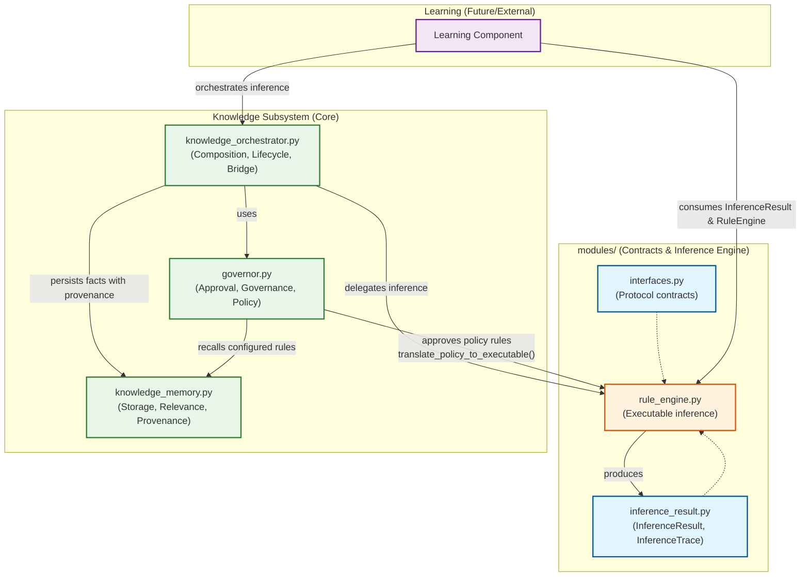

# `modules/` – Knowledge Inference Contracts & Engine

This package defines the **stable, implementation‑separated** core of the Knowledge subsystem’s inference machinery. Its contents are consumed by higher‑level orchestration, governance, and learning components, but they do **not** depend on concrete storage, monitoring, or action execution implementations.

---

## Package Structure

```
modules/
├── __init__.py               # Aggregates public exports
├── inference_result.py       # Immutable data types for inference envelopes
├── interfaces.py             # Protocol contracts for dependency injection
├── knowledge_ontology.db     # Persistent ontology backing (sqlite3)
└── rule_engine.py            # Executable rule inference implementation
```

---

## Component Overview

### `inference_result.py`
Defines the canonical data structures for inference results:
- **`InferenceTrace`** – provenance for a single rule contribution (fact, confidence, rule name, source, sector).
- **`InferenceResult`** – final facts (`Dict[Any, float]`) plus an optional list of traces and the inferred sector.

These types are **frozen** (immutable) and free of any I/O, configuration, or lifecycle logic. They serve as the single source of truth for what an inference operation produces.

### `interfaces.py`
Declares **protocol contracts** (`typing.Protocol`) that decouple the inference subsystem from its dependencies. Key protocols:
- `RuleService` – the primary contract for rule loading, management, and inference (`infer()`, `apply()`, `smart_apply()`, `reload_rules()`).
- `MemoryStore`, `CacheStore`, `ComplianceService`, `SyncService`, `MonitorService`, `ActionExecutor`, `KnowledgeOrchestrator` – used by the orchestrator to unify component interactions.

The protocols are **runtime‑checkable** and designed to be satisfied by concrete classes in the parent `knowledge` package (e.g., `RuleEngine`, `KnowledgeMemory`, `Governor`). This enables dependency injection and unit testing without circular imports.

### `rule_engine.py`
The **executable inference engine**:
- Manages source‑loaded and runtime‑added rules with idempotent reloading (`reload_rules()`).
- Supports sector‑based inference (`infer_sector()`), smart rule selection, and scoped execution.
- Provides a modern, typed entry point: `infer()` returning `InferenceResult`, alongside legacy `apply`/`smart_apply` for backward compatibility.
- Executes rule code in a sandboxed process pool with configurable timeouts and confidence thresholds.

**Key design points**:
- Rules are pure Python code strings executed in a restricted `exec` environment.
- The engine does **not** persist results; persistence is an orchestration responsibility.
- The `RuleService` wrapper adds caching and failure callbacks while preserving the same core interface.

### `knowledge_ontology.db`
A sqlite3 database used by the optional ontology manager (located outside `modules/`). It stores semantic relationships and is used for query expansion and concept grounding. The file is not part of the Python source but is kept here for proximity to the inference layer.

---

## Integration with the Wider Knowledge Subsystem

| Component | Role |
|-----------|------|
| **`knowledge_orchestrator.py`** | Composes `RuleService`, `MemoryStore`, `Governor`, etc. and exposes unified lifecycle (`infer()`, `persist_inference_result()`). |
| **`governor.py`** | Consumes approved policy rules (not executable) and can translate them to executable rules via `translate_policy_to_executable()`. |
| **`knowledge_memory.py`** | Stores inferred facts with provenance metadata (type: `inferred_fact`). |
| **`learning` (future)** | Will read `InferenceResult` and `RuleEngine` metadata to generate or refine rules without coupling to governance or persistence. |

---


---


## Usage Guidelines

- **Prefer the `infer()` method** over legacy `apply()` variants for new code. It returns a strongly‑typed `InferenceResult` and supports tracing.
- **Enable `trace=True`** when persistence or detailed provenance is required; traces are automatically included in persisted facts.
- **Do not modify rule code strings** outside the `RuleEngine`; use the `add_rule()` / `remove_rule()` API.
- **To reload source rules**, call `reload_rules()` on the `RuleService` (preserves runtime‑added rules).
- **Translate policy rules** via `Governor.translate_policy_to_executable()`; do not manually construct executable code from policy metadata.

---

## Testing & Extensibility

- The package is designed for **unit testing** – all dependencies are expressed as protocols, so mocks can be supplied.
- To add a new inference backend, implement the `RuleService` protocol; no changes to the orchestrator or governor are required.
- The `inference_result` types are frozen, ensuring that results are immutable and can be safely cached or serialised.

---

## Academic Context

This package embodies the **dependency‑inversion principle** and **separation of concerns** within a production‑grade knowledge agent. By isolating inference contracts, execution, and result types, we enable rigorous testing, clear versioning, and future integration with external reasoning engines or learned rule generators without destabilising the rest of the system.
