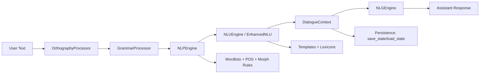
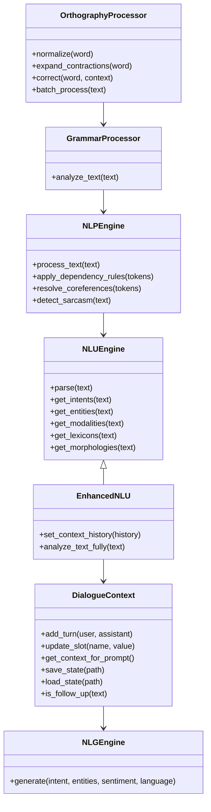

# Language Agent Module

This directory contains SLAI's language stack for **orthography correction**, **grammar analysis**, **NLP feature extraction**, **NLU parsing**, **context tracking**, and **response generation**.

## What lives here

- `orthography_processor.py` — normalizes spelling, handles contraction expansion, and performs context-aware correction.
- `grammar_processor.py` — inspects tokenized text and returns structured grammar issues.
- `nlp_engine.py` — tokenization + POS + lemmatization + dependency rules + coreference/sarcasm hooks.
- `nlu_engine.py` — intent/entity/modality/lexicon extraction plus richer semantic analysis (`EnhancedNLU`).
- `dialogue_context.py` — conversational memory, slot tracking, summaries, follow-up detection, and persistence.
- `nlg_engine.py` — template-based and model-assisted surface generation with style controls.
- `utils/` — tokenizer, transformer, cache, spell checker, config and rule helpers.
- `configs/language_config.yaml` — central configuration for all language subcomponents.
- `templates/`, `resources/`, and `library/` — lexical resources, templates, and linguistic rule data.

---

## End-to-end flow



---

## Internal architecture



---

## Configuration map

`configs/language_config.yaml` drives module behavior:

- `orthography_processor`: locale policy, auto-correction, contraction and compound behavior.
- `grammar_processor`: POS mapping resources.
- `nlp`: irregular verb/noun files, stopwords, POS regexes.
- `nlu`: intent/entity patterns, lexicons, morphology rules, embedding paths.
- `nlg`: template path, style/formality/verbosity controls.
- `dialogue_context`: memory limits, summarization, follow-up rules, persistence defaults.
- `language_cache`: cache size, TTL, compression/encryption strategy.

---

## Typical usage

```python
from src.agents.language.orthography_processor import OrthographyProcessor
from src.agents.language.grammar_processor import GrammarProcessor
from src.agents.language.nlp_engine import NLPEngine
from src.agents.language.nlu_engine import EnhancedNLU
from src.agents.language.dialogue_context import DialogueContext
from src.agents.language.nlg_engine import NLGEngine

text = "can u tell me if teh weather is good tomorrow?"

orth = OrthographyProcessor()
grammar = GrammarProcessor()
nlp = NLPEngine()
nlu = EnhancedNLU()
ctx = DialogueContext()
nlg = NLGEngine()

clean = orth.batch_process(text)
issues = grammar.analyze_text(clean)
tokens = nlp.process_text(clean)
analysis = nlu.analyze_text_fully(clean)
ctx.add_message("user", clean)

reply = nlg.generate(
    intent=analysis.get("intent", "unknown"),
    entities=analysis.get("entities", {}),
    sentiment=analysis.get("sentiment", "neutral"),
    language="en",
)
```

---

## Notes

- Most components are resource-driven (JSON/YAML templates), so behavior can be tuned without major code changes.
- `EnhancedNLU` is the best entry point when you need full semantic output with context-awareness.
- `DialogueContext` enables long-running, stateful interactions and slot-based workflows.
