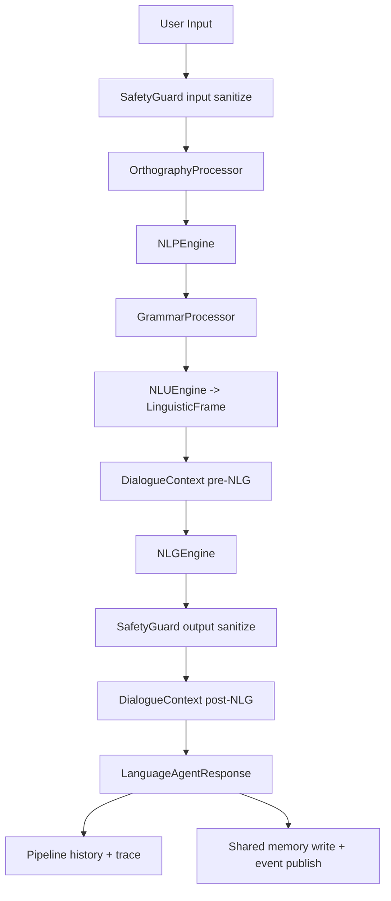
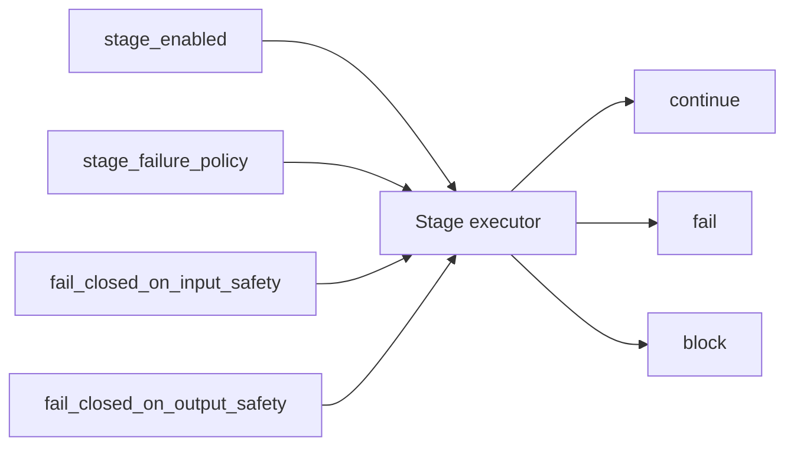

# Language Stack (`src/agents/language`)

This package contains the **language subsystem modules** used by `LanguageAgent` (`src/agents/language_agent.py`).

The recent `LanguageAgent` update (v`2.3.0`) introduces a more explicit, policy-driven pipeline with:

- canonical stage names (`StageName`),
- stage-level failure policy (`StagePolicy`: `continue` / `fail` / `block`),
- per-turn structured tracing (`PipelineTrace`, `StageRecord`, `PipelineArtifacts`),
- safer pre/post sanitization flow,
- clearer health/diagnostic surfaces,
- and stronger runtime integration with `DialogueContext` and shared memory.

---

## Where this package fits

`LanguageAgent` is the coordinator. The modules in this directory perform the actual language work:

- `orthography_processor.py` → spelling/normalization corrections.
- `nlp_engine.py` → tokenization + dependency extraction.
- `grammar_processor.py` → grammatical analysis from text/tokens.
- `nlu_engine.py` → intent/entities/modality/sentiment into a `LinguisticFrame`.
- `dialogue_context.py` → conversational state, unresolved issues, session memory.
- `nlg_engine.py` → response realization.
- `modules/` → reusable lower-level primitives (tokenizer, transformer, spell checker, rules).
- `utils/` → shared helpers, config loading, linguistic data structures.

---

## Runtime pipeline used by `LanguageAgent`

The language package is orchestrated by `LanguageAgent.process()` in this order:

1. `safety_input`
2. `orthography`
3. `nlp`
4. `grammar`
5. `nlu`
6. `dialogue_pre_nlg`
7. `nlg`
8. `safety_output`
9. `dialogue_post_nlg`
10. `shared_memory` (finalization side effect)

### End-to-end execution flow



### Control plane (policies and recoverability)



---

## Key integration behavior from the updated agent

### 1) Structured pipeline observability

Each turn generates:

- `PipelineTrace` (trace id, status, records, warnings, timing),
- `StageRecord` per stage (duration, policy, error metadata),
- `PipelineArtifacts` (sanitized text, orthography text, token/dependency counts, grammar/frame summaries),
- `LanguageAgentResponse` (response text + confidence/intent/status + trace/artifacts metadata).

This gives both runtime and audit visibility without forcing downstream components to parse logs.

### 2) Stage-level policy and enable/disable controls

The agent can selectively disable stages (for example grammar/orthography) and can enforce per-stage behavior on failure:

- `continue` → warn and proceed,
- `fail` → raise stage failure,
- `block` → block request (used especially for safety-critical behavior).

### 3) Precomputed NLP handoff

When `pass_precomputed_nlp_to_nlu = true`, NLU gets token/dependency artifacts directly from the NLP stage, reducing duplicate analysis and improving consistency between grammar and intent/entity extraction.

### 4) Clarification policy for low confidence

If frame confidence drops below configured threshold (`dialogue_policy.low_confidence_threshold`), unresolved issue state is tracked and a clarification-oriented frame can be emitted before NLG.

### 5) Shared-memory trace persistence

If enabled, final response and trace are written to shared memory keys and optionally published to an event channel.

---

## Configuration boundaries

Keep configuration separated by responsibility:

- `agents_config.yaml` (`language_agent` section):
  - pipeline order,
  - stage failure policies,
  - stage enable flags,
  - observability toggles,
  - shared-memory trace/event settings,
  - dialogue/runtime policy.
- `language_config.yaml` (under this package):
  - component-internal behavior for orthography/NLP/NLU/NLG/tokenization/rules/etc.

In short: **agent runtime policy belongs to `language_agent`; language mechanics belong to `language_config.yaml`.**

---

## Public API expectations

The updated coordinator preserves compatibility methods:

- `pipeline(text, session_id=None) -> str`
- `process(text, session_id=None, **metadata) -> LanguageAgentResponse`
- `predict(input_data) -> dict`
- `act(input_data) -> str`
- `perform_task(input_data) -> dict | str` (configurable structured return)
- `health_check() -> dict`
- `diagnostics() -> dict`
- `clear_context() -> bool`

---

## Package map

```text
src/agents/language/
├── README.md
├── orthography_processor.py
├── nlp_engine.py
├── grammar_processor.py
├── nlu_engine.py
├── dialogue_context.py
├── nlg_engine.py
├── language_memory.py
├── modules/
│   ├── README.md
│   ├── language_tokenizer.py
│   ├── language_transformer.py
│   ├── spell_checker.py
│   └── rules.py
├── utils/
├── templates/
├── resources/
└── configs/language_config.yaml
```

---

## Notes for maintainers

- Keep this README aligned with **pipeline stage names in `StageName`** and not with legacy aliases.
- If stage ordering or policies change in `LanguageAgent`, update the flow diagram and configuration section together.
- For lower-level module details (tokenizer/transformer/spell/rules), see `src/agents/language/modules/README.md`.
