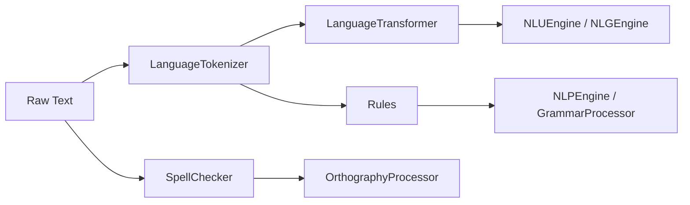

# Language Modules (`src/agents/language/modules`)

This directory contains reusable, model-adjacent building blocks used across the language stack.

These modules are **not** the top-level orchestrator; `LanguageAgent` coordinates them via higher-level engines. The modules here provide deterministic, inspectable primitives for tokenization, transformation, lexical correction, and linguistic rules.

---

## Module inventory

- `language_tokenizer.py`
  - BPE-capable tokenizer built on `BaseTokenizer`.
  - Supports pre-tokenization, train/save/load, encode/decode, offsets, diagnostics, and structured outputs.
- `language_transformer.py`
  - Language-specialized wrapper on `BaseTransformer`.
  - Supports generation (including beam search), sequence scoring/perplexity, embedding extraction, task adaptation, and checkpoint metadata.
- `spell_checker.py`
  - Production spell checker with structured suggestions/results and text-level correction reports.
- `rules.py`
  - Deterministic morphology/dependency rule engine with confidence, deduplication, and lexical normalization.
- `__init__.py`
  - Re-export surface for module dataclasses and runtime classes.

---

## How these modules connect

The typical runtime path in the full stack is:

- `SpellChecker` assists orthographic cleanup,
- `LanguageTokenizer` shapes model-compatible token sequences,
- `Rules` provide deterministic linguistic signals,
- `LanguageTransformer` supports representation and generation workloads.

---

## Design principles (reflected in the current implementations)

### Deterministic and inspectable

Each module exposes structured dataclasses (`...Result`, `...Stats`, etc.) so callers can inspect decisions rather than relying on opaque tuples/strings.

### Config-driven, not hardcoded

All modules read configuration from language/global config loaders where possible, minimizing code-only behavior switches.

### Backward-compatible but upgraded

Modules maintain compatibility with legacy call paths while adding richer interfaces (e.g., detailed generation/tokenization/check results).

### Explicit error/issue surfaces

Modules prefer structured issues/diagnostics and shared helper/error types over ad-hoc exception strings.

---

## Quick reference

### `LanguageTokenizer`

Primary outputs:

- `TokenizationResult`
- `LanguageTokenizerStats`
- `BPETrainingSummary`

Use when you need:

- deterministic pre-token + BPE segmentation,
- token ID/interoperable model inputs,
- offset-aware downstream NLP alignment.

### `LanguageTransformer`

Primary outputs:

- `GenerationOutput` / `BeamSearchOutput`
- `SequenceScore`
- `EmbeddingOutput`
- `TaskAdaptationResult`
- `LanguageTransformerStats`

Use when you need:

- configurable generation,
- sequence likelihood/perplexity,
- embedding extraction for downstream tasks,
- model save/load with metadata continuity.

### `SpellChecker`

Primary outputs:

- `SpellSuggestion`
- `SpellCheckResult`
- `TextSpellCheckResult`
- `SpellCheckerStats`

Use when you need:

- token-level spelling decisions with confidence,
- span-aware corrected text,
- correction telemetry.

### `Rules`

Primary outputs:

- `RuleToken`
- `DependencyRelation`
- `RuleApplicationResult`
- `VerbInflection`
- `LanguageRulesStats`

Use when you need:

- deterministic dependency fallback,
- morphology inference,
- conservative rule-based linguistic augmentation.

---

## Coordination with `LanguageAgent`

`LanguageAgent` v2.3.0 emphasizes precomputed artifact handoff and structured stage tracing. These modules should continue to:

- return stable structured objects for trace embedding,
- preserve compatibility with both detailed and fallback call paths,
- keep behavior configurable through YAML/resources,
- avoid side effects outside of their scope.

If module APIs change, update:

1. this README,
2. `src/agents/language/README.md`,
3. and `src/agents/language_agent.py` integration points.
