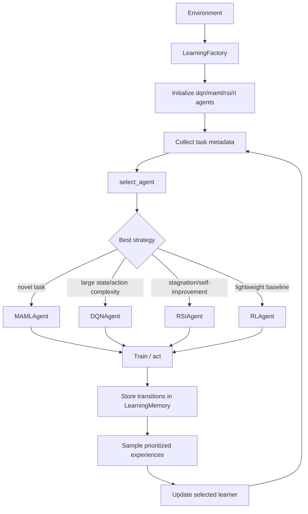
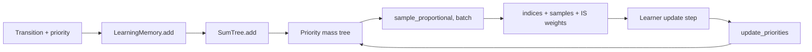

# Learning Module

This module contains the reinforcement and meta-learning stack used by SLAI to select, train, and adapt learning agents (DQN, MAML, RSI, and classical RL variants).

## Directory structure

```text
learning/
├── __init__.py
├── dqn.py
├── learning_calculations.py
├── learning_factory.py
├── learning_memory.py
├── maml_rl.py
├── rl_agent.py
├── rsi.py
├── slaienv.py
├── strategy_selector.py
├── configs/
│   └── learning_config.yaml
└── utils/
    ├── __init__.py
    ├── config_loader.py
    ├── error_calls.py
    ├── multi_task_learner.py
    ├── neural_network.py
    ├── policy_network.py
    ├── recovery_system.py
    ├── rl_engine.py
    └── state_processor.py
```

## Main components

- `LearningFactory` (`learning_factory.py`)
  - Initializes and coordinates core learners (`DQNAgent`, `MAMLAgent`, `RSIAgent`, `RLAgent`).
  - Selects an agent based on task metadata and recent performance/checkpoint quality.
  - Maintains temporary/permanent agent pools and evolution-related parameters.

- `LearningMemory` + `SumTree` (`learning_memory.py`)
  - Prioritized experience replay with proportional sampling.
  - Supports priority updates, tagging, and checkpoint-triggered persistence.

- `DQNAgent` (`dqn.py`)
  - Value-based deep RL agent.
  - Includes training/evolution helpers (e.g., `EvolutionaryTrainer`, unified wrappers).

- `MAMLAgent` (`maml_rl.py`)
  - Meta-learning oriented agent for rapid adaptation across tasks.
  - Includes decentralized fleet support.

- `RSIAgent` (`rsi.py`)
  - Self-improvement oriented learner with replay/plasticity-oriented controls.

- `RLAgent` and extensions (`rl_agent.py`)
  - Base RL implementation with advanced variants (`AdvancedQLearning`, encoder/transformer wrappers).

- Utility submodules (`utils/`)
  - State preprocessing, policy/value network building blocks, optimizers, error types, recovery helpers, and multi-task learning support.

## Learning orchestration flow



## Memory replay model



## Practical integration points

- Use `learning_factory.py` when you need one entry point to initialize/select across multiple learning paradigms.
- Use `learning_memory.py` independently when a module only needs prioritized replay.
- Use utilities in `utils/` for custom learners that still need shared state processing, networks, and recovery/error handling.
