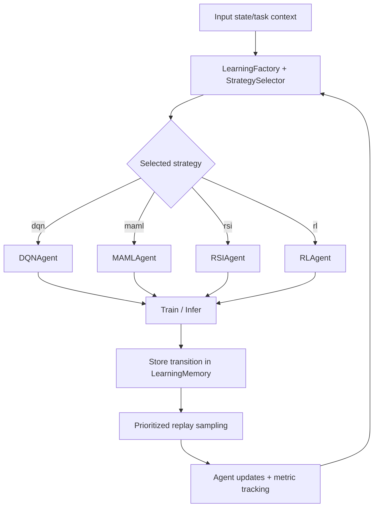

# Learning Module

The Learning module provides SLAI's adaptive decision stack. It combines reinforcement learning, meta-learning, self-improvement loops, prioritized replay, and orchestration logic to select and train the right strategy for each task context.

## Goals

- Provide a **single orchestration layer** for multiple learning strategies (`dqn`, `maml`, `rsi`, `rl`).
- Maintain **safe adaptation** through thresholds, recovery, and trend-aware selection.
- Support **lifelong learning** with memory replay, checkpointing, and subsystem-level utilities.

## Directory structure

```text
learning/
├── __init__.py
├── dqn.py
├── learning_factory.py
├── learning_memory.py
├── maml_rl.py
├── rl_agent.py
├── rsi.py
├── slaienv.py
├── strategy_selector.py
├── README.md
├── configs/
│   ├── learning_config.yaml
└── utils/
    ├── __init__.py
    ├── config_loader.py
    ├── error_calls.py
    ├── learning_calculations.py
    ├── multi_task_learner.py
    ├── neural_network.py
    ├── policy_network.py
    ├── recovery_system.py
    ├── rl_engine.py
    ├── state_processor.py
    └── README.md
```

## Core subsystem map

| Subsystem | Primary file(s) | Responsibility |
|---|---|---|
| Orchestration | `learning_factory.py`, `strategy_selector.py` | Builds strategy set and chooses the best learner given state/task signals. |
| Agents | `dqn.py`, `maml_rl.py`, `rsi.py`, `rl_agent.py` | Implements strategy-specific learning and acting behavior. |
| Experience memory | `learning_memory.py` | Prioritized replay with SumTree-backed sampling and priority updates. |
| Runtime environment | `slaienv.py` | Unified interface between policy logic and environment transitions. |
| Shared utilities | `utils/` | State processing, policy/network construction, optimization helpers, recovery/error handling. |

## Learning lifecycle



## Configuration model

The learning subsystem uses a single runtime configuration file: `configs/learning_config.yaml`.

This file is now structured to stay detailed and operational while preserving top-level section names expected by runtime loaders (for example: `learning_agent`, `dqn`, `maml`, `rsi`, `rl`, `strategy_selector`, `evolutionary`, and utility configs).

### Recommended usage

- Add new knobs directly to `learning_config.yaml` under the relevant top-level section.
- Preserve section names consumed by `get_config_section(...)` calls to avoid runtime regressions.
- Keep naming aligned with established patterns (`*_threshold`, `*_history_size`, `*_frequency`, `*_rate`).

## Consistency guidelines

When introducing a new learner or utility:

1. Register/route it through the orchestration layer (`learning_factory.py`, `strategy_selector.py`).
2. Add related defaults in `configs/learning_config.yaml`.
3. Document operational knobs and failure modes in `utils/UTILS_OVERVIEW.md`.
4. Keep naming aligned with existing keys (`*_threshold`, `*_history_size`, `*_frequency`, `*_rate`).
