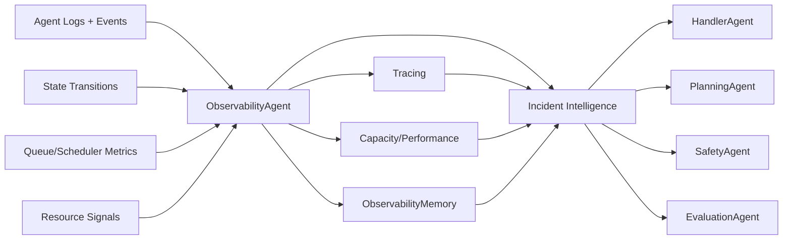

# Observability Subsystem

## Overview
The `src/agents/observability/` package is the operational intelligence layer for SLAI runtime health.
It converts multi-agent execution telemetry into actionable outputs for incident triage, performance diagnosis,
and automated mitigation support.

At a high level, the subsystem is responsible for:

- **Tracing** end-to-end tasks across agents (trace/session/span/event views).
- **Reliability analytics** (error clustering, regression detection, retry/failure waterfalls).
- **Capacity and performance insight** (queue pressure, resource saturation, latency/throughput signals).
- **Incident intelligence** (severity assessment, root-cause hypotheses, runbook recommendations, operator briefs).
- **Historical memory** (`ObservabilityMemory`) for similarity matching, trend recall, and playbook outcome learning.

This subsystem is orchestrated by `ObservabilityAgent` (`src/agents/observability_agent.py`) and is intentionally scoped to runtime telemetry and operability intelligence (not response-quality scoring or fallback policy ownership).

---

## Mission
**Observability Agent mission:** turn multi-agent runtime behavior into operational intelligence that shortens detection and resolution loops.

Concretely, it should help operators and adjacent agents answer:

- What failed?
- Where did it fail in the workflow?
- Is this isolated or systemic?
- Is it regressing compared to baseline?
- What is the most likely root cause?
- Which remediation is most likely to recover service quickly?

---

## Why SLAI Needs This Now
As SLAI scales from single-agent logic to coordinated multi-agent workflows, diagnostics become cross-cutting:

- Failures propagate across agent boundaries.
- User-facing degradation can be caused by queues, retries, or saturation—not only business logic bugs.
- Raw logs are insufficient for fast localization without trace correlation and incident synthesis.

Without a dedicated observability owner, SLAI risks slower MTTD/MTTR, recurring regressions, and noisy alerting.

---

## Non-Overlap With Other Agents
Observability is intentionally partitioned from nearby concerns:

- **EvaluationAgent**: evaluates output quality, behavior, and performance scoring.
- **HandlerAgent**: applies fallback/retry/escalation policies during execution.
- **Observability Agent**: owns runtime telemetry intelligence, incident synthesis, and operational signal quality.

This separation keeps accountability clear:

- quality evaluation ≠
- failure handling ≠
- telemetry intelligence.

---

## Directory Structure

```text
src/agents/observability/
├── __init__.py
├── observability_tracing.py
├── observability_cnp.py
├── observability_intelligence.py
├── observability_memory.py
├── configs/
│   └── observability_config.yaml
└── utils/
    ├── __init__.py
    ├── config_loader.py
    ├── observability_error.py
    └── waterfall_analysis.py
```

---

## Core Capability Map

### A) Tracing
Implemented primarily in `observability_tracing.py`.

- End-to-end task trace IDs and sessions.
- Per-agent span timing and status lifecycle.
- Event-level correlation (`trace_id`, `span_id`, `agent_name`, severity).
- Critical-path reconstruction through waterfall analysis.
- Shared-memory snapshotting and trace archival hooks.

### B) Reliability Analytics
Implemented across `observability_cnp.py`, `observability_intelligence.py`, and memory integrations.

- Error taxonomy clustering/signature correlation.
- Regression detection across latency/error/throughput patterns.
- Retry/failure waterfall interpretation.
- Alert-fatigue controls (dedupe windows and repeat-threshold handling).

### C) Capacity and Performance
Implemented in `observability_cnp.py`.

- Queue depth and backlog growth detection.
- Inflow/outflow imbalance and drain-ratio warnings.
- CPU/memory/GPU pressure indicators (where metrics exist).
- Latency/throughput histograms and regression assessments.
- Trace-level bottleneck/anomaly/retry-chain summaries.

### D) Incident Intelligence
Implemented in `observability_intelligence.py`.

- Incident scoring and level normalization (`info`, `warning`, `critical`).
- Auto-generated incident briefs (symptoms, evidence, impact framing).
- Root-cause hypothesis ranking with weighted signals.
- Remediation runbook selection from configured catalogs.

### E) `observability_memory` (Specialized Memory Module)
Implemented in `observability_memory.py`.

- Stores trace/span archives and correlated event timelines.
- Maintains incident fingerprints for fast regression matching.
- Persists objective history (SLO/SLA context), suppression history, and remediation outcomes.
- Supports playbook-learning loops by recording post-action recovery metrics.
- Exposes retrieval APIs for:
  - `incident_similarities(error_signature)`
  - `latency_trend(agent_name, percentile, window)`
  - `runbook_outcome(playbook_id)`

---

## Shared Memory Contract
Recommended shared keys produced/consumed by the orchestrator and subsystem:

- `observability.trace_id`
- `observability.agent_spans`
- `observability.error_clusters`
- `observability.latency_p95`
- `observability.incident_level`
- `observability.recommended_actions`

These keys should remain stable to preserve compatibility with routing, dashboards, and downstream automation.

---

## Inputs, Outputs, and Integrations

### Inputs
- Logs/events emitted by all agents.
- Execution state transitions.
- Queue/scheduler telemetry.
- Resource signals (CPU/memory/GPU when available).

### Outputs
- Alert severity and incident status.
- Root-cause hypotheses (ranked).
- Remediation recommendations/runbook candidates.
- Operational summaries suitable for dashboards and on-call handoff.

### Integrates With
- **HandlerAgent**: degradation/fallback activation paths.
- **PlanningAgent**: runtime-aware replanning under pressure.
- **SafetyAgent**: risk escalation when incident severity increases.
- **EvaluationAgent**: operability signal consumption and health scoring.

---

## High-Level Runtime Flow



---

## Alert Policy (Reference)

- **info**: isolated, low-severity anomalies.
- **warning**: sustained p95 latency breach or elevated retry rates.
- **critical**: cascading failures, persistent backlog growth, or multi-agent outage signals.

The default thresholds and weighting knobs are configurable in `configs/observability_config.yaml`.

---

## KPIs
Primary subsystem KPIs:

- **Mean Time To Detect (MTTD)**
- **Mean Time To Resolve (MTTR)**
- **Alert precision** (signal/noise ratio)
- **Recurring incident rate**
- **User-facing degraded response rate**

Suggested practice:

- Track each KPI as both trailing-window trend and point-in-time snapshot.
- Correlate KPI movement with runbook changes and suppression policy updates.

---

## Failure Modes and Mitigations

### 1) Alert Fatigue
**Risk:** noisy repeated alerts reduce operator response quality.

**Mitigations:**
- Alert dedupe windows.
- Repeat-threshold gating.
- Context-aware suppression with TTL and incident linkage.

### 2) Telemetry Blind Spots
**Risk:** missing fields break cross-agent localization.

**Mitigations:**
- Enforce telemetry contract via `BaseAgent` hooks.
- Validate required trace context fields.
- Fail loudly (typed observability errors) for contract violations.

### 3) High-Cardinality Metric Explosion
**Risk:** memory/cost growth and lower signal clarity.

**Mitigations:**
- Bounded label strategies and caps per series.
- Rollups/histograms instead of unbounded tags.
- Explicit retention limits in config.

---

## Configuration Surface
Configuration is loaded from `configs/observability_config.yaml` and split by concern:

- `observability_capacity`
- `observability_performance`
- `observability_intelligence`
- `observability_memory`

Representative controls include:

- Queue/resource pressure thresholds.
- Incident scoring thresholds and signal weights.
- Runbook catalog and priority ordering.
- Memory retention, similarity, suppression, and percentile settings.

Use conservative defaults first, then tune using post-incident retrospectives.

---

## Operational Guidance

- Keep event and span metadata structured and bounded.
- Prefer stable identifiers for agents/operations to improve trend continuity.
- Record remediation outcomes immediately after incident closure.
- Treat suppression as temporary debt: expire aggressively and review routinely.
- Validate that downstream consumers (Handler/Planning/Safety/Evaluation) read the shared-memory keys you publish.

---

## Versioning and Compatibility Notes

When evolving this subsystem:

- Keep shared-memory contract keys backward-compatible where possible.
- Gate behavior changes behind config toggles for safe rollout.
- Document threshold changes with impact expectations.
- Preserve retrieval API semantics in `ObservabilityMemory` to avoid regressions in automation.
