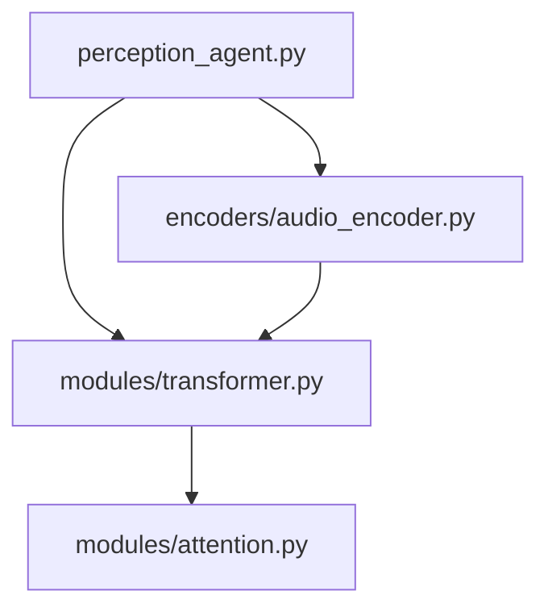

# PerceptionAgent — Multimodal Encoder & Fusion Layer

## Overview
PerceptionAgent is the sensory-computational module within SLAI, designed to process and unify visual, textual, and auditory data into a shared multimodal embedding. It supports pretraining, dropout masking, and full backpropagation, making it ideal for tasks requiring comprehensive environmental awareness or LLM integration.

---

## Architecture
- VisionEncoder: Converts images into patch-based transformer embeddings.
- TextEncoder: Embeds tokenized sequences with positional encoding.
- AudioEncoder: Processes waveforms into transformer-consumable audio frames.
- MultimodalFusion: Dynamically fuses encoder outputs using weighted gating, dropout, and optional cross-attention.
- Projection Layer: Projects fused embeddings to a compact latent space.
- SLAILMAdapter (optional): Aligns perception output with a large language model embedding space.

---

## Workflow
1. Input data is processed by its respective encoder.
2. Each encoder returns a tensor of shape (batch, seq_len, embed_dim).
3. MultimodalFusion averages, weights, and masks embeddings, returning a unified (batch, embed_dim) vector.
4. Projection layer compresses it to (batch, projection_dim).
5. Final output can be used for:
   - Pretraining objectives
   - Downstream task prediction
   - Feeding into SLAILM for reasoning

---

## Pretraining Objectives
- Masked Modality Modeling — Randomly masks patches/tokens/frames and reconstructs them.
- Crossmodal Matching — Contrastive learning for embedding alignment across modalities.
- Temporal Consistency — Ensures coherence across frames/audio sequences over time.

---



## API Usage
```python
  agent = PerceptionAgent(config, shared_memory, agent_factory)
  output = agent.forward(batch_inputs)
  agent.backward(gradients)
  agent.step()

  losses = agent.pretrainer.masked_modality_modeling(batch_inputs)
  similarity = agent.pretrainer.crossmodal_matching(embeddings)
```

---

## Compatibility
- Plug-and-play with SLAILM via .align_with_slailm(llm)
- Fully differentiable and backprop-capable
- Works with pretrained vision, text, audio weights (ViT, GPT2, wav2vec-style)
