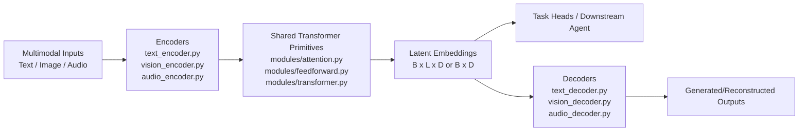

# Perception Package

The `src/agents/perception/` package provides the multimodal perception stack for SLAI. It includes:

- **Encoders** to convert text, image, and audio inputs into latent representations.
- **Core modules** (transformer, attention, feedforward, tokenizer) used by both encoders and decoders.
- **Decoders** to reconstruct or generate outputs from latent representations.
- **Utilities and memory helpers** for config loading, task heads, and checkpoint-friendly execution.

## Directory layout

```text
src/agents/perception/
├── README.md
├── configs/
│   └── perception_config.yaml
├── modules/
│   ├── attention.py
│   ├── feedforward.py
│   ├── tokenizer.py
│   └── transformer.py
├── encoders/
│   ├── audio_encoder.py
│   ├── text_encoder.py
│   └── vision_encoder.py
├── decoders/
│   ├── audio_decoder.py
│   ├── text_decoder.py
│   └── vision_decoder.py
├── utils/
│   ├── common.py
│   ├── config_loader.py
│   └── taskheads.py
├── data_loader.py
└── perception_memory.py
```

## End-to-end data flow

Use this as the primary reference for how data moves through perception during training/inference.


```mermaid
flowchart LR
    A[Multimodal Inputs\nText / Image / Audio]
    B[Encoders\ntext_encoder.py\nvision_encoder.py\naudio_encoder.py]
    C[Shared Transformer Primitives\nmodules/attention.py\nmodules/feedforward.py\nmodules/transformer.py]
    D[Latent Embeddings<br/>B x L x D or B x D]
    E[Task Heads / Downstream Agent]
    F[Decoders\ntext_decoder.py\nvision_decoder.py\naudio_decoder.py]
    G[Generated/Reconstructed Outputs]

    A --> B
    B --> C
    C --> D
    D --> E
    D --> F
    F --> G
```

## Component guides

- See [`encoders/README.md`](./encoders/README.md) for modality-specific encoding behavior.
- See [`modules/README.md`](./modules/README.md) for transformer internals and shared primitives.
- See [`decoders/README.md`](./decoders/README.md) for reconstruction and generation flows.

## Practical notes

- The implementation is strongly config-driven through `utils/config_loader.py` and `configs/perception_config.yaml`.
- Several classes support multiple backend variants (e.g., transformer/CNN/MFCC) with runtime fallback behavior.
- `PerceptionMemory` is integrated in core components for optional checkpointing and intermediate cache support.
