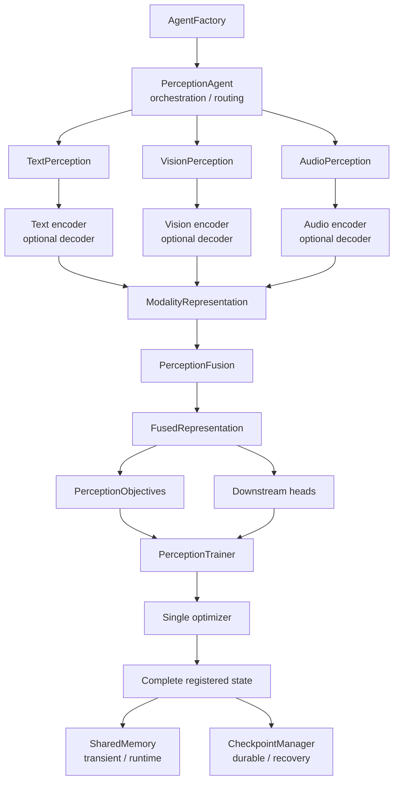

# SLAI Perception Subsystem

The `src/agents/perception/` package is the internal multimodal perception subsystem used by `PerceptionAgent`. It provides the computational pipeline for **text**, **vision**, and **audio** perception while preserving one externally registered SLAI agent boundary.

The v2.3 design deliberately separates **agent orchestration** from **subsystem computation**:

- `src/agents/perception_agent.py` is the externally routable SLAI agent. It owns task dispatch, agent-level runtime policy, SharedMemory coordination, downstream-head lifecycle, and durable checkpoint orchestration.
- `src/agents/perception/` owns modality processing, model architecture, representation contracts, multimodal fusion, learning objectives, and optimizer-step mechanics.
- `TextPerception`, `VisionPerception`, and `AudioPerception` are internal `torch.nn.Module` components. They are **not** `BaseAgent` subclasses and are not independently registered with `AgentFactory`.
- `PerceptionTrainer` owns the single optimizer and training-step mechanics, but does not own SLAI lifecycle, SharedMemory, or durable persistence.
- `SharedMemory` is the PerceptionAgent's transient/runtime coordination layer.
- the central `CheckpointManager` is the durable/recovery persistence layer.
- `perception/perception_memory.py`, where still useful to subsystem internals, remains a subsystem-local facility and is not an Agent dependency.

This boundary prevents the former v2.2 pattern in which modality preprocessing, masking, fusion, loss mathematics, optimizer logic, persistence, and task orchestration were duplicated across the top-level agent and its internal modules.

---

## 1. Resulting v2.3 architecture

```text
                       AgentFactory
                            │
                            ▼
                     PerceptionAgent
                  orchestration / routing
                            │
          ┌─────────────────┼─────────────────┐
          ▼                 ▼                 ▼
   TextPerception     VisionPerception    AudioPerception
          │                 │                 │
      encoder            encoder            encoder
          │                 │                 │
   optional decoder    optional decoder  optional decoder
          │                 │                 │
          └─────────────────┼─────────────────┘
                            │
                  ModalityRepresentation
                            │
                            ▼
                    PerceptionFusion
                            │
                            ▼
                    FusedRepresentation
                            │
                 ┌──────────┴──────────┐
                 ▼                     ▼
        PerceptionObjectives     downstream heads
                 │                     │
                 └──────────┬──────────┘
                            ▼
                    PerceptionTrainer
                            │
                     single optimizer
                            │
                            ▼
                complete registered state
                            │
          ┌─────────────────┴────────────────┐
          ▼                                  ▼
    SharedMemory                    CheckpointManager
 transient/runtime                  durable/recovery
```

The same dependency flow expressed as Mermaid:


```mermaid
flowchart TB
    AF[AgentFactory]
    PA[PerceptionAgent<br/>orchestration / routing]

    TP[TextPerception]
    VP[VisionPerception]
    AP[AudioPerception]

    TE[Text encoder<br/>optional decoder]
    VE[Vision encoder<br/>optional decoder]
    AE[Audio encoder<br/>optional decoder]

    MR[ModalityRepresentation]
    PF[PerceptionFusion]
    FR[FusedRepresentation]
    PO[PerceptionObjectives]
    DH[Downstream heads]
    PT[PerceptionTrainer]
    OPT[Single optimizer]
    STATE[Complete registered state]
    SM[SharedMemory<br/>transient / runtime]
    CM[CheckpointManager<br/>durable / recovery]

    AF --> PA
    PA --> TP
    PA --> VP
    PA --> AP

    TP --> TE
    VP --> VE
    AP --> AE

    TE --> MR
    VE --> MR
    AE --> MR

    MR --> PF
    PF --> FR
    FR --> PO
    FR --> DH
    PO --> PT
    DH --> PT
    PT --> OPT
    OPT --> STATE
    STATE --> SM
    STATE --> CM
```

### Architectural interpretation

The diagram should be read as an **ownership and data-flow model**, not as a claim that every inference request executes every box. For example, ordinary representation inference does not execute `PerceptionObjectives` or an optimizer step. Likewise, a masked-modality pretraining step may use a modality pipeline and `PerceptionObjectives` without requiring multimodal fusion. The important invariant is that each responsibility has one authoritative owner.

---

## 2. Package layout

```text
src/agents/perception/
├── README.md
├── perception_contracts.py
├── perception_fusion.py
├── perception_objectives.py
├── perception_trainer.py
├── perception_memory.py
├── data_loader.py
│
├── modalities/
│   ├── __init__.py
│   ├── base.py
│   ├── text.py
│   ├── vision.py
│   └── audio.py
│
├── encoders/
│   ├── __init__.py
│   ├── text_encoder.py
│   ├── vision_encoder.py
│   └── audio_encoder.py
│
├── decoders/
│   ├── __init__.py
│   ├── text_decoder.py
│   ├── vision_decoder.py
│   └── audio_decoder.py
│
├── modules/
│   ├── __init__.py
│   ├── attention.py
│   ├── feedforward.py
│   ├── tokenizer.py
│   └── transformer.py
│
├── utils/
│   ├── __init__.py
│   ├── common.py
│   ├── config_loader.py
│   ├── perception_errors.py
│   ├── perception_helpers.py
│   └── taskheads.py
│
└── configs/
    └── perception_config.yaml
```

The exact contents of `encoders/`, `decoders/`, and `modules/` can evolve independently as long as they continue to satisfy the modality and representation contracts described below.

---

## 3. Responsibility boundaries

### 3.1 `PerceptionAgent`

`src/agents/perception_agent.py` is the only SLAI agent boundary for this subsystem. It is responsible for:

- registration and construction through `AgentFactory`;
- SLAI `BaseAgent` lifecycle and execution-envelope integration;
- dispatch between `pretrain`, `finetune`, and `inference` tasks;
- reading **agent-owned policy** from `src/agents/base/configs/agents_config.yaml -> perception_agent`;
- constructing the three modality pipeline boundaries;
- constructing and wiring `PerceptionFusion`, `PerceptionObjectives`, and `PerceptionTrainer`;
- dynamic downstream classification/regression head registration;
- transient runtime snapshots, training coordination, and optional embedding caching through `SharedMemory`;
- durable save/restore through the central `CheckpointManager`;
- enforcing state/schema compatibility at its external boundary.

The Agent should **not** duplicate tokenizer behavior, modality input normalization, masking algorithms, reconstruction objectives, contrastive mathematics, temporal loss mathematics, raw encoder/decoder construction logic, or optimizer steps.

### 3.2 Modality pipelines

`TextPerception`, `VisionPerception`, and `AudioPerception` are vertical computational components built around `BasePerceptionModality`.

Each modality pipeline owns:

- canonical payload validation and normalization for its modality;
- its encoder;
- its optional decoder/reconstructor;
- construction of `ModalityRepresentation`;
- masked-modality prediction preparation;
- modality-supported temporal encoding;
- modality-specific reconstruction/decoding behavior.

They do **not** own SLAI agent routing, SharedMemory, durable checkpoint policy, or another AgentFactory registration.

### 3.3 `PerceptionFusion`

`PerceptionFusion` is the single multimodal fusion authority. It:

- consumes a mapping of canonical `ModalityRepresentation` instances;
- projects modality-specific pooled vectors into one common dimension;
- maintains fixed modality slots;
- optionally performs modality-level attention;
- supports the configured `concat`, `mean`, `sum`, or `max` fusion policy;
- produces a fixed-width `FusedRepresentation` even when a request contains only a subset of configured modalities.

The top-level Agent should therefore not concatenate text/image/audio tensors manually.

### 3.4 `PerceptionObjectives`

`PerceptionObjectives` is the single owner of perception loss mathematics currently exposed by the subsystem:

- masked text reconstruction/classification;
- masked vision/audio reconstruction;
- paired cross-modal contrastive alignment;
- temporal coherence objectives.

This separation keeps objective definitions testable and prevents different call paths from implementing subtly different versions of the same loss.

### 3.5 `PerceptionTrainer`

`PerceptionTrainer` owns:

- the single AdamW optimizer for active perception parameters;
- unique trainable-parameter collection;
- dynamic downstream-head optimizer registration;
- backward propagation;
- optional gradient clipping;
- optimizer stepping;
- the perception global training step;
- training-mode propagation across registered perception components.

It intentionally does **not** inherit `nn.Module`. Learned state remains registered on the actual `nn.Module` objects; trainer-owned state is the optimizer lifecycle and `global_step`.

---

## 4. Configuration ownership

v2.3 uses **two intentionally different configuration scopes**. They should not be merged.

### Agent configuration

Source:

```text
src/agents/base/configs/agents_config.yaml
└── perception_agent:
```

This section owns policy visible at the SLAI agent boundary, such as:

- runtime device selection;
- canonical agent embedding width contract;
- masking ratio selected by the agent for masked pretraining requests;
- optimizer hyperparameters passed into `PerceptionTrainer`;
- contrastive/temporal objective policy passed into `PerceptionObjectives`;
- multimodal fusion policy passed into `PerceptionFusion`;
- which optional modality decoders the Agent asks the subsystem to construct;
- SharedMemory key/TTL policy;
- durable CheckpointManager policy.

`PerceptionAgent` uses the base-level config loader and does **not** import `perception.utils.config_loader`.

### Subsystem configuration

Source:

```text
src/agents/perception/configs/perception_config.yaml
```

This remains an internal subsystem configuration source. It may be consumed by lower-level perception components for model-architecture and preprocessing details such as:

- encoder/decoder backend selection;
- Transformer depth/width internals;
- attention implementation parameters;
- feed-forward architecture;
- tokenizer behavior and vocabulary details;
- image/audio patching and preprocessing;
- decoder-internal generation/reconstruction settings;
- other lower-level model implementation parameters.

The Agent does not read this file directly, copy it, or mirror its full contents into `agents_config.yaml`.

### Why both scopes remain

The distinction is intentional:

```text
agents_config.yaml
    └── "How should SLAI operate PerceptionAgent?"

perception_config.yaml
    └── "How are perception subsystem models internally constructed?"
```

This avoids a second copy of the model schema at the agent layer while still allowing the Agent to own orchestration policy.

---

## 5. Runtime contracts

### 5.1 `Modality`

The canonical modality identity is one of:

```text
text
vision
audio
```

`multimodal` is an **Agent request mode**, not an additional `Modality` enum member. A multimodal request is represented internally as a mapping containing two or more ordinary modality representations.

### 5.2 `ModalityRepresentation`

Every modality pipeline normalizes its encoder output to a common contract:

```text
pooled:          (B, D)       required
sequence:        (B, L, D)    optional
attention_mask:  (B, L)       optional; valid only with sequence
modality:        text | vision | audio
metadata:        structured non-model metadata
```

`pooled` is the stable cross-modal interface. Modality-specific sequence representations remain available where an operation requires them.

### 5.3 `FusedRepresentation`

`PerceptionFusion` emits:

```text
pooled:          (B, D)
tokens:          (B, M, D)
presence_mask:   (B, M)
modalities:       fixed configured modality slot order
modality_embeddings:
                  projected embeddings for modalities present in the request
```

This fixed-width output is the interface used by downstream heads.

---

## 6. Inference flow

### Single modality

```text
request
  │
  ▼
PerceptionAgent
  │
  ▼
TextPerception / VisionPerception / AudioPerception
  │
  ▼
ModalityRepresentation
  │
  ├── raw representation request ──> pooled/sequence output
  │
  ├── downstream task ──> PerceptionFusion ──> task head
  │
  └── supported generation/reconstruction ──> modality decoder
```

Even for a single-modality downstream task, the v2.3 Agent routes the representation through `PerceptionFusion` before a downstream head. This gives downstream heads one fixed-width contract rather than modality-dependent input dimensions.

### Multimodal

```text
text payload ──> TextPerception ───┐
vision payload -> VisionPerception ├─> PerceptionFusion -> FusedRepresentation
 audio payload -> AudioPerception ─┘
                                                │
                                                ├─> returned fused embedding
                                                └─> downstream head
```

A subset of modalities is valid if `PerceptionFusion` was configured for those modalities. The Agent does not fabricate a missing modality.

### Multimodal generation

The Agent does not infer a multimodal generation/reconstruction algorithm from a fused embedding. That would require an explicit learned decoder contract. Until such a component exists, multimodal generation should fail explicitly rather than route an arbitrary fused tensor into one modality decoder.

---

## 7. Pretraining flow

The Agent supports the objective identifiers already represented by the subsystem contract:

| Agent objective | Trainer path | Subsystem owner |
|---|---|---|
| `mlm` | `masked_step(TEXT, ...)` | `TextPerception` + `PerceptionObjectives` |
| `mpm` | `masked_step(VISION, ...)` | `VisionPerception` + `PerceptionObjectives` |
| `mam` | `masked_step(AUDIO, ...)` | `AudioPerception` + `PerceptionObjectives` |
| `contrastive_text_image` | `contrastive_step(TEXT, VISION)` | modality pipelines + `PerceptionObjectives` |
| `contrastive_text_audio` | `contrastive_step(TEXT, AUDIO)` | modality pipelines + `PerceptionObjectives` |
| `contrastive_vision_audio` | `contrastive_step(VISION, AUDIO)` | modality pipelines + `PerceptionObjectives` |
| `temporal_vision` | `temporal_step(VISION, ...)` | `VisionPerception` + `PerceptionObjectives` |
| `temporal_audio` | `temporal_step(AUDIO, ...)` | `AudioPerception` + `PerceptionObjectives` |

The Agent only dispatches the operation and provides agent-owned policy values such as `masking_ratio`. `PerceptionTrainer` performs zeroing, backward propagation, gradient clipping when configured, optimizer stepping, and `global_step` advancement.

This removes the former duplicate pattern:

```text
Agent-defined masking
+ Agent-defined loss
+ Agent-defined backward
+ Agent-defined optimizer step
```

in favor of:

```text
Agent dispatch
    ↓
modality pipeline
    ↓
PerceptionObjectives
    ↓
PerceptionTrainer
```

---

## 8. Fine-tuning and downstream heads

v2.3 currently exposes bounded Agent-managed downstream head creation for:

- classification;
- regression.

Unknown task types do not silently fall back to a generic or seq2seq head.

### Dynamic registration

A downstream head is:

1. constructed only when first requested;
2. stored in the Agent's `nn.ModuleDict`;
3. registered with `PerceptionTrainer`;
4. added to the existing optimizer without rebuilding or discarding existing optimizer moments;
5. recorded in an ordered task-head specification list for deterministic restore.

Task identity is part of the head key. This prevents two semantically different classification tasks with the same class count from unintentionally sharing one classifier.

### Classification

`num_classes` is required when a classification head is first constructed. The Agent does not rely on a hidden subsystem default to determine the external task's label space.

### Regression

Regression labels must match the prediction geometry. A `(B,)` label vector is only expanded automatically when the subsystem head returns `(B, 1)`; arbitrary broadcasting is rejected.

---

## 9. Memory and persistence

### 9.1 SharedMemory: transient/runtime

`PerceptionAgent` uses SLAI `SharedMemory` for transient coordination only:

- an ownership-aware training lock;
- short-lived complete runtime snapshots;
- optional shared embedding cache entries.

The Agent does not instantiate or import `perception/perception_memory.py`.

A SharedMemory snapshot contains:

```text
full PerceptionAgent state_dict
optimizer state_dict
agent state:
    schema version
    agent version
    global step
    ordered dynamic task-head specifications
    agent-level configuration snapshot
```

The full `state_dict` is important because the registered model graph includes more than raw encoders and decoders. It also contains modality prediction heads/mask tokens, fusion parameters, objective projection layers, and dynamic downstream heads.

### 9.2 CheckpointManager: durable/recovery

Durable recovery uses the repository-level central `CheckpointManager`.

The Agent saves the canonical components:

```text
model       -> complete PerceptionAgent nn.Module state
optimizer   -> PerceptionTrainer's single optimizer
agent_state -> schema/global-step/task-head topology/runtime policy snapshot
rng         -> optional RNG state for reproducible training recovery
```

The Agent does not implement its own filesystem checkpoint format.

### Two-phase restore

Dynamic task heads make restore ordering significant. v2.3 therefore restores in two phases:

```text
Phase 1
CheckpointManager
    ↓
load agent_state only
    ↓
validate schema and architecture contract
    ↓
reconstruct dynamic heads in saved order
    ↓
rebuild base optimizer topology + re-register heads

Phase 2
CheckpointManager
    ↓
verify + decode model / optimizer / RNG
    ↓
PerceptionAgent strict model-state application
    ↓
PerceptionAgent optimizer-state application
    ↓
CheckpointManager RNG restore if present
    ↓
restore trainer global_step
```

This ordering is necessary because optimizer state is indexed against a concrete parameter topology. Loading optimizer moments before reconstructing dynamically created task heads would make the restore ambiguous or invalid.

The current central Torch checkpoint codec applies its generic target restore as `load_state_dict(state, strict=...)`. That contract is valid for `nn.Module`, but `torch.optim.Optimizer.load_state_dict()` does not accept `strict`. Therefore, the v2.3 Agent still delegates checkpoint selection, integrity verification, compatibility checking, safe decoding, and RNG restoration to `CheckpointManager`, but applies the already-decoded model and optimizer state explicitly after topology reconstruction. This is a bounded compatibility measure for the current checkpoint API; it does not create a second checkpoint format or persistence implementation inside the Agent.

### SharedMemory is not durable checkpointing

The two paths intentionally coexist:

```text
SharedMemory snapshot
    transient runtime coordination / warm reuse

CheckpointManager checkpoint
    durable, verified, transactional recovery
```

They should not be conflated or routed through `PerceptionMemory`.

---

## 10. `PerceptionMemory`

`perception_memory.py` is not part of the PerceptionAgent's v2.3 persistence boundary.

If retained, its valid scope is subsystem-local behavior such as bounded intermediate caching or another explicitly documented local optimization. It must not become a second durable checkpoint manager or a replacement for SharedMemory.

Dependency direction should remain:

```text
PerceptionAgent ──────> SharedMemory
       │
       └──────────────> CheckpointManager
       │
       └──────────────> perception subsystem public components

perception subsystem ─X─> PerceptionAgent
perception subsystem ─X─> AgentFactory
perception subsystem ─X─> SharedMemory policy
perception subsystem ─X─> CheckpointManager orchestration
```

The `X` paths are intentionally prohibited reverse dependencies.

---

## 11. Transformer primitives

The shared Transformer stack in `modules/` follows the responsibility split established for v2.3:

### `attention.py`

Owns attention implementations and attention-specific masking/projection behavior.

### `feedforward.py`

Owns only the position-wise feed-forward transformation. It does not own Transformer residual connections, normalization, or multimodal fusion.

### `transformer.py`

Owns Transformer-layer composition:

```text
pre-norm self-attention -> residual
optional pre-norm cross-attention -> residual
pre-norm feed-forward -> residual
```

Encoder and decoder behavior is selected at construction rather than by replacing parameterized attention modules dynamically at runtime.

For autoregressive decoding, causal target self-attention and encoder-memory cross-attention remain distinct sublayers. This is consistent with the decoder architecture introduced by Vaswani et al. (2017), rather than treating one attention operation over external context as both mechanisms.

---

## 12. Error handling

Subsystem boundaries use the structured perception error hierarchy from:

```text
utils/perception_errors.py
```

Examples include:

- `PerceptionConfigurationError` / `InvalidPerceptionConfigurationError`;
- `PerceptionContractError`;
- `ModalityInputError`;
- `ModalityEncodingError` / `ModalityDecodingError`;
- `PerceptionDimensionError`;
- `PerceptionTrainingError`;
- `PerceptionStateError`;
- `UnsupportedPerceptionOptionError`.

The Agent should fail explicitly when a requested operation has no validated implementation. Examples include unsupported downstream head families or attempting to infer multimodal generation behavior without an explicit decoder contract.

This is preferable to silent fallback because silent fallback changes model semantics while presenting the request as successful.

---

## 13. External pretrained-weight conversion

The legacy Agent contained heuristic conversion code for unrelated third-party architectures. That behavior is not appropriate at the orchestration boundary because safe conversion requires source-specific knowledge of:

- parameter names;
- tensor orientations;
- architecture depth;
- normalization conventions;
- patch/token semantics;
- projection geometry;
- positional encoding structure;
- source and target checkpoint schema.

v2.3 therefore distinguishes:

```text
SLAI durable checkpoint
    -> PerceptionAgent.restore_checkpoint()

third-party pretrained architecture
    -> explicit format-specific subsystem adapter
```

The Agent should not split ambiguous tensors, assign unclassified parameters to multiple modalities, or reshape arbitrary learned tensors merely because the element count matches.

---

## 14. Dependency-direction rules

To avoid circular imports and duplicated ownership, follow these rules:

1. `PerceptionAgent` may import the subsystem's public contracts, modality pipelines, fusion, objectives, trainer, errors, helpers, and downstream heads.
2. Perception subsystem modules must not import `PerceptionAgent`.
3. Modality pipelines may import their lower-level encoder/decoder/tokenizer implementations.
4. `PerceptionTrainer` may reference modality/fusion/objective contracts, but not SharedMemory or CheckpointManager.
5. `PerceptionFusion` and `PerceptionObjectives` must not construct agents.
6. `perception.utils.config_loader` remains a subsystem dependency; `PerceptionAgent` uses `base.utils.main_config_loader` instead.
7. `perception_memory.py` remains subsystem-local and must not be imported by `PerceptionAgent`.
8. Durable persistence remains a top-level service dependency through `CheckpointManager`; checkpointing modules must not import perception agents in return.

The intended dependency direction is therefore acyclic:

```text
BaseAgent / AgentFactory
          │
          ▼
   PerceptionAgent
          │
          ├──────────────> SharedMemory
          ├──────────────> CheckpointManager
          │
          ▼
 modality / fusion / objectives / trainer contracts
          │
          ▼
 encoders / decoders / modules / utilities
```

---

## 15. AgentFactory registration

Perception remains one AgentFactory entry:

```yaml
agent_factory:
  dependency_profiles:
    perception:
      torch_required: true
      notes: "Perception encoder/decoder stack is torch-based."

  agent_specs:
    perception:
      module_path: src.agents.perception_agent
      class_name: PerceptionAgent
      capabilities:
        - perception
        - sensor_processing
        - representation_learning
```

Do not separately register `TextPerception`, `VisionPerception`, or `AudioPerception`. They are implementation components of the one perception capability boundary.

---

## 16. Academic design basis

The subsystem combines several established objective/architecture families without claiming to reproduce any one paper implementation exactly:

- **Transformer attention and encoder-decoder separation**: Vaswani et al., *Attention Is All You Need* (2017). The decoder distinction between masked target self-attention and encoder-decoder attention motivates the v2.3 decoder-layer separation.
- **Masked language modeling**: Devlin et al., *BERT: Pre-training of Deep Bidirectional Transformers for Language Understanding* (2018). SLAI's text masked objective belongs to this general objective family; its exact masking/tokenizer implementation is SLAI-specific.
- **Contrastive representation learning / InfoNCE family**: van den Oord, Li, and Vinyals, *Representation Learning with Contrastive Predictive Coding* (2018). SLAI uses batch-paired contrastive objectives in this general family.

These references justify the architectural separation of attention, masked prediction, and contrastive objective responsibilities. They do **not** imply that SLAI is an exact reimplementation of BERT, CPC, CLIP, MAE, or another published model.

---

## 17. v2.3 invariants

A production v2.3 Perception stack should preserve the following invariants:

1. **One external agent** — only `PerceptionAgent` is AgentFactory-routable.
2. **One canonical modality contract** — all modality pipelines return `ModalityRepresentation`.
3. **One fusion authority** — multimodal combination goes through `PerceptionFusion`.
4. **One objective authority** — perception loss mathematics lives in `PerceptionObjectives`.
5. **One optimizer owner** — `PerceptionTrainer` owns optimizer lifecycle and optimizer steps.
6. **Complete registered learned state** — wrappers, fusion, objectives, and downstream heads are reachable from the Agent's `state_dict()`.
7. **SharedMemory is transient** — it coordinates runtime state and temporary reuse.
8. **CheckpointManager is durable** — filesystem recovery is centralized and verified.
9. **No Agent dependency on PerceptionMemory** — internal memory facilities remain internal.
10. **No Agent dependency on perception_config.yaml** — model configuration remains subsystem-owned.
11. **No silent task fallback** — unsupported semantic operations raise structured errors.
12. **No heuristic checkpoint mutation** — parameter conversion must be explicit and architecture-aware.
13. **No circular ownership** — subsystem modules never import the top-level PerceptionAgent to perform their own routing or persistence.

These invariants are the primary compatibility target for future perception changes during SLAI v2.3 development.
