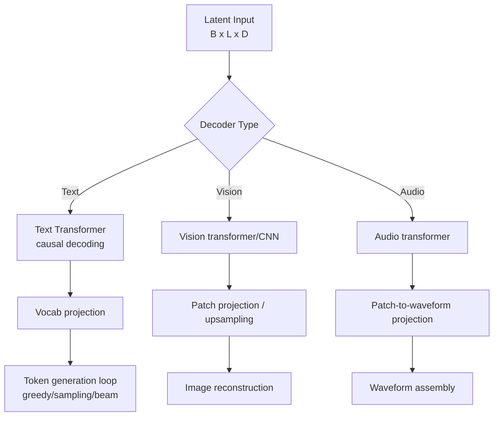

# Perception Decoders

`src/agents/perception/decoders/` contains modality-specific decoders that map latent representations back to outputs.

## Decoders overview

- `text_decoder.py` → `TextDecoder`
  - Autoregressive generation with causal transformer behavior.
  - Supports inference strategies: `greedy`, `sampling`, and `beam`.
  - Can tie output projection weights to encoder token embeddings.

- `vision_decoder.py` → `VisionDecoder`
  - Supports **transformer** and **cnn** decode paths.
  - Transformer path projects latent tokens to patch space and reassembles images.
  - CNN path upsamples from latent vectors through transposed convolutions.

- `audio_decoder.py` → `AudioDecoder`
  - Primary implemented path is **transformer** decoding into waveform patches.
  - Includes placeholders/fallbacks for `cnn` and `mfcc` decode types.

## Decoder flow

## Practical notes

- Decoder implementations intentionally mirror encoder assumptions where possible (embedding dims, patch sizes, positional handling).
- For unimplemented decode backends, current behavior is to warn and fallback to transformer implementations.
- In text generation, decode-time controls (temperature/top-k/top-p/repetition penalty) are available through config values.
