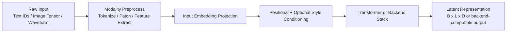

# Perception Encoders

`src/agents/perception/encoders/` contains modality-specific encoders that project raw inputs into shared latent spaces.

## Encoders overview

- `text_encoder.py` → `TextEncoder`
  - Token embeddings + positional encoding + transformer backbone.
  - Supports `output_type` as `sequence`, `cls`, or `mean`.
  - Supports optional style conditioning and attention-hook registration.

- `vision_encoder.py` → `VisionEncoder`
  - Supports **transformer** (patch-based) and **cnn** backends.
  - Handles dynamic patching for non-divisible image sizes.
  - Transformer path adds CLS token + positional signal before transformer processing.

- `audio_encoder.py` → `AudioEncoder`
  - Supports **transformer**, **mfcc**, **cnn**, and a wav2vec2 placeholder fallback.
  - Transformer path converts waveform chunks to patch embeddings.
  - MFCC path computes coefficients and projects into embedding space.

## Encoder pipeline (modality-agnostic)

## Operational notes

- Encoder behavior is config-driven via global and section-specific settings.
- The transformer-backed encoders align to a mostly common output contract for cross-modal usage.
- Some encoder types gracefully fallback when incomplete backends are selected (e.g., wav2vec2 placeholder logic).
