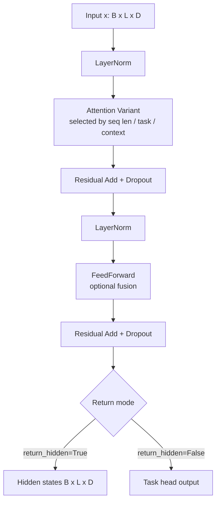

# Perception Modules

`src/agents/perception/modules/` contains the reusable building blocks used across encoders/decoders.

## Files and responsibilities

- `transformer.py`
  - Defines `Transformer`, an enhanced transformer stack that selects attention variants dynamically and routes outputs through task heads.
  - Integrates with `PerceptionMemory` for checkpointed execution/cache behavior.
- `attention.py`
  - Provides attention primitives and variants:
    - `BaseAttention`
    - `EfficientAttention`
    - `CosineAttention`
    - `MultiQueryAttention`
    - `CrossAttention`
  - Includes both standard and memory-efficient attention kernels.
- `feedforward.py`
  - Implements configurable FFN with optional normalization, residuals, and fusion modes (`add`, `concat`, `film`).
- `tokenizer.py`
  - Implements tokenizer behavior with optional BPE subword handling and multi-modal token packing.

## Transformer block flow

## Key design points

- **Dynamic attention selection** in `Transformer.select_attention(...)` is based on context presence, sequence length, task type, and estimated memory pressure.
- **Task head routing** allows one backbone to serve classification, regression, seq2seq, multimodal, and multitask output contracts.
- **Memory efficiency** is addressed via chunked attention and optional checkpointing hooks through `PerceptionMemory`.
- **Compatibility-first implementation**: many defaults are safe fallbacks (e.g., unknown task type → base task head).
