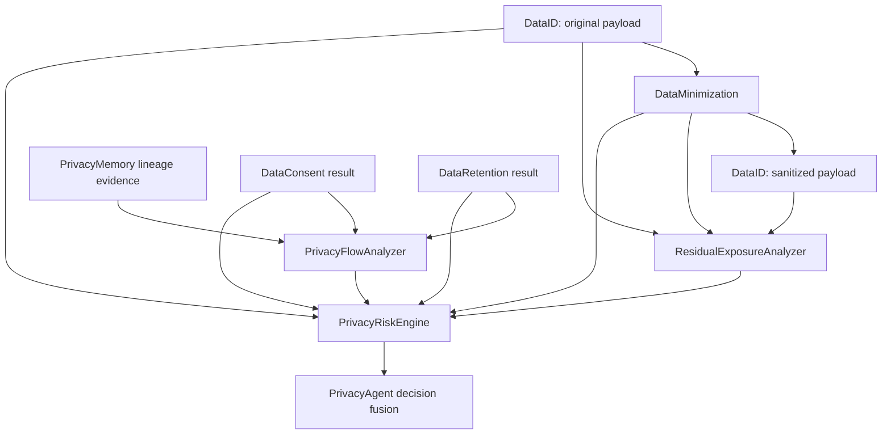

# SLAI Privacy Intelligence Modules

This directory extends `src/agents/privacy/` with three evidence-driven privacy reasoning modules:

- `residual_exposure.py`
- `privacy_flow_analyzer.py`
- `privacy_risk_engine.py`

The modules are intentionally **not** independent privacy subsystems. They consume structured evidence produced by the existing Privacy components and add reasoning that is currently absent: post-control verification, cumulative dissemination analysis, and explainable privacy-risk aggregation.

## Architectural boundary



Ownership remains unchanged:

| Responsibility | Owner |
|---|---|
| PII/PHI and sensitive-data detection | `data_id.py` |
| Consent, purpose limitation and context authorization | `data_consent.py` |
| Mask/drop/tokenize/hash policy | `data_minimization.py` |
| Retention, deletion and legal hold | `data_retention.py` |
| Privacy state and lineage persistence | `privacy_memory.py` |
| Audit evidence and reporting | `privacy_auditability.py` |
| Reusable deterministic mechanics | `utils/privacy_helpers.py` |
| Post-control effectiveness verification | `modules/residual_exposure.py` |
| Cumulative privacy-flow reasoning | `modules/privacy_flow_analyzer.py` |
| Evidence-weighted privacy risk aggregation | `modules/privacy_risk_engine.py` |

The new modules do **not** import `privacy_agent.py`, `PrivacyMemory`, Safety, Quality, Monitoring, or `src/tuning/`. This keeps dependency direction one-way and prevents a second orchestration path.

---

## Package layout

```text
src/agents/privacy/
├── modules/
│   ├── __init__.py
│   ├── README.md
│   ├── residual_exposure.py
│   ├── privacy_flow_analyzer.py
│   └── privacy_risk_engine.py
└── utils/
    ├── privacy_error.py
    ├── config_loader.py
    └── privacy_helpers.py
```

`privacy_helpers.py` is a required dependency. The modules import it directly from `..utils.privacy_helpers` instead of relying on `utils/__init__.py`, so adding these modules does not require changing the utility package exports first.

---

# 1. `ResidualExposureAnalyzer`

`ResidualExposureAnalyzer` verifies whether minimization actually reduced privacy exposure.

It consumes:

- the original `DataID.identify_entities()` result;
- a second `DataID.identify_entities()` result produced from the sanitized payload;
- the corresponding `DataMinimization.minimize_payload()` result.

It does **not** perform another classification algorithm. Re-running `DataID` remains the responsibility of the orchestrator, preserving a single classifier implementation.

### Main outputs

- pre-control sensitivity;
- post-control sensitivity;
- exposure reduction;
- transformation coverage;
- residual critical/high-risk entity count;
- residual direct-identifier count;
- required-field preservation;
- under-redaction evidence;
- over-redaction evidence;
- scan-completeness state;
- residual privacy-risk score;
- `allow | modify | escalate | block` decision candidate.

### Academic interpretation

`residual_risk_score` is an **operational residual-exposure score**, not a formal probability of re-identification. Formal re-identification estimates require population assumptions, quasi-identifier distributions, attacker knowledge, and release context that are not available in a single runtime payload.

---

# 2. `PrivacyFlowAnalyzer`

`PrivacyFlowAnalyzer` reasons over privacy lineage that has already been recorded by `PrivacyMemory`/`DataMinimization`.

It detects cumulative patterns such as:

- excessive destination expansion;
- repeated cross-context transfer;
- context fan-out;
- purpose drift;
- destinations outside the supplied authorized-context set;
- configured high-risk destinations;
- non-whitelisted context cycles;
- processing after a verified deletion completion timestamp;
- incomplete lineage evidence.

The module does not determine whether a processor is legally compliant and does not perform routing or network-security assessment.

### Input contract

`lineage_events` should be a **scope-limited sequence** relevant to the current record/request/subject. Each event may use the current `PrivacyMemory` event shape:

```python
{
    "event_id": "...",
    "timestamp": 1710000000.0,
    "request_id": "request-123",
    "record_id": "record-123",
    "subject_id": "subject-123",
    "payload": {
        "operation": "payload_minimization",
        "source_context": "chat_runtime",
        "destination_context": "ticketing_connector",
        "purpose": "support_resolution",
    },
}
```

The analyzer also accepts equivalent flattened event mappings.

`authorized_contexts` should come from the already-evaluated consent/purpose evidence. The Flow Analyzer does not create or reinterpret consent rules.

---

# 3. `PrivacyRiskEngine`

`PrivacyRiskEngine` aggregates the Privacy subsystem's structured evidence into one explainable residual-risk assessment.

It consumes:

- identification;
- consent/purpose result;
- minimization result;
- residual-exposure assessment;
- retention result;
- flow analysis.

The score is a weighted sum whose weights are entirely configuration-backed. Each component produces a `PrivacyRiskFactor` containing:

- raw factor score;
- configured weight;
- weighted contribution;
- rationale;
- sanitized evidence.

### Authoritative-decision preservation

The risk model does not average away hard privacy decisions.

Final decision precedence remains:

```text
block > escalate > modify > allow
```

For example, a low aggregate numeric score cannot turn a consent `block` into `allow`.

`risk_can_block: false` is recommended for runtime use. With this setting, a purely weighted risk score may escalate but does not create a new hard block on its own. An authoritative stage may still block normally.

---

# Configuration

All new-module configuration belongs in the existing:

```text
src/agents/privacy/configs/privacy_config.yaml
```

Do **not** create separate YAML files for these modules.

Append the following three top-level sections to `privacy_config.yaml`.

```yaml
residual_exposure:
  enabled: true
  strict_mode: true
  default_decision_stage: "residual_exposure.runtime_gate"

  # Compatibility switch. Set true after DataID explicitly returns
  # scan_complete on every classification result.
  require_explicit_scan_completeness: false

  block_on_critical_residual: true
  block_on_incomplete_post_scan: true
  escalate_on_high_residual: true
  escalate_on_under_redaction: true
  modify_on_over_redaction: true

  max_findings: 100
  max_required_fields: 200
  high_residual_saturation_count: 3

  critical_severities:
    - critical

  high_severities:
    - high
    - critical

  coverage_severities:
    - high
    - critical

  direct_identifier_categories:
    - direct_identifier
    - government_identifier
    - financial_identifier
    - credential

  thresholds:
    max_post_sensitivity_allow: 0.20
    min_exposure_reduction: 0.50
    min_transformation_coverage: 0.90
    min_required_field_preservation: 1.00
    max_removal_ratio: 0.90

  risk_weights:
    post_sensitivity: 0.35
    critical_residual: 0.25
    high_residual: 0.15
    coverage_gap: 0.15
    scan_uncertainty: 0.10


privacy_flow_analyzer:
  enabled: true
  strict_mode: true
  default_decision_stage: "flow.runtime_gate"

  block_on_post_deletion_processing: true
  block_on_unauthorized_destination: false
  escalate_on_unauthorized_destination: true
  escalate_on_purpose_drift: true
  escalate_on_context_cycle: false

  max_events: 500
  max_findings: 100
  max_authorized_contexts: 100

  # These values are SLAI privacy-policy context identifiers, not network hosts.
  high_risk_contexts: []
  ignored_contexts: []
  allowed_cycle_contexts: []

  thresholds:
    max_unique_destinations: 3
    max_cross_context_transitions: 5
    max_unique_purposes: 2
    max_context_fanout: 3
    modify_score: 0.30
    escalate_score: 0.60

  risk_weights:
    destination_expansion: 0.15
    cross_context: 0.15
    purpose_drift: 0.15
    unauthorized_destination: 0.25
    post_deletion_processing: 0.25
    cycle: 0.05


privacy_risk_engine:
  enabled: true
  strict_mode: true
  default_decision_stage: "risk.runtime_gate"

  # Weighted risk can escalate, but authoritative subsystem blocks remain
  # the preferred source of hard-block decisions.
  risk_can_block: false
  escalate_on_incomplete_evidence: true

  max_factors: 20
  max_evidence_sources: 10
  max_recommended_controls: 20

  required_evidence_sources:
    - identification
    - consent
    - minimization
    - residual_exposure
    - retention
    - flow

  authoritative_decision_sources:
    - identification
    - consent
    - minimization
    - residual_exposure
    - retention
    - flow

  component_weights:
    inherent_sensitivity: 0.15
    residual_exposure: 0.25
    authorization: 0.15
    retention: 0.10
    flow: 0.15
    uncertainty: 0.10
    evidence_gap: 0.10

  decision_scores:
    allow: 0.00
    modify: 0.35
    escalate: 0.75
    block: 1.00

  decision_thresholds:
    modify: 0.25
    escalate: 0.55
    block: 0.85

  confidence_penalties:
    uncertainty: 0.60
    evidence_gap: 0.40

  recommended_controls:
    allow: []
    modify:
      - "Apply the configured privacy transformation before downstream use."
    escalate:
      - "Require explicit privacy review before broader processing or transfer."
    block:
      - "Stop ordinary downstream processing until the blocking privacy condition is resolved."
    under_redaction:
      - "Re-run minimization with stronger controls and verify the sanitized payload again."
    over_redaction:
      - "Review declared required fields and reduce unnecessary suppression."
    unauthorized_destination:
      - "Revalidate destination authorization and purpose binding before further propagation."
    post_deletion_processing:
      - "Stop processing the deleted record and investigate lineage after deletion completion."
    incomplete_evidence:
      - "Complete the missing privacy evidence before allowing sensitive downstream processing."
```

### Configuration invariants

The modules fail initialization with `PrivacyConfigurationError` when required configuration is missing or malformed. They do not silently substitute hidden policy defaults.

The following weight groups must sum to exactly `1.0`:

- `residual_exposure.risk_weights`
- `privacy_flow_analyzer.risk_weights`
- `privacy_risk_engine.component_weights`

Decision thresholds must be monotonic.

---

# Recommended PrivacyAgent integration order

The modules are designed to be instantiated once by `PrivacyAgent` and reused across requests.

```python
from .privacy.modules import (
    PrivacyFlowAnalyzer,
    PrivacyRiskEngine,
    ResidualExposureAnalyzer,
)
```

Recommended runtime sequence:

```python
# 1. Existing pre-control identification
identification = self.data_id.identify_entities(...)

# 2. Existing consent/purpose evaluation
consent = self.data_consent.evaluate_request(...)

# 3. Existing minimization
minimization = self.data_min.minimize_payload(...)

# 4. Re-use DataID on the sanitized payload -- do not create a second classifier
post_identification = self.data_id.identify_entities(
    minimization["sanitized_payload"],
    ...,
)

# 5. Verify transformation effectiveness
residual = self.residual_exposure.assess(
    before_identification=identification,
    after_identification=post_identification,
    minimization=minimization,
    request_id=req_id,
    required_fields=required_fields,
)

# 6. Existing retention evaluation
retention = self.data_retention.enforce_retention(...)

# 7. Query scoped lineage from PrivacyMemory / audit evidence, then analyze it
flow = self.privacy_flow_analyzer.analyze(
    lineage_events=lineage_events,
    request_id=req_id,
    record_id=rec_id,
    subject_id=subject,
    authorized_contexts=authorized_contexts,
    retention=retention,
)

# 8. Aggregate evidence
risk = self.privacy_risk_engine.assess(
    identification=identification,
    consent=consent,
    minimization=minimization,
    residual_exposure=residual,
    retention=retention,
    flow_analysis=flow,
    request_id=req_id,
)
```

The final PrivacyAgent decision should still use the shared conservative decision combiner from `privacy_helpers.py` so that no stage can accidentally downgrade another stage's blocker.

---

# Lineage retrieval requirement

`PrivacyFlowAnalyzer` deliberately does not import `PrivacyMemory`. The Privacy Agent should pass the relevant lineage events into the analyzer.

If `PrivacyMemory` does not yet expose bounded retrieval methods, add small read APIs such as:

```python
lineage_trace(request_id: str) -> Dict[str, Any]
record_lineage(record_id: str) -> Dict[str, Any]
subject_lineage(subject_id: str) -> Dict[str, Any]
```

Those methods should remain in `privacy_memory.py`; do not add persistence or indexing logic to `privacy_flow_analyzer.py`.

---

# Circular-import model

```text
privacy_agent.py
      |
      +--> privacy domain modules
      |
      +--> privacy/modules/*
                    |
                    +--> privacy/utils/config_loader.py
                    +--> privacy/utils/privacy_helpers.py
                    +--> privacy/utils/privacy_error.py
```

Forbidden dependency direction:

```text
privacy/modules/*  -X-> privacy_agent.py
privacy/modules/*  -X-> privacy_memory.py
privacy/modules/*  -X-> data_id.py
privacy/modules/*  -X-> data_consent.py
privacy/modules/*  -X-> data_minimization.py
privacy/modules/*  -X-> data_retention.py
```

The runtime modules also do not import one another. They exchange plain mappings, making each component independently testable and preventing sibling-module cycles.

---

# `src/tuning/` and `src/utils/`

No runtime import from `src/tuning/` is included. This is intentional.

The existing tuning framework is suitable for **offline calibration** of empirical quantities such as detector thresholds and risk weights after a labelled privacy benchmark exists. It should not be coupled to ordinary runtime privacy enforcement or allowed to optimize legal/policy requirements such as consent necessity, purpose authorization, legal holds, or retention obligations.

The new modules reuse `privacy_helpers.py`, which already delegates generic primitives to SLAI's Base helpers. No duplicate statistics or generic drift implementation is introduced. Distribution drift remains the responsibility of SLAI Monitoring/Quality rather than the Privacy modules.

---

# Error behavior

Configuration failures always fail initialization.

At runtime:

- `strict_mode: true` raises the normalized Privacy error and lets the Privacy Agent's fail-closed policy handle it;
- `strict_mode: false` returns a structured `escalate`/`error` result without exposing raw payload data.

This preserves explicit error semantics without silent `allow` fallbacks.

---

# Security and privacy properties

The modules intentionally avoid:

- logging raw payload values;
- persisting personal data;
- generating unkeyed pseudonyms;
- treating residual-exposure scores as formal re-identification probabilities;
- silently truncating privacy evidence;
- inventing consent or legal basis;
- downgrading authoritative privacy decisions;
- dynamically training/tuning policy during a request.

Configuration and audit fingerprints use the existing deterministic privacy helper. Fingerprints are integrity identifiers, not anonymization mechanisms.

---

# Validation performed

The delivered modules were checked with:

- Python syntax compilation;
- package/import smoke testing using the SLAI import layout;
- residual exposure before/after transformation assessment;
- context-flow analysis over representative lineage events;
- end-to-end risk aggregation over all six evidence sources;
- weight and threshold configuration validation;
- authoritative decision preservation.

The modules target Python 3.10+ and use no new third-party runtime dependencies.
