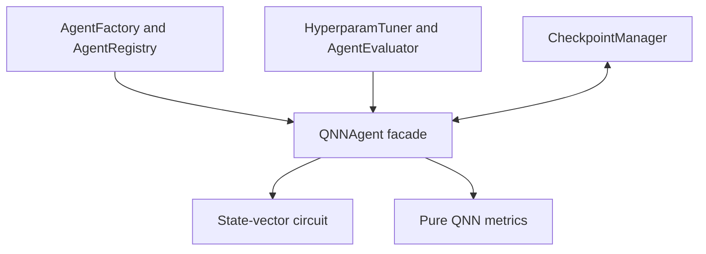

# SLAI QNN capability

The QNN capability is a deterministic NumPy simulation of a parameterized
quantum circuit. It accepts encoded state-vector sequences, applies unitary
`Rx-Ry-Rz` layers and an explicit CNOT topology, produces Born probabilities,
and supports target-bearing optimization.

It does **not** claim quantum hardware execution, quantum speed-up, automatic
classical feature encoding, or quantum recurrence. Those properties require
separate implementations and comparative evidence.

## Responsibility boundary



| Component | Owns | Does not own |
|---|---|---|
| `qnn_agent.py` | BaseAgent task modes, model parameters, training state, service hooks | Cross-agent routing, search, storage implementation |
| `qnn/types.py` | Resolved configuration and task value objects | Numerical execution |
| `qnn/quantum_encoding.py` | Validation/normalization of already encoded state vectors | Classical feature-map choice |
| `qnn/simulator.py` | Local gates, tensor-axis application, unitary circuit evolution | Measurement and optimization policy |
| `qnn/quantum_mno.py` | Born measurement, fidelity/probability metrics, gradient estimation and clipping | Search or candidate promotion |
| `qnn/quantum_policy.py` | Tunable allowlist and bounded work/resource decisions | Cross-agent routing policy |
| `qnn/quantum_memory.py` | Defensive decoded model-state schema | Recurrence, shared memory, or durable storage |
| `qnn/integration.py` | Tuning transactions, scenarios, checkpoint delegation | Search strategy, promotion, checkpoint storage |
| `qnn/utils/` | Lazy configuration facade, error taxonomy, side-effect-free helpers | Domain behavior |

`qnn/metrics.py` remains a compatibility export for callers of the former
module path; its implementation is not duplicated.

MAML and RL are peer learning capabilities. A learning or orchestration agent
may compare and route between them and QNN, but QNN does not construct or train
those agents.

## Numerical contract

For `n` qubits, every input is a one-dimensional complex vector of length
`2**n`. Inputs must contain finite amplitudes and have non-zero norm. With
`normalize_inputs: true`, the boundary maps the input to

\[
\lvert\psi\rangle \leftarrow
\frac{\lvert\psi\rangle}{\lVert\psi\rVert_2}.
\]

The zero state is rejected. The compatibility hidden-state helper returns the
valid basis state \(\lvert 0\ldots0\rangle\), not an all-zero vector.

Qubit `0` is the most-significant tensor axis. Multi-qubit target order defines
the local gate basis order. Therefore `apply_gate(state, CNOT, (c, t))` works
for adjacent, non-adjacent, and reversed-index control/target pairs without
constructing a full-system matrix.

One state vector uses

\[
2^n \times 16\ \text{bytes}
\]

with `complex128`. `max_statevector_bytes` bounds this primary allocation;
`max_parameter_bytes` independently bounds the `layers * qubits * 3` float64
rotation tensor, so a small state dimension cannot hide an excessive-depth
allocation. `max_working_set_bytes`, `max_sequence_length`,
`max_tasks_per_request`, and `max_gradient_evaluations` bound aggregate work;
they prevent individually valid state vectors from forming an unbounded batch
or parameter-shift workload. The working-set calculation is conservative and
is a policy estimate, not a claim of measured process peak memory.

## Circuit and measurements

Each layer applies `Rx`, `Ry`, and `Rz` to every qubit, followed by one declared
entanglement topology:

- `none`: no CNOT gates;
- `linear`: adjacent pairs `(0,1), (1,2), ...`;
- `ring`: the linear edges plus `(n-1,0)` when `n > 2`.

Born probabilities are computed as

\[
p_i = \frac{\lvert\psi_i\rvert^2}
{\sum_j \lvert\psi_j\rvert^2}.
\]

The normalization in the denominator is a defensive measurement-boundary
check. Circuit tests separately require unitary evolution to preserve norm.

## Task modes

`QNNAgent.perform_task()` supports exactly three modes:

| Mode | Required fields | Result |
|---|---|---|
| `infer` | `input_sequences` | output states, Born probabilities, norm error |
| `evaluate` | `input_sequences`, `target_outputs` | inference evidence plus `loss` and state fidelity |
| `train` | evaluation fields, optional positive `steps` | updated parameters, loss, fidelity, gradient norm and variance |

Example:

```python
import numpy as np

from src.agents.agent_factory import AgentFactory

factory = AgentFactory()
agent = factory.create(
    "qnn",
    config={"num_qubits": 1, "num_quantum_layers": 1, "entanglement": "none"},
)

state = np.array([1.0, 0.0], dtype=np.complex128)
result = agent.execute(
    {
        "mode": "evaluate",
        "input_sequences": [state],
        "target_outputs": [state],
    }
)
```

Missing targets are errors in `evaluate` and `train`; they never become an
artificial zero loss.

## Metrics and gradients

For normalized pure states, fidelity is

\[
F(\psi,\phi)=\lvert\langle\phi\mid\psi\rangle\rvert^2,
\qquad L_F=1-F.
\]

`state_fidelity` is invariant to global phase. `probability_mse` compares the
Born distributions and intentionally discards phase information.

The two-shift rule is enabled only for `state_fidelity`, which is an expectation
of the target-state projector for the supported rotation generators. Direct
parameter shift is not used for nonlinear probability MSE; that loss requires
the configured central finite-difference path. See Schuld et al.,
[Evaluating analytic gradients on quantum hardware](https://doi.org/10.1103/PhysRevA.99.032331).

`gradient_norm` and `gradient_variance` are evidence, not proof of trainability.
Tuning studies should compare these statistics across prespecified seeds,
depths, and qubit counts because broad families of random parameterized
circuits can exhibit barren plateaus. See McClean et al.,
[Barren plateaus in quantum neural network training landscapes](https://doi.org/10.1038/s41467-018-07090-4).

## Tuning integration

QNN tuning uses the existing `HyperparamTuner` and transactional
`AgentEvaluator`. The helper changes the evaluation mode and objective in a
defensive copy; it does not mutate the shared configuration.

```python
from src.agents.qnn.integration import (
    make_qnn_transaction_factory,
    prepare_qnn_tuning_config,
    qnn_scenario_runner,
)
from src.tuning.evaluators.agent import AgentEvaluator
from src.tuning.tuner import HyperparamTuner
from src.tuning.tuning_contracts import AgentScenario

qnn_config = prepare_qnn_tuning_config(base_tuning_config)
transaction_factory = make_qnn_transaction_factory(agent_builder)
scenarios = [
    AgentScenario(
        "held-out-state-transition",
        {
            "training": {
                "input_sequences": training_inputs,
                "target_outputs": training_targets,
            },
            "evaluation": {
                "input_sequences": held_out_inputs,
                "target_outputs": held_out_targets,
            },
            "training_steps": 10,
        },
    )
]
evaluator = AgentEvaluator(
    transaction_factory,
    qnn_scenario_runner,
    scenarios,
    qnn_config["agent_evaluation"],
)
tuning_result = HyperparamTuner(
    model_type="QNNAgent",
    config=qnn_config,
).run(evaluation_context=evaluator.evaluate)
```

The configured search space deliberately excludes `num_qubits`. Qubit count is
fixed by the state encoder and resource policy; changing it changes input
semantics rather than only tuning the model. Every seed receives an independent
transaction, every scenario resets the candidate state, and cleanup restores
or discards the candidate before a trial can succeed.

Each QNN tuning scenario declares separate `training` and `evaluation`
partitions. Candidate optimization runs only on `training`; `task_utility` is
the held-out evaluation fidelity. This makes learning rate, gradient method,
and gradient clipping observable tuning dimensions instead of inert config
values. Scenario authors remain responsible for constructing a scientifically
valid split and for providing classical and ablation baselines to the existing
promotion policy.

Fidelity is task utility in the supplied scenario runner. It is not treated as
a calibrated probability of correctness, so QNN evaluation disables inferred
calibration rather than fabricating confidence labels.

## Checkpoint integration

QNN delegates persistence to the existing component-oriented checkpoint
manager:

```python
from checkpointing import CheckpointManager

manager = CheckpointManager(base_dir="checkpoints/qnn")
agent.save_checkpoint(manager, version="qnn-v1")
agent.load_checkpoint(manager, version="qnn-v1")
```

| Component | Codec | Contents |
|---|---|---|
| `model` | `numpy` | quantum weights and training step |
| `agent_state` | `agent-state` | schema, resolved configuration, RNG provider and RNG state |

Shared memory receives only a compact runtime summary and configuration
fingerprint. It is not a model or checkpoint store.

## Configuration

Agent-level model choices are in
`src/agents/base/configs/agents_config.yaml` under `qnn_agent`. Numerical
subsystem defaults are in `qnn/configs/quantum_config.yaml`. The QNN loader uses
SLAI's shared lazy configuration repository, so importing the QNN performs no
YAML file access. Resolution order is subsystem defaults, agent defaults, then
an explicit constructor override.

| Field | Constraint |
|---|---|
| `num_qubits` | positive integer within the state-vector byte budget |
| `num_quantum_layers` | positive integer |
| `learning_rate` | finite positive number |
| `seed` | integer, used by an instance-local NumPy generator |
| `entanglement` | `none`, `linear`, or `ring` |
| `loss` | `state_fidelity` or `probability_mse` |
| `gradient_method` | `parameter_shift` or `finite_difference` |
| `finite_difference_step` | finite positive number |
| `gradient_clip_norm` | finite positive number |
| `norm_tolerance` | finite positive number |
| `max_statevector_bytes` | positive integer |
| `max_parameter_bytes` | positive integer |
| `max_working_set_bytes` | positive integer large enough for one conservative task working set |
| `max_sequence_length` | positive per-task state count |
| `max_tasks_per_request` | positive task-batch count |
| `max_gradient_evaluations` | positive cap on shifted/finite-difference circuit evaluations per training call |
| `max_training_steps` | positive integer |
| `normalize_inputs` | boolean |

The agent-level file owns `num_qubits`, `num_quantum_layers`, `learning_rate`,
`seed`, `entanglement`, `loss`, and `gradient_method`. The local QNN file owns
encoding tolerance/normalization, measurement-optimization thresholds, and
resource limits. A value therefore has one default source rather than two
competing YAML definitions.

## Verification

Run the focused suite from the repository root:

```bash
python -m pytest -q test_qnn_agent.py
```

The suite covers import isolation, gate unitarity, all ordered CNOT pairs for
two- and three-qubit systems, norm preservation, invalid input rejection,
global-phase fidelity, deterministic seeds, parameter-shift comparison,
training evidence, BaseAgent metrics, factory creation, checkpoint recovery,
transaction reset/cleanup, and the complete tuner/evaluator path.
