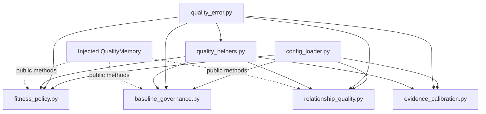
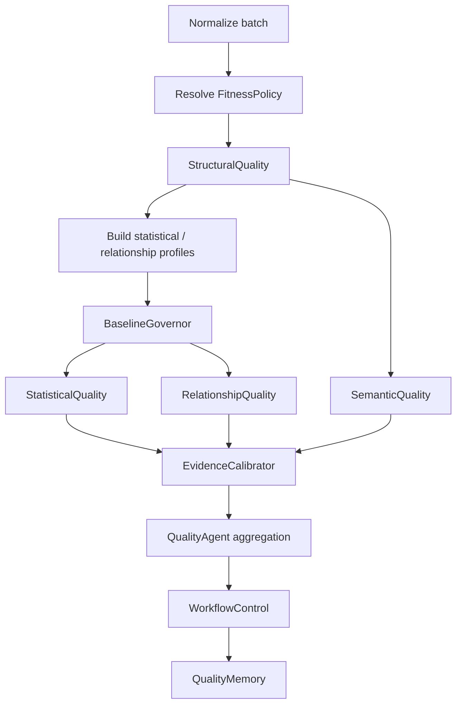

# SLAI Quality Intelligence Modules

This package extends the Data Quality Agent with four narrowly scoped intelligence capabilities while preserving the existing SLAI agent boundaries.

```text
src/agents/quality/
├── modules/
│   ├── __init__.py
│   ├── fitness_policy.py
│   ├── baseline_governance.py
│   ├── relationship_quality.py
│   ├── evidence_calibration.py
│   └── README.md
├── structural_quality.py
├── statistical_quality.py
├── semantic_quality.py
├── quality_memory.py
├── workflow_control.py
├── configs/
│   └── quality_config.yaml
└── utils/
    ├── config_loader.py
    ├── quality_error.py
    └── quality_helpers.py
```

## Ownership boundary

| Capability | Owner |
|---|---|
| Schema, type, required-field and constraint integrity | `StructuralQuality` |
| Marginal drift, missingness, duplicates, outliers | `StatisticalQuality` |
| Leakage, semantic consistency, provenance | `SemanticQuality` |
| Context-specific fitness-for-use policy | `FitnessPolicyResolver` |
| Trusted baseline lifecycle | `BaselineGovernor` |
| Cross-variable relationship drift | `RelationshipQuality` |
| Evidence strength and uncertainty | `EvidenceCalibrator` |
| Quarantine, routing and remediation | `WorkflowControl` |
| Durable quality history | `QualityMemory` |
| Agent/model performance | `EvaluationAgent` |
| General adaptation and learning | `AdaptiveAgent` / `LearningAgent` |
| Hyperparameter search | `src/tuning/` |

The four modules do **not** import `QualityAgent`, `QualityMemory`, `WorkflowControl`, or another SLAI agent. `QualityMemory` is accepted only through dependency injection and public API discovery. This prevents circular ownership.

## Dependency direction



## `fitness_policy.py`

`FitnessPolicyResolver` answers **what fitness-for-use means for this specific downstream purpose**. It resolves immutable profiles such as `general`, `knowledge_ingestion`, `training`, `replay`, `inference_context`, and `memory_write` from `quality_config.yaml`.

A resolved profile includes pass/warn thresholds, subsystem weights, required checks, hard-block error types, minimum source reliability, trusted-baseline policy, baseline-bootstrap permission, and minimum evidence strength.

Runtime overrides are disabled by default. If enabled, the default behavior is monotonic strictness: an override may tighten a requirement but may not silently relax it.

```python
resolver = FitnessPolicyResolver(memory=quality_memory)
resolved = resolver.resolve(
    use_case="training",
    source_id="source_alpha",
    context={"source_reliability": 0.91},
)
policy = resolved.policy
```

## `baseline_governance.py`

`BaselineGovernor` separates **baseline trust** from **drift detection**. `StatisticalQuality` remains responsible for measuring distribution shift.

Lifecycle:

```text
UNESTABLISHED -> CANDIDATE -> TRUSTED -> ACTIVE -> STALE / SUPERSEDED
                         \-> REJECTED
```

Candidate promotion can require an acceptable structural verdict, acceptable semantic verdict, minimum source reliability, schema compatibility, multiple stable batches, and bounded quality-score variation.

A current batch is never automatically considered trustworthy merely because no prior baseline exists.

```python
governor = BaselineGovernor(memory=quality_memory)
result = governor.resolve(
    source_id="source_alpha",
    current_profile=current_profile,
    structural_verdict=structural_result["verdict"],
    semantic_verdict=semantic_result["verdict"],
    source_reliability=0.91,
    current_quality_score=0.94,
    schema_version="3",
)
```

The governor uses `record_drift_baseline()` to persist trusted baselines. Because the current `QualityMemory` does not expose a narrow `latest_drift_baseline()` reader, the implementation first looks for such a future public method and otherwise optionally uses the existing public `export_state()` API. It never reads private `_state`.

## `relationship_quality.py`

Marginal distributions can remain stable while relationships between fields change. `RelationshipQuality` detects this failure mode through:

- pairwise numeric Pearson-correlation drift;
- pairwise missingness-correlation drift;
- Fisher r-to-z comparison with sample-size-aware evidence.

It deliberately does not label a relationship as semantic leakage. That remains the responsibility of `SemanticQuality`.

Pair growth is bounded. With `p` selected numeric fields, pair analysis is `p(p-1)/2`, so `max_numeric_fields` is a hard computational guardrail.

A p-value alone never causes a block. The module first requires a configured effect-size threshold and, by default, statistical support.

```python
relationship = RelationshipQuality(memory=quality_memory)
profile = relationship.build_profile(records)
result = relationship.assess(
    records,
    source_id="source_alpha",
    batch_id="batch_001",
    baseline_profile=trusted_relationship_profile,
)
```

The Fisher transformation used to compare correlations is:

```text
z(r) = 0.5 * ln((1+r)/(1-r))
```

This tests evidence of a changed linear relationship. It is not causal inference.

## `evidence_calibration.py`

`EvidenceCalibrator` separates **finding severity** from **confidence in the evidence**. A severe defect can be weakly supported, while a small defect can be measured precisely.

Evidence components are:

- sample support;
- measurement coverage;
- baseline trust;
- source reliability;
- detector agreement.

For binomial rates it exposes a Wilson score interval, avoiding the poor small-sample behavior of a simple Wald interval.

```python
calibrator = EvidenceCalibrator()
calibrated = calibrator.calibrate_finding(
    finding,
    population_count=len(records),
    baseline_status="active",
    source_reliability=0.91,
    detector_agreement=0.84,
)
```

Returned evidence includes confidence, uncertainty, evidence strength, support count, population count, coverage, baseline trust, source reliability, detector agreement, component scores, reason codes, and an optional interval.

The calibrator never changes `pass/warn/block`. The active fitness policy decides whether weak evidence is acceptable.

## Recommended QualityAgent pipeline



Structural validation remains the earliest deterministic barrier.

Relationship quality should normally be folded into the **statistical** subsystem evidence rather than becoming a fourth top-level QualityAgent weight. This keeps the existing structural/statistical/semantic aggregation contract stable.

Do not silently change the existing statistical weighted score when integrating it. First define an explicit `relationship` weight in `statistical_quality.scoring.weights`, then update StatisticalQuality's validation and aggregation contract accordingly.

## Shared QualityMemory

The recommended production ownership is one `QualityMemory` per `QualityAgent`, injected into the subsystems and intelligence modules. This prevents independent in-memory copies of the same quality history.

```python
self.quality_memory = QualityMemory()

self.fitness_policy = FitnessPolicyResolver(memory=self.quality_memory)
self.baseline_governor = BaselineGovernor(memory=self.quality_memory)
self.relationship_quality = RelationshipQuality(memory=self.quality_memory)
self.evidence_calibrator = EvidenceCalibrator()
```

Before applying the same pattern to `StructuralQuality`, `StatisticalQuality`, `SemanticQuality`, and `WorkflowControl`, add an optional `memory=` constructor argument to those existing classes. Retain `memory or QualityMemory()` only for standalone compatibility.

## `src/tuning/` boundary

These runtime modules intentionally do not import `src/tuning/`. A quality gate should not launch Bayesian/grid search while deciding whether one live batch can be consumed.

Use `src/tuning/` externally to test candidate thresholds and weights on representative validation scenarios. Promotion must remain explicit and auditable; accepted threshold changes can be persisted with `QualityMemory.record_threshold_decision()`.

## `src/utils/` boundary

These modules reuse the existing Quality helper layer rather than creating new generic utilities. `RelationshipQuality` requires Pearson correlation and Fisher r-to-z comparison, which are not currently provided by `src/utils/helpers/stats_utils.py`; importing unrelated helpers would not reduce duplication.

Existing `StatisticalQuality` can separately reuse `StatisticalAnalysis.kolmogorov_smirnov()` when its marginal drift analysis is upgraded. That is outside this package's role.

## Configuration ownership

All settings are centralized in:

```text
src/agents/quality/configs/quality_config.yaml
```

The four top-level sections are:

```yaml
fitness_policy: ...
baseline_governance: ...
relationship_quality: ...
evidence_calibration: ...
```

No local YAML/JSON configuration and no hidden environment-variable policy is introduced.

## Failure semantics

- malformed configuration -> `CONFIGURATION_INVALID`;
- missing/untrusted baseline -> explicit baseline status rather than fabricated drift evidence;
- insufficient pair support -> pair is skipped;
- unavailable memory -> explicit-input operation remains possible;
- weak evidence -> lower evidence strength, not automatic verdict mutation;
- hard-block policy -> decided by the active fitness policy using existing QualityErrorType values.

## Academic interpretation

The package intentionally follows conservative principles:

- effect size is considered alongside statistical evidence;
- multiple qualifying observations are required before automatic baseline promotion;
- marginal stability is not equated with joint-distribution stability;
- sample size and coverage influence evidential confidence;
- provenance/source trust remains separate from empirical distribution fit;
- uncertainty is exposed instead of hidden in a verdict;
- correlations are not interpreted causally;
- runtime learning is not mixed into deterministic quality gating.

The thresholds included in `quality_config.yaml` are engineering defaults, not universal scientific constants. They should be validated against representative SLAI workloads before promotion to a production policy.
