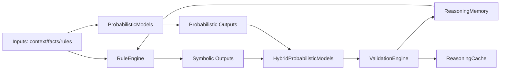

# Reasoning Agent Subsystem

## Overview
The `src/agents/reasoning/` package is SLAI’s reasoning core. It provides a layered stack for:

- symbolic inference (rule execution and knowledge-base transforms),
- probabilistic inference (Bayesian/grid/circuit-assisted reasoning),
- hybrid orchestration (symbolic + probabilistic composition),
- validation and consistency checks (conflict/redundancy/soundness), and
- memory/cache support for adaptive reasoning over time.

This package is designed to make reasoning behavior auditable, configurable, and resilient under uncertain or incomplete data.

---

## Scope and Responsibilities
This subsystem is responsible for:

1. **Representing and evaluating facts/rules** with confidence-aware semantics.
2. **Selecting and executing probabilistic models** appropriate to the input/task shape.
3. **Combining deterministic and probabilistic signals** into unified outputs.
4. **Validating inference quality** (soundness, contradictions, circularity, confidence bounds, MLN checks).
5. **Persisting reasoning artifacts** to support replay, diagnostics, and learning.

This subsystem is **not** the top-level product orchestrator/UI layer; it is a domain engine consumed by higher-level agent flows.

---

## Current Directory Structure

```text
src/agents/reasoning/
├── __init__.py
├── README.md
├── configs/
│   └── reasoning_config.yaml
├── hybrid_probabilistic_models.py
├── probabilistic_models.py
├── reasoning_cache.py
├── reasoning_memory.py
├── reasoning_types.py
├── rule_engine.py
├── validation.py
├── modules/
│   ├── __init__.py
│   ├── adaptive_circuit.py
│   ├── mln_rules.py
│   ├── model_compute.py
│   ├── nodes.py
│   └── pgmpy_wrapper.py
├── networks/
│   ├── README.md
│   ├── bayesian_network*.json
│   └── grid_network*.json
├── templates/
│   ├── semantic_frames.json
│   └── structure_weights.json
├── types/
│   ├── README.md
│   ├── __init__.py
│   ├── base_reasoning.py
│   ├── reasoning_abduction.py
│   ├── reasoning_analogical.py
│   ├── reasoning_cause_effect.py
│   ├── reasoning_decompositional.py
│   ├── reasoning_deductive.py
│   └── reasoning_inductive.py
└── utils/
    ├── __init__.py
    ├── config_loader.py
    ├── reasoning_errors.py
    └── reasoning_helpers.py
```

> Note: this structure reflects the files currently present in `src/agents/reasoning/`.

---

## High-Level Architecture



### Design Intent
- **RuleEngine** focuses on symbolic operations and rule-weighted inference.
- **ProbabilisticModels** handles uncertainty-aware model execution and network-backed inference.
- **HybridProbabilisticModels** composes both worlds without collapsing their traceability.
- **ValidationEngine** acts as a quality gate before results are accepted/persisted.
- **Memory/Cache** optimizes recall, diagnostics, and repeated inference paths.

---

## Component Details

### 1) `rule_engine.py`
Core symbolic reasoning executor.

Key responsibilities:
- rule registration and lifecycle management,
- dependency/circularity analysis,
- contradiction and redundancy detection,
- confidence-aware inference application,
- rule-weight adaptation and audit-friendly reporting.

Use when:
- deterministic or explainable rule progression is needed,
- you need explicit antecedent/consequent-level interpretation,
- you need direct knowledge-base mutation controls.

---

### 2) `probabilistic_models.py`
Primary probabilistic reasoning runtime.

Key responsibilities:
- network/model selection,
- probabilistic inference execution,
- trace/report generation,
- interoperability with network definitions under `networks/`.

Use when:
- uncertainty modeling is first-class,
- confidence propagation needs principled probabilistic semantics,
- symbolic-only reasoning is insufficient.

---

### 3) `hybrid_probabilistic_models.py`
Bridge layer combining symbolic and probabilistic signals.

Key responsibilities:
- strategy resolution for hybrid inference,
- connecting symbolic outputs into probabilistic graph structures,
- building/validating hybrid networks,
- preserving diagnostics about how final conclusions were formed.

Use when:
- deterministic constraints and stochastic evidence must both influence outcomes,
- model selection must adapt to mixed reasoning scenarios.

---

### 4) `validation.py`
Reasoning validation and consistency subsystem.

Key responsibilities:
- soundness checks for rule outputs,
- conflict detection (including threshold-based contradiction checks),
- redundancy checks,
- confidence-bound validation,
- KB consistency checks with retry/timeout controls,
- MLN rule evaluation integration.

Important behavior note:
- Override parameters use explicit `None` checks (rather than `x or default`) so valid falsy numeric values (e.g., `0`, `0.0`) are preserved intentionally.

---

### 5) `reasoning_memory.py`
Reasoning event/experience memory layer.

Key responsibilities:
- storing reasoning episodes/traces,
- retaining validation artifacts,
- priority-aware sampling/replay support,
- enabling post-hoc analysis and adaptive updates.

---

### 6) `reasoning_cache.py`
Runtime cache for expensive or repeated reasoning work.

Key responsibilities:
- namespace-aware caching,
- cache hit/miss accounting,
- bounded storage and retrieval behavior,
- memory-event integration hooks.

---

### 7) `reasoning_types.py` + `types/`
Typed reasoning mode implementations (deductive, inductive, analogical, etc.).

Key responsibilities:
- normalize reasoning mode APIs,
- provide specialized inference styles under a shared interface,
- keep reasoning families modular and testable.

---

### 8) `modules/`
Support modules used by probabilistic/hybrid/validation layers.

- `adaptive_circuit.py`: adaptive circuit-oriented helpers.
- `mln_rules.py`: MLN rule registry/evaluation/reporting utilities.
- `model_compute.py`: computational utilities for model operations.
- `nodes.py`: node-level abstractions/helpers.
- `pgmpy_wrapper.py`: wrapper integration for graph/probabilistic tooling.

---

### 9) `utils/`
Cross-cutting helpers.

- `config_loader.py`: configuration loading and section access.
- `reasoning_errors.py`: typed error hierarchy.
- `reasoning_helpers.py`: normalization, confidence/time/helper routines.

---

## Data and Configuration Assets

### `configs/reasoning_config.yaml`
Primary runtime configuration surface for reasoning behavior.

Typical categories include:
- thresholds and margins,
- retry/time limits,
- strategy toggles,
- memory/cache behavior,
- model/network defaults.

### `networks/*.json`
Prebuilt Bayesian/grid network definitions used by probabilistic layers.

### `templates/*.json`
Template resources for structural or semantic weighting.

---

## End-to-End Flow (Typical)

1. Input facts/context arrive.
2. Symbolic inference runs in `RuleEngine`.
3. Probabilistic inference runs in `ProbabilisticModels`.
4. Hybrid layer merges signals and strategy outputs.
5. Validation checks run (soundness/conflicts/redundancy/MLN/consistency).
6. Accepted artifacts are written to memory/cache.
7. Downstream components consume validated outputs.

---

## Operational Guidance

### Consistency Rules
- Prefer explicit `None` checks for override/fallback parameters.
- Keep confidence values bounded and normalized before comparisons.
- Preserve structured reports for every non-trivial reasoning decision.

### Safety/Robustness
- Validate external resource payloads (KB JSON, network JSON, template JSON).
- Fail with typed exceptions from `utils/reasoning_errors.py` where possible.
- Avoid silent coercions that hide malformed inputs.

### Observability
- Emit diagnostics that include thresholds/strategy IDs and elapsed timings.
- Keep validation summaries machine-readable for pipeline consumers.

---

## Extension Points

To add or evolve capabilities:

1. **New reasoning style**: implement in `types/` and wire through `reasoning_types.py`.
2. **New MLN rule family**: extend `modules/mln_rules.py` with registry + validation.
3. **New probabilistic topology**: add network JSON under `networks/` and map selection logic.
4. **New validation stage**: integrate in `validation.py` while preserving output schema stability.

Recommended practice:
- add explicit tests for edge values (`0`, `0.0`, empty collections, malformed keys),
- preserve backward-compatible result keys unless versioning is introduced,
- document any new config keys in this README and in `reasoning_config.yaml` comments.

---

## Quick Maintenance Checklist

- [ ] Config keys are documented and have safe defaults.
- [ ] Override semantics use `is None` where appropriate.
- [ ] All confidence thresholds are clamped/validated.
- [ ] Validation output remains schema-consistent.
- [ ] Memory/cache writes are bounded and observable.
- [ ] New modules are reflected in this README structure section.

---

## Related Documents

- `src/agents/reasoning/types/README.md`
- `src/agents/reasoning/networks/README.md`
