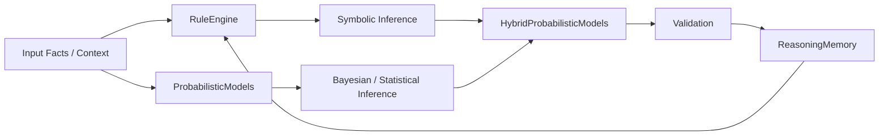
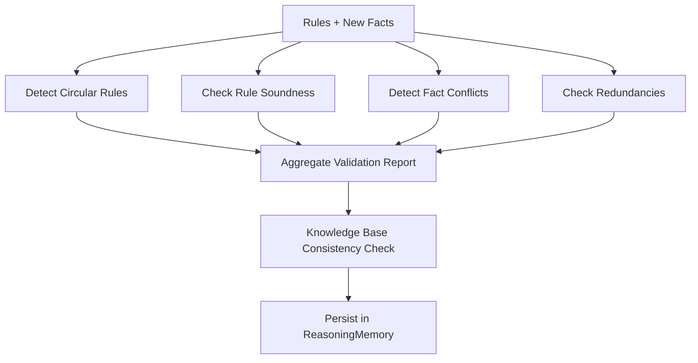

# Reasoning Agent Subsystem

## Overview
The `src/agents/reasoning/` package contains the symbolic + probabilistic reasoning stack used by SLAI. It combines:

- **Rule-based inference** (`rule_engine.py`)
- **Probabilistic reasoning models** (`probabilistic_models.py`)
- **Hybrid probabilistic pipelines** (`hybrid_probabilistic_models.py`)
- **Validation and consistency checks** (`validation.py`)
- **State/history persistence** (`reasoning_memory.py`)
- **Utility layers** for configs, graph/model wrappers, rule templates, and low-level computation (`utils/`)

---

## Directory Structure

```text
src/agents/reasoning/
├── __init__.py
├── rule_engine.py
├── probabilistic_models.py
├── hybrid_probabilistic_models.py
├── validation.py
├── reasoning_memory.py
├── configs/
│   └── reasoning_config.yaml
├── templates/
│   ├── semantic_frames.json
│   └── structure_weights.json
├── networks/
│   ├── README.md
│   ├── bayesian_network*.json
│   └── grid_network*.json
└── utils/
    ├── __init__.py
    ├── config_loader.py
    ├── model_compute.py
    ├── nodes.py
    ├── mln_rules.py
    ├── pgmpy_wrapper.py
    └── adaptive_circuit.py
```

---

## Conceptual Architecture



---

## Core Components

### `rule_engine.py`
- Loads configuration, knowledge base, lexicon, and dependency/pragmatic rule data.
- Executes rule evaluation and supports dynamic rule weighting/learning behaviors.
- Uses `ReasoningMemory` to store validation and reasoning artifacts.

### `probabilistic_models.py`
- Implements probabilistic inference components used for uncertain reasoning.
- Works with configurable network resources and utility model computation helpers.

### `hybrid_probabilistic_models.py`
- Combines symbolic outputs and probabilistic outputs.
- Supports reasoning strategies where deterministic rules and confidence-based inference are both required.

### `validation.py`
- Provides multi-stage validation utilities, including conflict checks, circular rule checks, and consistency-oriented checks.
- Produces structured validation results suitable for persistence and diagnostics.

### `reasoning_memory.py`
- Stores intermediate reasoning experiences, validation reports, and high-priority reasoning traces.
- Enables recall for later adaptive/learning processes.

---

## Validation Pipeline (high level)



---

## Notes

- Configuration is centralized through `configs/reasoning_config.yaml` and `utils/config_loader.py`.
- Static network definitions under `networks/` provide reusable graph templates for probabilistic experiments/inference.
- Templates under `templates/` provide semantic and structural weighting priors.
