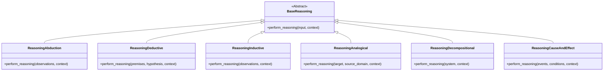

# Reasoning Types System

## Overview
This system provides a flexible framework for reasoning that combines multiple reasoning methodologies. It supports:
- 6 core reasoning types (abduction, deduction, induction, analogical, decompositional, cause-effect)
- Dynamic combination of up to 3 reasoning types
- Context passing between reasoning steps
- Memory-enhanced reasoning with prioritized experience replay

## Core Components

### Reasoning Types


### ReasoningTypes -> Manager


### ReasoningMemory


## System Flow

### Single Reasoning Flow


### Combined Reasoning Flow


## Key Concepts
### 1. Reasoning Type Composition
- Combine up to 3 reasoning types using + syntax
- Types execute in sequence (left to right)
- Output from each type becomes context for the next
- Final result synthesized from all outputs

### 2. Context Passing
Each reasoning step receives:
- Original input arguments
- Initial context (if provided)
- Results from previous steps
- Memory context tags
Context keys:
- prev_<TypeName>_result: Individual step result
- prev_step_result: Last step result
- Memory context tags (e.g., "high_priority_context")

### 3. Memory Integration
- All reasoning types share a common memory
- Memory provides:
    - Contextual tags based on recent experiences
    - Experience prioritization (SumTree)
    - Automatic checkpointing
    - Tag-based experience retrieval

### 4. Result Synthesis
The combined reasoning:
- Collects individual results in combined_result
- Sets reasoning_types to combined type names
- Sets final_output to last result by default
- Can be customized by overriding _synthesize_result()

----

## Usage Examples

### Single Reasoning
```code
reasoning_types = ReasoningTypes()
abduction = reasoning_types.create("abduction")
result = abduction.perform_reasoning(observations="The grass is wet")
```

### Combined Reasoning
```code
combo = reasoning_types.create("abduction+induction")
result = combo.perform_reasoning(
    observations=["Temperature drop", "Wind increase"],
    context={"location": "Seattle"}
)
```

### Custom Synthesis
```code
class CustomCombined(CombinedReasoning):
    def _synthesize_result(self, results):
        return {
            "insights": self._extract_insights(results),
            "confidence": self._calculate_confidence(results)
        }
```
