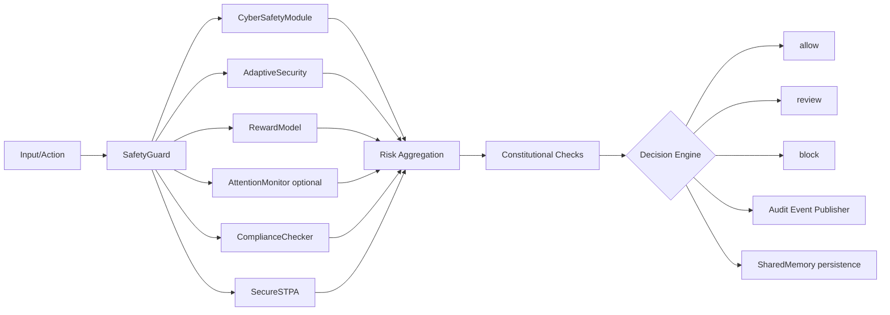
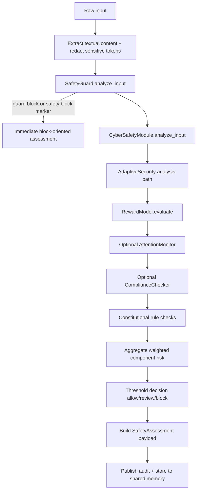
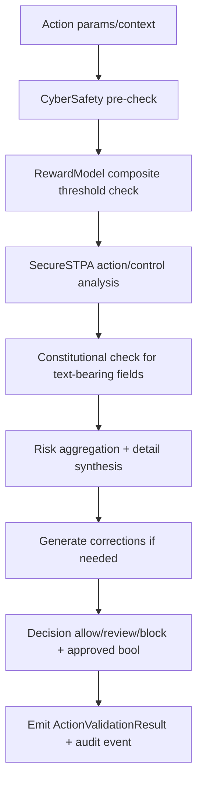

# Safety Agent (`src/agents/safety_agent.py`)

This document reflects the **current (v2.1.0)** implementation of the language Safety Agent and its orchestration behavior.

## What the Safety Agent does

`SafetyAgent` is the orchestration boundary for the safety subsystem. It:

- normalizes/sanitizes input,
- runs multiple specialized safety analyzers,
- aggregates component risk using weighted thresholds,
- applies constitutional checks,
- returns a bounded decision (`allow`, `review`, `block`), and
- emits structured audit events/posture artifacts for shared memory consumers.

The updated implementation also formalizes schema versions for major outputs:

- `safety_agent.assessment.v3`
- `safety_agent.action_validation.v3`
- `safety_agent.audit.v2`
- `safety_agent.posture.v2`

---

## High-level architecture

---

## Initialization behavior

During initialization, the agent:

1. loads `safety_agent` config from global config,
2. validates critical config sections (including risk-threshold integrity),
3. initializes all component modules,
4. loads constitutional rule definitions,
5. optionally enables learnable aggregation hooks, and
6. initializes runtime state for history/auditing.

Notable runtime controls include:

- `fail_closed_on_component_error`
- `store_assessments`, `store_audit_events`
- `assessment_history_limit`, `audit_trail_limit`
- `risk_thresholds.*` (including `block_threshold`, `review_threshold`, and module-specific thresholds)

---

## Main workflow: `perform_task(data_to_assess, context)`

### Output contract (assessment)

`perform_task` returns a structured `SafetyAssessment` object (serialized to dict), including:

- identity/time: `assessment_id`, `timestamp`, `module_version`, `schema_version`
- input metadata: `input_type`, `context_type`, `input_fingerprint`, sanitized preview text
- per-module diagnostics: `reports`, `component_risks`, `component_weights`
- governance signals: `blockers`, `warnings`, `constitutional_violations`
- aggregate outcomes: `final_safety_score`, `risk_score`, `risk_level`, `decision`, `overall_recommendation`, `is_safe`
- operation metadata: `aggregation_method`, internal metadata fields

---

## Action workflow: `validate_action(action_params, action_context)`

`validate_action` performs pre-execution gating for proposed actions.

### Output contract (action validation)

The serialized `ActionValidationResult` includes:

- identifiers: `validation_id`, `action_name`, `action_fingerprint`, `timestamp`
- decisioning: `approved`, `decision`, `risk_score`, `risk_level`
- diagnostics: `component_risks`, `details`, `corrections`, `reports`
- metadata for downstream automation

---

## Decision model and risk semantics

The decision engine is threshold-based with blocker-aware escalation:

- `block` when risk exceeds block threshold or hard blockers are present,
- `review` when risk is above review threshold or non-fatal concerns exist,
- `allow` when below review threshold and no blocker conditions are active.

Risk levels are categorized separately from binary safety and are preserved in output for observability.

---

## Audit and memory publication

The agent emits normalized audit events (schema `safety_agent.audit.v2`) and can store:

- assessment history,
- action validation history,
- audit trail events,
- posture/alert style events.

This enables cross-agent safety traceability without exposing raw sensitive content.
