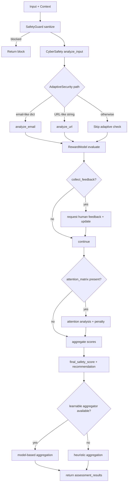
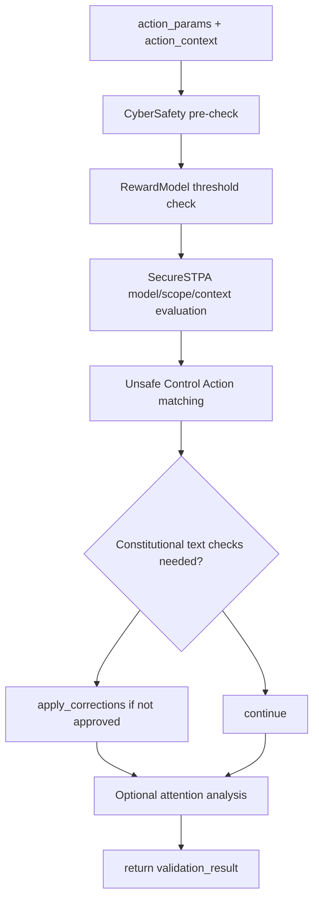

# Safety Agent (`src/agents/safety_agent.py`)

This document describes the current architecture and execution flow of the Safety Agent after the recent updates.

## Overview

`SafetyAgent` is a **multi-layer safety orchestration agent** that aggregates checks across:

- **SafetyGuard** (sanitization / input blocking)
- **CyberSafetyModule** (pattern-, signature-, and context-based cyber risk analysis)
- **AdaptiveSecurity** (email/URL security checks)
- **RewardModel** (ethical/safety scoring)
- **AttentionMonitor** (optional, torch-dependent)
- **Secure STPA** (unsafe control action risk analysis)
- **ComplianceChecker** and audit mechanisms

The agent exposes two primary workflows:

1. `perform_task(data_to_assess, context)` for comprehensive assessment of arbitrary inputs.
2. `validate_action(action_params, action_context)` for pre-execution action safety validation.

---

## Runtime initialization

On startup, `SafetyAgent`:

1. Loads global safety config (`safety_agent` section).
2. Initializes module dependencies.
3. Loads constitutional rules JSON.
4. Optionally enables learnable risk aggregation via `LearningFactory`.
5. Maintains runtime state (`calls`, `training_data`, `risk_table`, `audit_trail`).

### Config fields currently consumed

- `constitutional_rules_path`
- `audit_level`
- `collect_feedback`
- `enable_learnable_aggregation`
- `architecture_map`
- `system_models`
- `known_hazards`
- `global_losses`
- `safety_policies`
- `formal_specs`
- `fault_tree_config`
- `risk_thresholds`
- `secure_memory`

---

## Execution flow (`perform_task`)

### Key return payload shape

`perform_task` returns an object including:

- `timestamp`
- `input_type`
- `overall_recommendation`
- `is_safe`
- `reports` (module-by-module details)
- `final_safety_score`
- `aggregation_method` (`heuristic` or `learnable_model`)

---

## Action validation flow (`validate_action`)

### Validation output includes

- `approved`
- `risk_assessment`
- `reward_scores`
- `cyber_findings`
- `constitutional_concerns`
- `details`
- `suggested_corrections` (when validation fails)
- `attention_analysis` (when provided)

---

## Module map

See detailed module notes in:

- `src/agents/safety/modules/README.md`

That file provides a per-module contract-style summary to keep this top-level README focused on orchestration.

---

## Notes for maintainers

- `AttentionMonitor` is optional and loaded lazily; runtime falls back to lightweight mode if torch-dependent import fails.
- Risk aggregation currently has a heuristic fallback and an optional learnable path.
- Threshold interpretation should be kept consistent across:
  - `risk_thresholds.overall_safety`
  - `risk_thresholds.cyber_risk`
- Keep config, templates, and module docs synchronized when adding or removing safety checks.