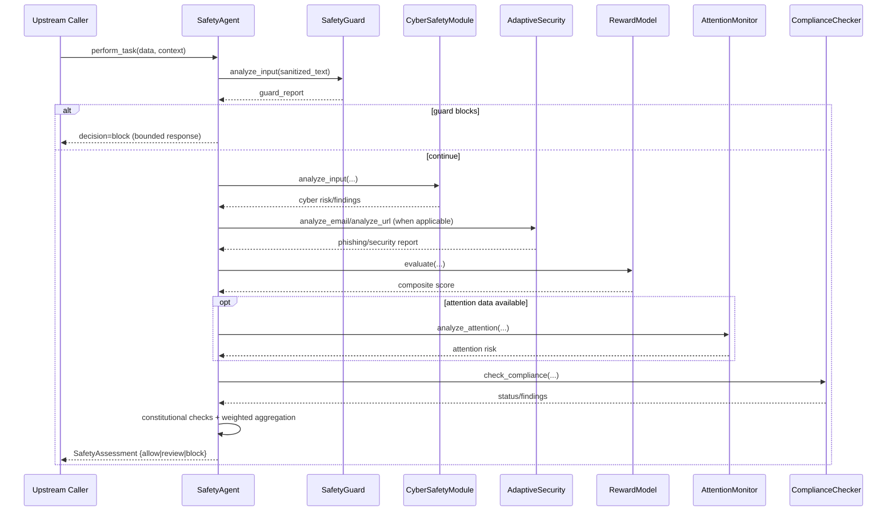
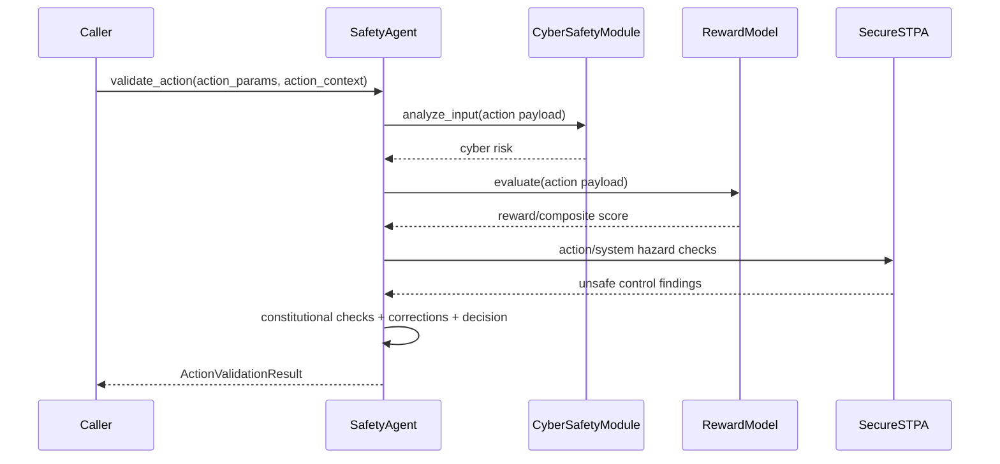

# Safety Modules Pipeline & Contracts

This document provides a detailed module-level companion to `src/agents/safety/README.md`.

## Orchestration contract summary

The Safety Agent expects each module to provide **structured, machine-readable** output so that risk can be aggregated consistently.

Minimum expected shape (conceptually):

- `risk_score` (0.0 to 1.0 where applicable)
- findings/details payloads
- optional recommendation/decision fields

---

## Module responsibilities

| Module | Primary responsibility | Typical contribution to aggregation |
|---|---|---|
| `SafetyGuard` | Early sanitization + immediate unsafe-content interception | Can force early blocking path, contributes guard-level risk context |
| `CyberSafetyModule` | Threat pattern/signature/context analysis | High-signal cyber risk score and findings |
| `AdaptiveSecurity` | URL/email phishing and transport-surface checks | Additional targeted cyber indicators |
| `RewardModel` | Policy/ethics-alignment scoring | Composite reward/safety score -> mapped risk |
| `AttentionMonitor` (optional) | Attention anomaly/alignment signals | Optional risk bump when anomalous |
| `ComplianceChecker` | Compliance posture checks | May introduce warnings/blockers depending on status |
| `SecureSTPA` | Unsafe control action and system-hazard reasoning | Action-validation risk and governance evidence |

---

## Assessment pipeline details (`perform_task`)

---

## Action-validation pipeline details (`validate_action`)

---

## Notes for maintainers

1. Keep module outputs stable; if a field changes, update aggregation logic and docs together.
2. Keep threshold names/config alignment synchronized with code.
3. Preserve fail-closed behavior for critical module errors unless deliberately reconfigured.
4. When adding a new module, update:
   - top-level safety README,
   - this module pipeline doc,
   - config defaults and tests.

