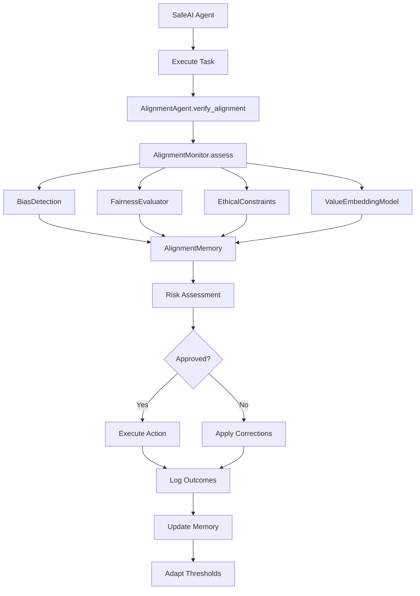

```mermaid
graph TD
    A[SafeAI Agent] --> B[Execute Task]
    B --> C[AlignmentAgent.verify_alignment]
    C --> D[AlignmentMonitor.assess]
    D --> E[BiasDetection]
    D --> F[FairnessEvaluator]
    D --> G[EthicalConstraints]
    D --> H[ValueEmbeddingModel]
    E --> I[AlignmentMemory]
    F --> I
    G --> I
    H --> I
    I --> J[Risk Assessment]
    J --> K{Approved?}
    K -->|Yes| L[Execute Action]
    K -->|No| M[Apply Corrections]
    L --> N[Log Outcomes]
    M --> N
    N --> O[Update Memory]
    O --> P[Adapt Thresholds]
```
