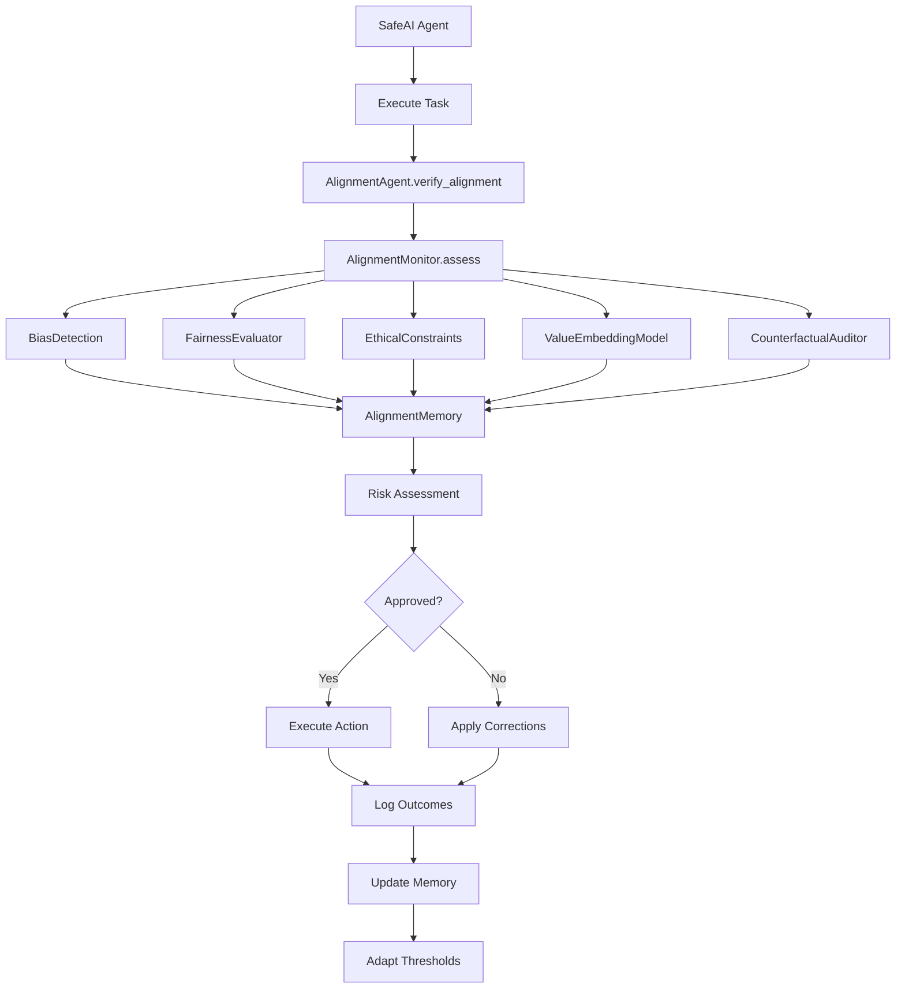

Here’s a comprehensive **step-by-step narrative explanation** of the **SLAI Alignment Flow Architecture** based on your diagram and the underlying code across your modules:

---

### 1. Task Initiation
**`SafeAI Agent`** begins by executing an assigned task.

- This agent is responsible for **risk-aware decision-making**, using predefined thresholds and prior performance data.

---

### 2. Alignment Verification
Before the action is finalized, the system calls:
**`AlignmentAgent.verify_alignment()`**

- This agent extends `SafeAI_Agent` and integrates longitudinal tracking, drift detection, and human-overridable correction pipelines.

---

### 3. Multi-Dimensional Alignment Assessment
**`AlignmentMonitor.assess()`** performs five distinct, concurrent audits:

1. **`BiasDetection`**: Checks group-level statistical bias (e.g., demographic parity).
2. **`FairnessEvaluator`**: Assesses both **group** and **individual fairness** using statistical testing, Lipschitz estimates, and consistency scoring.
3. **`EthicalConstraints`**: Applies rules from STPA safety models, Constitutional AI, and fairness governance.
4. **`ValueEmbeddingModel`**: Encodes ethical norms and cultural dimensions into latent vectors to measure alignment between model behavior and human values.
5. **`CounterfactualAuditor`**: Runs structural interventions to test fairness under hypothetical changes in sensitive attributes.

---

### 4. Shared Evidence Pool
All these modules push their findings to a common module:
**`AlignmentMemory`**, a formal structure holding historical violations, fairness scores, and concept drift states.

This memory allows for:
- **Temporal trend learning**
- **Threshold adaptation**
- **Future-aware interventions**

---

### 5. Risk Profiling
The system computes a **risk profile** via:
**`RiskAssessment`**, which quantifies overall alignment deviation using:

- KL-divergence between current and ideal alignment vectors
- Concept drift signals
- Ethical violation counts

---

### 6. Conditional Decision Logic
A conditional logic block checks:

```python
if risk_score >= threshold:
    trigger correction
else:
    execute action
```

**Corrections** can range from:
- Logging warnings
- Adjusting rewards
- Triggering human oversight
- Suspending agents

This is governed by:
**`CorrectionPolicy`** — a configurable intervention strategy.

---

### 7. Finalization and Learning
Whether the action proceeds or is corrected, the outcome is:

- **Logged** in audit trails
- **Stored** in memory
- **Used** to update thresholds through contextual bandits or RLHF signals.

---

## Scientific Justification for Architecture

This architecture is grounded in:

| Component | Theory / Reference |
|----------|--------------------|
| BiasDetection | Dwork et al., 2012 |
| FairnessEvaluator | Hardt et al., 2016; Feldman et al., 2015 |
| EthicalConstraints | STPA (Leveson, 2011); Bai et al., 2022 |
| ValueEmbeddingModel | Ng & Russell, 2000; Christiano et al., 2017 |
| CounterfactualAuditor | Kusner et al., 2017 |
| Adaptive Thresholding | Li et al., 2010; Wu et al., 2016 |
| Drift Detection | Wasserstein Distance; Liang et al., 2022 |
| Safe Interruptibility | Orseau & Armstrong, 2016 |

---

Would you like this flow also exported as a `.pdf`/`.docx` visual + written report format for documentation or publication purposes?
